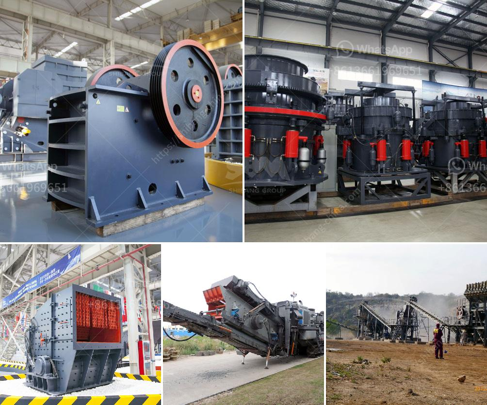

<h3>مطاحن الحجر الجيري المستخدمة في الفلبين</h3>
تعتبر مطاحن الحجر الجيري المستخدمة في الفلبين من أهم الصناعات التي تعمل على تحويل الصخور الجيرية إلى مسحوق جيري دقيق، وتستخدم هذا المسحوق في العديد من الصناعات المختلفة.

تتميز مطاحن الحجر الجيري في الفلبين بجودة ومتانة عالية، وتعتبر أحدث التقنيات والمعدات المستخدمة للتعامل مع الحجر الجيري.

تعد الفلبين بلدا غنيا بالموارد الطبيعية ومنها الحجر الجيري، وتحتوي العديد من المناطق على مناجم للحجر الجيري التي تستخدم في صناعة الأسمنت والزجاج والصيدلة وغيرها من الصناعات.

تستخدم مطاحن الحجر الجيري في تحويل الحجر الجيري إلى مسحوق ناعم يمكن أن يستخدم في صناعة الأسمنت، حيث يستخدم مسحوق الحجر الجيري لتنظيم تجانس الأسمنت وتحسين قوته. كما يستخدم أيضًا في صناعة الزجاج لإضفاء الشفافية واللمعان، وفي صناعة الصيدلة لإنتاج العديد من المنتجات العلاجية.

تم تطوير مطاحن الحجر الجيري في الفلبين بتقنيات حديثة تحقق قدرة إنتاجية عالية وجودة متميزة للمنتج النهائي. تعمل هذه المطاحن عبر عملية طحن الحجر الجيري الخام في وحدة تكسير خاصة. يتم تحويل الحجر الجيري إلى حبيبات صغيرة ثم يتم تجفيفها وطحنها إلى مسحوق ناعم.

تعمل مطاحن الحجر الجيري في الفلبين على توفير منتج نهائي ذو جودة عالية، وتلبي الاحتياجات المتنوعة لعملائها في العديد من الصناعات. كما تسهم في تعزيز الصناعة المحلية وتوفير فرص العمل للعديد من العمال.

يرتبط استخدام مطاحن الحجر الجيري في الفلبين بالسعي إلى تعزيز التنمية المستدامة والاعتماد على الموارد الطبيعية المحلية. تعتبر هذه الصناعة جزءًا هامًا من الاقتصاد الفلبيني وتساهم في توفير العديد من السلع والخدمات للسوق المحلية والعالمية.

إن مطاحن الحجر الجيري في الفلبين تعتبر قطاعًا حيويًا في اقتصاد البلاد، وتسهم في تعزيز الصناعات المحلية وتحقيق التنمية الاقتصادية. وبفضل تحسين جودتها وتطوير تقنياتها، فإن هذه المطاحن تسعى دائمًا لتلبية توقعات العملاء وتوفير منتجات ذات جودة عالية وفي الوقت المناسب.
<h3>Contact us</h3><ul><li><strong>Whatsapp:&nbsp;<a href="https://wa.me/8613661969651">+8613661969651</a></strong></li><li><a href="https://swt.shibang-china.com/?git&amp;zhl&amp;مطاحن الحجر الجيري المستخدمة في الفلبين"><strong>Online Service(chat now)</strong></a></li></ul><h3>Related</h3><ul><li><a href='خطة عمل للرمال.md'>خطة عمل للرمال</a></li><li><a href='أسعار مصنع الكسارة بوزولانا 50 طن في الساعة.md'>أسعار مصنع الكسارة بوزولانا 50 طن في الساعة</a></li><li><a href='كسارة الحجر الجيري المصنعة في باكستان.md'>كسارة الحجر الجيري المصنعة في باكستان</a></li><li><a href='مشروع محجر للبيع في نيجيريا.md'>مشروع محجر للبيع في نيجيريا</a></li><li><a href='كسارات الحجر في ماليزيا.md'>كسارات الحجر في ماليزيا</a></li></ul>