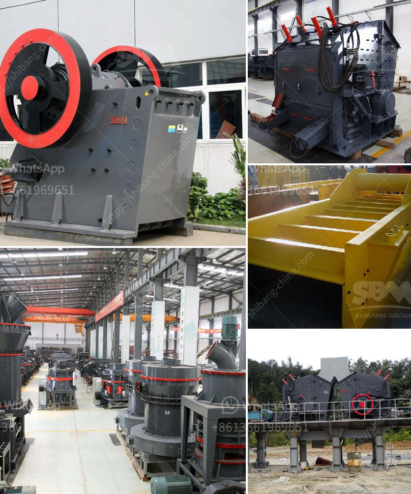

<h3>مطاحن الحجر للبيع في كينيا</h3>
تعتبر مطاحن الحجر من الأدوات الأساسية التي يستخدمها مزارعو الحبوب وأصحاب محلات البقالة في كينيا. وتعد هذه المطاحن الحجرية منتجًا تقليديًا وموثوقًا به لطحن الحبوب وإعداد الدقيق الطازج.

توجد العديد من الشركات المصنعة لمطاحن الحجر في كينيا التي تقدم مجموعة واسعة من الخيارات من حيث الحجم والسعة والأسعار. تتراوح أسعارها عادة بين 200 و 400 دولار أمريكي، وذلك حسب الجودة والسعة التي يمكن أن توفرها المطاحن.

مزايا استخدام مطاحن الحجر تتمثل في توفير طعام صحي وعالي الجودة للأسر المكينية. فبفضل هذه المطاحن، يمكن للمزارعين والأفراد الطحن الطازج للحبوب والقمح والشعير وغيرها من الحبوب الهامة. وبالتالي، يمكن للأسر أن تحضر طعامًا مغذيًا وصحيًا يلبي احتياجاتها الغذائية.

علاوة على ذلك، تساهم مطاحن الحجر في توفير فرص عمل في المجتمعات الريفية. فتشغيل هذه المطاحن يحتاج إلى الكثير من القوى العاملة المحلية، مما يعني توفير فرص عمل للعديد من الأشخاص، بما في ذلك الشباب الذين يعانون من صعوبة في العثور على فرص العمل.

إضافة إلى ذلك، فإن مطاحن الحجر مزوَّدة بتقنيات حديثة تسهل عملية الطحن وتجعلها أكثر سلاسة وفعالية. فهناك وحدات سعة صغيرة يمكن استخدامها في المنازل والمحلات التجارية الصغيرة، وهناك وحدات أكبر يمكن استخدامها في مصانع أكبر.

بالإضافة إلى ذلك، تشتهر مطاحن الحجر المصنوعة في كينيا بجودتها ومتانتها. فقد تم تطوير هذه المطاحن بمواد قوية ومتينة مثل الحجر الطبيعي والفولاذ المقاوم للصدأ، مما يضمن متانة واستدامة المطاحن لفترة طويلة من الزمن.

لذا، يعتبر شراء مطاحن الحجر في كينيا استثمارًا جيدًا لأولئك الذين يعملون في صناعة الحبوب أو الأفراد الذين يرغبون في طحن الحبوب الطازجة في منازلهم. إن مطاحن الحجر للبيع في كينيا تقدم فرصة فريدة لإعداد طعام صحي ومغذي للأسر وتعزز التنمية المجتمعية في المناطق الريفية.
<h3>Contact us</h3><ul><li><strong>Whatsapp:&nbsp;<a href="https://wa.me/8613661969651">+8613661969651</a></strong></li><li><a href="https://swt.shibang-china.com/?git&amp;zhl&amp;مطاحن الحجر للبيع في كينيا"><strong>Online Service(chat now)</strong></a></li></ul><h3>Related</h3><ul><li><a href='سحق الجرانيت إلى مسحوق.md'>سحق الجرانيت إلى مسحوق</a></li><li><a href='مصنعي آلات المحجر.md'>مصنعي آلات المحجر</a></li><li><a href='مصنع تصنيع لوحات الجبس في الهند.md'>مصنع تصنيع لوحات الجبس في الهند</a></li><li><a href='آلة صنع الكرةست.md'>آلة صنع الكرةست</a></li><li><a href='مطحنة طحن الحجر الصناعي.md'>مطحنة طحن الحجر الصناعي</a></li></ul>