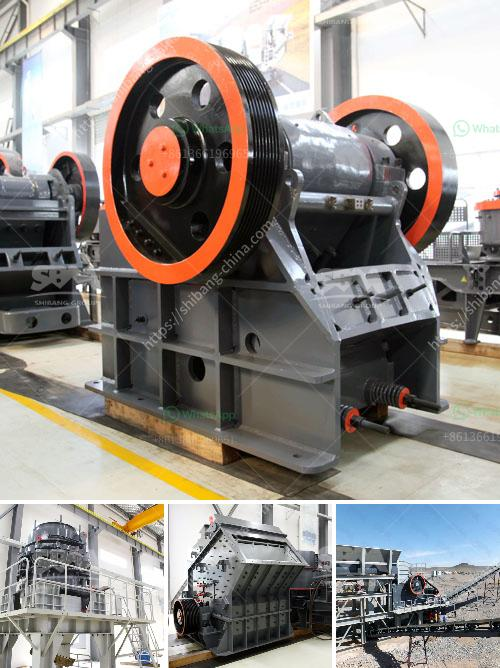

<h3>مطاحن الذهب الصينية للبيع في جنوب أفريقيا</h3>
تعد مطاحن الذهب الصينية في جنوب أفريقيا من أهم الأماكن التي يتواجد بها تعدين الذهب في القارة الأفريقية. فقد ارتفعت قيمة الذهب في السنوات الأخيرة، مما أدى إلى زيادة الاهتمام بتعدينه واستغلاله. وتعد الشركات الصينية من أكبر اللاعبين في هذا القطاع في جنوب أفريقيا.

تنتشر مطاحن الذهب الصينية على طول خط جبال ويتوتراند في جنوب أفريقيا. وتضم هذه المطاحن ورش عمل لتعلية خام الذهب في الطرق المشتركة والقادمة من المناجم القريبة. وبالإضافة إلى ذلك، توفر هذه المطاحن أيضًا خدمات أخرى مثل سبك الذهب وتصنيعه وبيعه.

تتميز مطاحن الذهب الصينية في جنوب أفريقيا بتقنياتها الحديثة والمتطورة، مما يجعلها قادرة على استخلاص أكبر كمية ممكنة من الذهب من خامه. وتستخدم هذه المطاحن أحدث التقنيات مثل طريقة السيانيد وزراعة الذهب لاستخراج الذهب من الصخور.

ويعود سبب انتشار مطاحن الذهب الصينية في جنوب أفريقيا إلى العلاقات التجارية القوية بين الصين وجنوب أفريقيا. فقد استثمرت الشركات الصينية مبالغ هائلة في هذا القطاع وساهمت في تحريك اقتصاد جنوب أفريقيا. وهذا يعزز الاستفادة المتبادلة بين البلدين.

علاوة على ذلك، فإن مطاحن الذهب الصينية تقدم فرص عمل للكثير من السكان المحليين في جنوب أفريقيا. وتعد هذه الصناعة سببًا رئيسيًا لتوظيف الشباب في المناطق القريبة من المطاحن. وبذلك، فإن هذه المطاحن تساهم في تحسين الظروف المعيشية وتقديم فرص للتنمية المستدامة في المناطق النائية.

في الختام، تعد مطاحن الذهب الصينية في جنوب أفريقيا أماكن مهمة لتعدين الذهب وتكريره. فهي توفر وظائف وفرص تنمية مستدامة للمجتمعات المحلية وتساهم في تعزيز العلاقات التجارية بين الصين وجنوب أفريقيا.
<h3>Contact us</h3><ul><li><strong>Whatsapp:&nbsp;<a href="https://wa.me/8613661969651">+8613661969651</a></strong></li><li><a href="https://swt.shibang-china.com/?git&amp;zhl&amp;مطاحن الذهب الصينية للبيع في جنوب أفريقيا"><strong>Online Service(chat now)</strong></a></li></ul><h3>Related</h3><ul><li><a href='تكلفة آلة الكسارة.md'>تكلفة آلة الكسارة</a></li><li><a href='طحن الرمل السيليكا.md'>طحن الرمل السيليكا</a></li><li><a href='مطحنة الأسطوانة مطحنة السميكة.md'>مطحنة الأسطوانة مطحنة السميكة</a></li><li><a href='سعر كسارة الحجر الصلب.md'>سعر كسارة الحجر الصلب</a></li><li><a href='تكلفة أعمال المحجر في الهند.md'>تكلفة أعمال المحجر في الهند</a></li></ul>