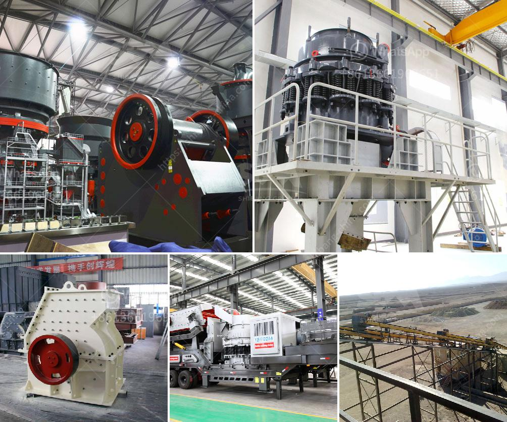

<h3>مطاحن الرمل للتصنيع</h3>
مطاحن الرمل للتصنيع هي الآلات المستخدمة لطحن وتكسير حبيبات الرمل للحصول على الرمال الناعمة المستخدمة في عدة صناعات مختلفة. تعد مطاحن الرمل للتصنيع أدوات أساسية في عملية التصنيع وتشتهر بقدرتها على تقديم رمال عالية الجودة بأحجام وتراكيب مختلفة.

تتكون مطاحن الرمل للتصنيع من وحدة طحن تتكون من عجلة تدور بسرعة عالية وحجر ثابت. تتم عملية التكسير عن طريق ضرب حبيبات الرمل بين هذين الجهازين، مما يؤدي إلى تفتيت الحجارة الكبيرة وطحنها للحجم المطلوب. يتم إدخال الرمل إلى داخل آلة الطحن من خلال مصدر تغذية لضمان توزيع متساوٍ للمواد ومنع التكتل.

تعد مطاحن الرمل للتصنيع ضرورية في صناعة البناء والخرسانة، حيث تستخدم الرمال الناعمة لإعطاء الخرسانة قوة ومتانة أكبر. كما تستخدم في صناعة الزجاج، حيث يتم طحن الرمل للحصول على رمال ناعمة يتم استخدامها في صنع الزجاج. بالإضافة إلى ذلك، تستخدم أيضًا في صناعة المواد الكيميائية والدهانات والمواد الحبيبية الأخرى.

تتميز مطاحن الرمل للتصنيع بعدة مزايا، فهي تعمل بكفاءة عالية وتقدم رمال ناعمة ذات جودة عالية بأحجام محددة. توجد أيضًا مطاحن الرمل للتصنيع المتنقلة التي تسمح بنقل الآلة بسهولة وتشغيلها في مواقع مختلفة.

على الرغم من مزايا مطاحن الرمل للتصنيع، فإنها تتطلب صيانة دورية واهتمام كبير. يجب تنظيف المكونات بانتظام من الرمال المتراكمة لمنع حدوث أي تلف في الجهاز. كما يجب مراقبة سرعة الدوران وتوازن الجهاز لضمان عملية طحن فعالة وآمنة.

باختصار، تعتبر مطاحن الرمل للتصنيع أدوات هامة في عملية التصنيع وتلعب دورًا حاسمًا في عدة صناعات. تقدم الرمال الناعمة عالية الجودة والمتسقة التركيب بأحجام مطلوبة، مما يمنح المنتجات النهائية خواص ميكانيكية ومقاومة عالية. رغم التحديات المحتملة، فإن مطاحن الرمل للتصنيع مهمة للغاية وتستحق قدراً كبيرًا من الاهتمام والتطوير.
<h3>Contact us</h3><ul><li><strong>Whatsapp:&nbsp;<a href="https://wa.me/8613661969651">+8613661969651</a></strong></li><li><a href="https://swt.shibang-china.com/?git&amp;zhl&amp;مطاحن الرمل للتصنيع"><strong>Online Service(chat now)</strong></a></li></ul><h3>Related</h3><ul><li><a href='بيع كسارة الصخور.md'>بيع كسارة الصخور</a></li><li><a href='سعر كسارة الحجر المحمولة في.md'>سعر كسارة الحجر المحمولة في</a></li><li><a href='تكلفة الكسارة المحمولة للساعة الواحدة.md'>تكلفة الكسارة المحمولة للساعة الواحدة</a></li><li><a href='عملية الكرة الطحن.md'>عملية الكرة الطحن</a></li><li><a href='مطاحن المطرقة.md'>مطاحن المطرقة</a></li></ul>