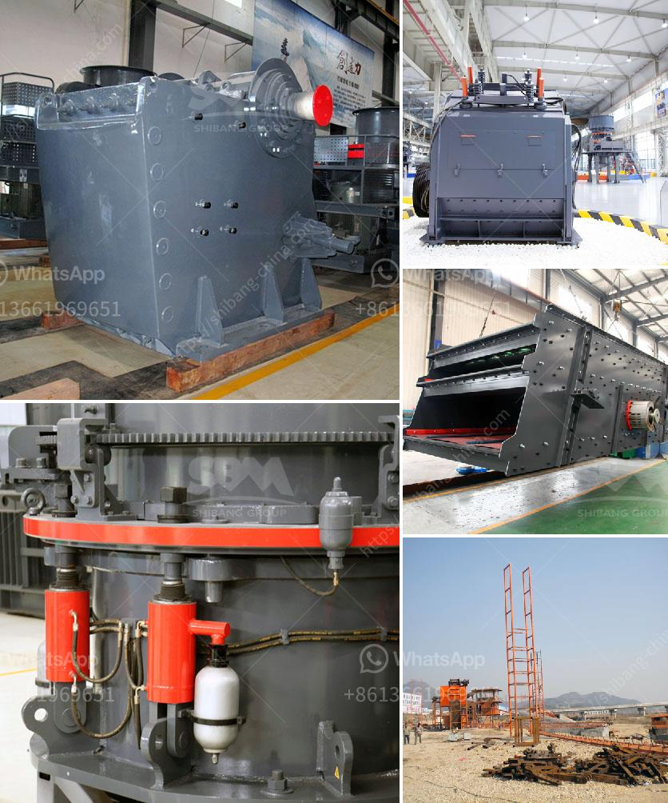

<h3>مطاحن الطحن للبيع في باكستان</h3>
تعتبر صناعة الدقيق من أهم الصناعات في باكستان، فهي تلبي احتياجات السكان للغذاء الأساسي وتساهم في تحسين الأمن الغذائي داخل البلاد. تعد مطاحن الطحن الموجودة في باكستان واحدة من أهم الوحدات الصناعية في هذا القطاع.

تشتهر مطاحن الطحن في باكستان بتوفير مجموعة واسعة من المنتجات الدقيقة، مثل الطحين الأبيض والطحين الكامل، وذلك بفضل العمليات المتقدمة والتكنولوجيا المستخدمة في هذه المطاحن. ومن خلال العمل المستمر والاستثمار في أحدث المعدات والآلات، تتمكن مطاحن الطحن في باكستان من تلبية الطلب المتزايد على المنتجات الدقيقة على مستوى السوق المحلية والعالمية.

تُعد مطاحن الطحن في باكستان فرصة استثمارية مثالية للمستثمرين المهتمين بصناعة الأغذية. فهذه الصناعة لديها إمكانات كبيرة للنمو والتوسع، خاصة مع زيادة الطلب على المنتجات الدقيقة في البلاد. بالإضافة إلى ذلك، فإن الحكومة الباكستانية قدمت العديد من التسهيلات والحوافز للمستثمرين في هذا القطاع، مما يعزز الفرصة للنجاح والاستدامة في هذا المجال.

من بين المزايا الرئيسية لاقتناء مطاحن الطحن في باكستان هي القدرة على تلبية احتياجات السوق المحلية من الدقيق، وذلك يعزز الاكتفاء الذاتي والاستقلالية الاقتصادية للبلاد. بالإضافة إلى ذلك، يمكن بيع المنتجات الزراعية الأساسية مثل القمح والشعير مباشرة إلى المطاحن، مما يساهم في تعزيز عائدات المزارعين وتحسين مستوى دخلهم.

لذلك، يمكن القول بأن مطاحن الطحن المتاحة للبيع في باكستان تعد فرصة استثمارية رائعة للمهتمين بصناعة الأغذية. فهي تلبي احتياجات السوق المحلية للدقيق وتعزز الاكتفاء الذاتي، كما توفر إمكانية التصدير إلى الأسواق العالمية. من الضروري الاستفادة من الدعم والتسهيلات التي تطرحها الحكومة الباكستانية لتعزيز نمو هذا القطاع وتطويره بشكل مستدام.
<h3>Contact us</h3><ul><li><strong>Whatsapp:&nbsp;<a href="https://wa.me/8613661969651">+8613661969651</a></strong></li><li><a href="https://swt.shibang-china.com/?git&amp;zhl&amp;مطاحن الطحن للبيع في باكستان"><strong>Online Service(chat now)</strong></a></li></ul><h3>Related</h3><ul><li><a href='تكلفة آلة الطحن.md'>تكلفة آلة الطحن</a></li><li><a href='آلة سحق الطين.md'>آلة سحق الطين</a></li><li><a href='نموذج 2D لمطحنة الكرة.md'>نموذج 2D لمطحنة الكرة</a></li><li><a href='تبيع شاشات الاهتزاز للحصى والرمل.md'>تبيع شاشات الاهتزاز للحصى والرمل</a></li><li><a href='خط سحق البازلت.md'>خط سحق البازلت</a></li></ul>