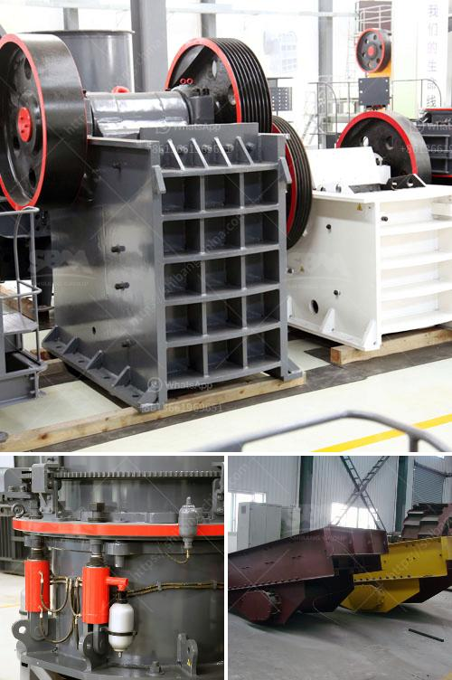

<h3>مطاحن الكرة الأرجنتينية</h3>
تعتبر مطاحن الكرة الأرجنتينية من أبرز وأهم المطاحن في جنوب أمريكا. تمتلك الأرجنتين تاريخًا طويلًا في رياضة كرة القدم وتعد واحدة من الأسواق الرئيسية في عالم كرة القدم.

تأسست أول مطاحن كرة في الأرجنتين في بداية القرن العشرين وازدهرت بشكل سريع. في عام 1930، استضافت الأرجنتين أول بطولة كأس العالم لكرة القدم وحققت نجاحًا كبيرًا في هذه البطولة. منذ ذلك الحين، حصدت المنتخبات الأرجنتينية العديد من البطولات والألقاب على المستوى الدولي، بما في ذلك كأس العالم وبطولة كوبا أمريكا.

تتميز مطاحن الكرة الأرجنتينية بأنها تضم لاعبين موهوبين وذوي مهارات فنية عالية. لاعبو الكرة الأرجنتينيين يعتمدون على التمريرات القصيرة والمراوغة الممتازة للتفوق على خصومهم. كما تشتهر الأرجنتين بإنتاج المهاجمين المميزين الذين يتمتعون بقدرة فردية عالية وفاعلية كبيرة في الهجوم.

معظم مطاحن الكرة الأرجنتينية تمتلك أكاديميات شبابية تهتم بتنمية المواهب الشابة في البلاد. تعتبر أكاديميات الشباب المكونة للمطاحن فرصة هامة لاكتشاف وتطوير المواهب الجديدة وتأهيلها للانضمام للفرق الكبيرة.

بعض المطاحن الأرجنتينية الشهيرة تشمل أندية مثل ريفر بليت وبوكا جونيورز وراسينغ كلوب. تتنافس هذه الأندية في الدوري المحلي الشهير وتلعب مسابقات قارية مثل كأس ليبرتادوريس وكوبا سود أمريكا.

من المهم أيضًا أن نذكر أن للأرجنتين مشجعين شغوفين بالكرة القدم. تمتاز المباريات في الأرجنتين بالجماهير الحماسية والصاخبة التي تشجع الفريق الخاص بها. هذا الشغف الكبير للمشجعين يجعل من مطاحن الكرة الأرجنتينية مكانًا رائعًا للعيش والتنافس.

باختصار، مطاحن الكرة الأرجنتينية تمتلك تاريخًا غنيًا في عالم كرة القدم وتلعب دورًا هامًا في تطوير وتعزيز هذه الرياضة. تمتاز باللاعبين الموهوبين والأكاديميات الشبابية المتخصصة التي تعمل على اكتشاف وتطوير المواهب الجديدة. علاوة على ذلك، تتمتع المطاحن الأرجنتينية بجماهير حماسية تزيد من جاذبيتها كمكان مثالي لممارسة هذه الرياضة.
<h3>Contact us</h3><ul><li><strong>Whatsapp:&nbsp;<a href="https://wa.me/8613661969651">+8613661969651</a></strong></li><li><a href="https://swt.shibang-china.com/?git&amp;zhl&amp;مطاحن الكرة الأرجنتينية"><strong>Online Service(chat now)</strong></a></li></ul><h3>Related</h3><ul><li><a href='مطحنة المطرقة في نيجيريا.md'>مطحنة المطرقة في نيجيريا</a></li><li><a href='مطحنة الكرة لخام الذهب للبيع في زيمبابوي.md'>مطحنة الكرة لخام الذهب للبيع في زيمبابوي</a></li><li><a href='سعر كسارة الفك 24x12.md'>سعر كسارة الفك 24x12</a></li><li><a href='مصنع معالجة الحجر الجيري المحمول.md'>مصنع معالجة الحجر الجيري المحمول</a></li><li><a href='سعر مركز تركيز خام النحاس.md'>سعر مركز تركيز خام النحاس</a></li></ul>