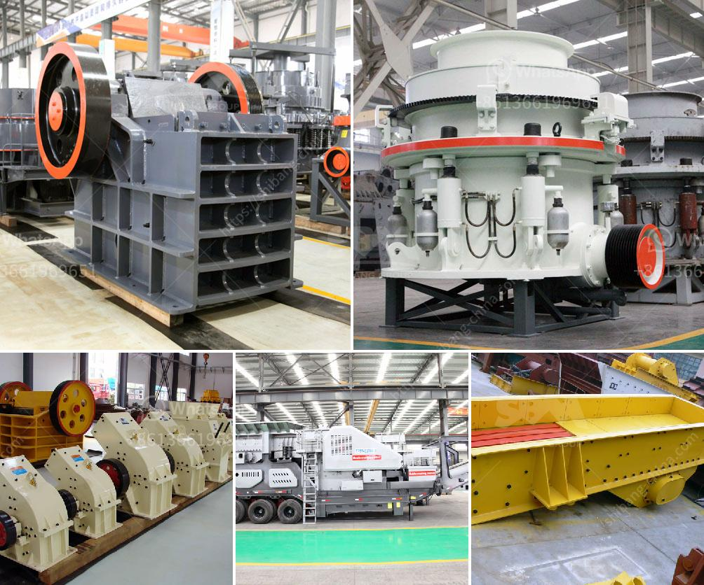

<h3>مطاحن الكرة الاصطناعية الجبس</h3>
توجد العديد من مطاحن الكرة الاصطناعية التي تستخدم في صناعة الجبس. تعتبر هذه المطاحن أدوات فعالة لطحن وتكسير الجبس إلى حجم صغير يمكن استخدامه في عمليات الإنتاج اللاحقة.

تتألف مطاحن الكرة الاصطناعية من حاوية معدنية تحتوي على كرات من الفولاذ أو المواد الأخرى المقاومة للتآكل. يتم وضع الجبس في الحاوية وتدور الكرات بسرعة عالية داخل المطحنة، مما يؤدي إلى تكسير الجبس وطحنه إلى حجم صغير.

تستخدم مطاحن الكرة الاصطناعية الجبس في صناعة البناء والأعمال الانشائية، حيث يتم استخدام الجبس كمادة أساسية لإنتاج الجص والدهانات والملاط. بفضل قدرة مطاحن الكرة الاصطناعية على طحن الجبس بشكل فعال وسريع، يتم الحصول على مواد ذات جودة عالية وخاصة بنسبة الحجم المطلوبة.

يعتبر استخدام مطاحن الكرة الاصطناعية الجبس من الطرق الاقتصادية والفعالة لإعادة تدوير الجبس المستخدم أو المهمل. فعندما يتم تكسير الجبس القديم وطحنه في مطاحن الكرة الاصطناعية، يمكن إعادة استخدامه في عمليات الإنتاج اللاحقة، مما يقلل من التكاليف ويحافظ على الموارد الطبيعية.

بالإضافة إلى ذلك، تلعب مطاحن الكرة الاصطناعية دورًا هامًا في تحسين جودة الجبس وخصائصه الميكانيكية. فعملية طحن الجبس بواسطة هذه المطاحن تقوم بتجزيئه إلى جسيمات صغيرة يمكن أن تندمج بشكل أفضل مع العناصر الأخرى في مواد البناء.

لخلاصة القول، مطاحن الكرة الاصطناعية الجبس تعد أدوات فعالة في صناعة الجبس. بفضل تقنيتها المتقدمة، تساعد في تحسين جودة الجبس المستخدم وتقليل التكاليف الإنتاجية. يمكن استخدام مطاحن الكرة الاصطناعية لإعادة تدوير الجبس المهمل، مما يساهم في المحافظة على البيئة والاستدامة.
<h3>Contact us</h3><ul><li><strong>Whatsapp:&nbsp;<a href="https://wa.me/8613661969651">+8613661969651</a></strong></li><li><a href="https://swt.shibang-china.com/?git&amp;zhl&amp;مطاحن الكرة الاصطناعية الجبس"><strong>Online Service(chat now)</strong></a></li></ul><h3>Related</h3><ul><li><a href='التحكم الهيدروليكي لكسارة الفك.md'>التحكم الهيدروليكي لكسارة الفك</a></li><li><a href='معدات معالجة خام الحديد.md'>معدات معالجة خام الحديد</a></li><li><a href='كسارة الحجر المحمولة.md'>كسارة الحجر المحمولة</a></li><li><a href='آلة تكسير وطحن مناجم الذهب.md'>آلة تكسير وطحن مناجم الذهب</a></li><li><a href='مصنع مطحنة ريموند في الهند.md'>مصنع مطحنة ريموند في الهند</a></li></ul>