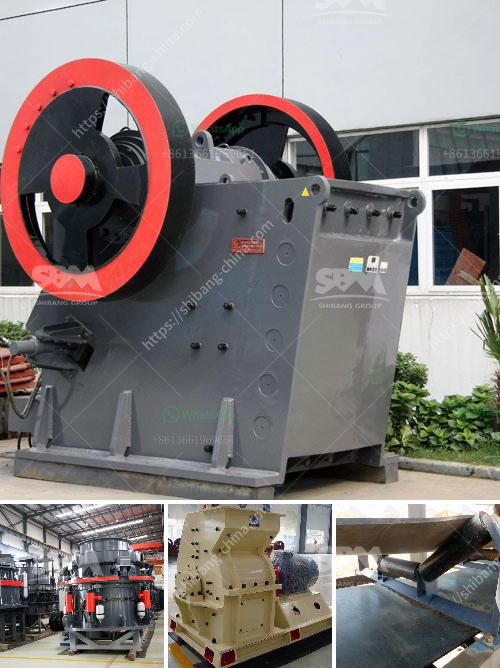

<h3>مطاحن الكرة الفلسبار</h3>
مطاحن الكرة الفلسبار هي آلات تستخدم لطحن مسحوق الفلسبار إلى حجم الجسيمات المطلوب. يعتبر الفلسبار من المواد الخام الهامة في صناعة السيراميك والزجاج والطلاء والدهانات ومواد البناء الأخرى. تلعب مطاحن الكرة الفلسبار دورًا هامًا في عملية تحويل الفلسبار الخام إلى مسحوق قابل للتطبيق.

تتألف مطاحن الكرة الفلسبار عادة من هيكل أسطواني يحتوي على وسائط طحن الكرة الفولاذية والفلسبار الخام. عندما يدور الهيكل ، يتعرض الكرة لقوة الاحتكاك من الفلسبار الخام وتحطمها وطحنها. يتم تفريغ المنتج النهائي من خلال فتحات في الهيكل الأسطواني.

يتم استخدام مطاحن الكرة الفلسبار بشكل واسع في صناعة السيراميك ، حيث يتم طحن الفلسبار الخام لإنتاج مسحوق الفلسبار الدقيق الذي يستخدم في صنع البلاط والصفائح السيراميكية. يعمل الفلسبار على تعزيز خواص المواد السيراميكية مثل المتانة والصلابة ومقاومة التآكل.

كما يستخدم الفلسبار في صناعة الزجاج ، حيث يتم طحنه لإنتاج مسحوق الفلسبار الدقيق لإضافته إلى خليط الزجاج ، مما يعزز شفافية الزجاج وقوته ومقاومته للحرارة والتشوه.

بالإضافة إلى ذلك ، يتم استخدام الفلسبار المطحون في صناعة الدهانات والطلاءات ، حيث يعمل على تحسين اللزوجة والتغطية وسهولة التطبيق.

يتوفر مطحنة الكرة الفلسبار بمختلف الأحجام والقدرات لتلبية متطلبات الإنتاج المختلفة. يعمل العديد من المصانع على تطوير تقنيات جديدة لزيادة كفاءة تحويل الفلسبار إلى مسحوق وتقليل استهلاك الطاقة.

باختصار ، تعتبر مطاحن الكرة الفلسبار أداة أساسية في صناعة السيراميك والزجاج والطلاءات. تساهم في تحسين خصائص هذه المواد وتوفير مسحوق فلسبار عالي الجودة القابل للتطبيق في تلك الصناعات.
<h3>Contact us</h3><ul><li><strong>Whatsapp:&nbsp;<a href="https://wa.me/8613661969651">+8613661969651</a></strong></li><li><a href="https://swt.shibang-china.com/?git&amp;zhl&amp;مطاحن الكرة الفلسبار"><strong>Online Service(chat now)</strong></a></li></ul><h3>Related</h3><ul><li><a href='آلة كسارة الذهب للبيع في جنوب أفريقيا.md'>آلة كسارة الذهب للبيع في جنوب أفريقيا</a></li><li><a href='سير الناقل في زامبيا.md'>سير الناقل في زامبيا</a></li><li><a href='كسارة مخروطية للبيع في جنوب أفريقيا.md'>كسارة مخروطية للبيع في جنوب أفريقيا</a></li><li><a href='آلة حفر الحجر الجرانيت في الهند.md'>آلة حفر الحجر الجرانيت في الهند</a></li><li><a href='علامات الناقل والكسارات في إندونيسيا.md'>علامات الناقل والكسارات في إندونيسيا</a></li></ul>