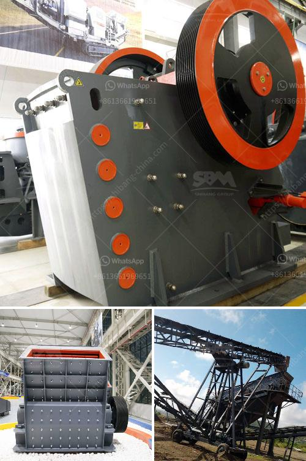

<h3>مطاحن الكرة المتواصلة أو الانقطاعية</h3>
تعتبر مطاحن الكرة المتواصلة أو الانقطاعية آلات حديثة تستخدم في صناعات عديدة مثل صناعة الأسمنت والكيماويات والطاقة والتعدين. تعد هذه المطاحن من الآلات الحاسمة لعمليات الطحن وتكسير المواد الخام بفعالية وكفاءة عالية.

مبدأ عمل مطاحن الكرة المتواصلة أو الانقطاعية بسيط وفعال. تتكون المطحنة من جسم أسطواني يحتوي على كرات صلبة من الفولاذ في الداخل. عند تشغيل المطحنة، يتم تدوير الأسطوانة على محورها الأفقي. يتم تغذية المادة الخام في المطحنة من خلال فتحة التغذية في الجزء العلوي من الأسطوانة. تتحرك الكرات داخل المطحنة بفعل قوة الطرد المركزي التي تتولد بسبب دوران الأسطوانة.

أثناء دوران المطحنة، تتعرض المواد الخام للتكسير والطحن عندما يتفاعل الكرات الصلبة معها. يعتمد حجم وشكل الكرات على الاستخدام المعين للمطحنة، وتتراوح الكرات في الحجم من 20 ملم إلى 125 ملم. تعتمد كفاءة طحن المواد الخام على عدة عوامل مثل سرعة دوران المطحنة وحجم الكرات الصلبة ونوعية المادة الخام.

تتميز مطاحن الكرة المتواصلة بعدة مزايا. أحدها هو قدرتها على طحن المواد الخام بشكل متسق ومتجانس. بفضل حركة المطحنة المستمرة، يتم تحقيق توزيع متساوي للجسيمات المطحونة، مما يزيد من تأثير الطحن ويحسن جودة المنتج النهائي.

بالإضافة إلى ذلك، توفر مطاحن الكرة المتواصلة أيضًا إمكانية ضبط السرعة والمدة الزمنية للطحن، مما يسمح للمشغلين بتحديد الشروط المثلى لعمليات الطحن بناءً على نوع المادة الخام ومتطلبات الإنتاج. هذا يساعد في تحقيق أداء متفوق وخفض التكاليف العملية.

وفي الختام، تعد مطاحن الكرة المتواصلة أو الانقطاعية أدوات أساسية في صناعات متعددة. توفر هذه المطاحن عملية طحن فعالة وسريعة للمواد الخام، مما يساهم في زيادة الإنتاجية وجودة المنتج النهائي. تتطلب استخدام المطاحن الكرة اتباع معايير السلامة والصيانة لضمان عملية سلسة ومستدامة.
<h3>Contact us</h3><ul><li><strong>Whatsapp:&nbsp;<a href="https://wa.me/8613661969651">+8613661969651</a></strong></li><li><a href="https://swt.shibang-china.com/?git&amp;zhl&amp;مطاحن الكرة المتواصلة أو الانقطاعية"><strong>Online Service(chat now)</strong></a></li></ul><h3>Related</h3><ul><li><a href='مصنع غسيل وفرز للتأجير في جنوب أفريقيا.md'>مصنع غسيل وفرز للتأجير في جنوب أفريقيا</a></li><li><a href='مصانع فحص الركام.md'>مصانع فحص الركام</a></li><li><a href='كسارة صناعية.md'>كسارة صناعية</a></li><li><a href='آلة تكبير الفحم الدقيقة في الهند.md'>آلة تكبير الفحم الدقيقة في الهند</a></li><li><a href='وزير التعدين في غانا.md'>وزير التعدين في غانا</a></li></ul>