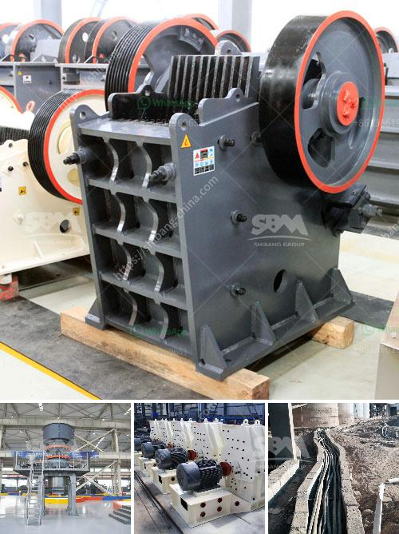

<h3>مطاحن الكرة المستخدمة في بيرو</h3>
تعد مطاحن الكرة أحد التجهيزات الهامة في عملية طحن المواد الصلبة، وتعتبر من التقنيات الأساسية المستخدمة في صناعة الإسمنت والسيراميك والمناجم والتعدين بشكل عام. وتستخدم مطاحن الكرة لسحق المواد بين ثنايا جسم الطحن المستقيم وجسم الطاحونة الدوار. تعتمد طريقة عمل هذه المطاحن على تدوير هذا الجسم الدوار الذي يحتوي على كرات صلبة، وعندما تتعرض المواد الصلبة للطحن للقوى الحاصلة من تأثير الكرات، يتم طحن المواد بحيث يتم تقليل حجمها وتحويلها إلى حبيبات صغيرة ومتجانسة.

في بيرو، تعتبر صناعة التعدين ذات أهمية كبيرة. فهي تعتبر أحد أهم القطاعات الاقتصادية في البلاد وتحظى بتركيز كبير من الاستثمارات. وتحتاج صناعة التعدين إلى استخدام معدات ذات كفاءة عالية لتحقيق أفضل النتائج ودقة في عمليات الطحن.

لذا، تجد في بيرو استخدام مطاحن الكرة بشكل شائع في صناعة التعدين. وتتميز مطاحن الكرة المستخدمة في بيرو بالتكنولوجيا المتقدمة والجودة العالية. حيث تقوم على توفير إعدادات محسّنة للطحن ورفع الكفاءة وتحقيق أداء ممتاز في عملية الطحن.

تستخدم مطاحن الكرة في بيرو أيضًا لطحن المعادن المختلفة مثل النحاس والذهب والزنك والفضة. حيث تسمح هذه المطاحن بالحصول على مسحوق دقيق يستخدم في المراحل اللاحقة من عملية التعدين. ويتم تصميم مطاحن الكرة في بيرو بشكل محكم وقوي للتعامل مع المواد الصلبة والمعادن بشكل فعال وفقًا لاحتياجات العملية.

إن استخدام مطاحن الكرة في بيرو يعتبر أحد أهم العوامل التي تساهم في تحسين عملية التعدين وزيادة الإنتاجية. حيث توفر هذه المطاحن الكفاءة العالية والمرونة في العمل، وتعزز أداء الطحن وتقلل الخسائر والهدر، مما يؤدي إلى توفير المزيد من الوقت والجهد والتكاليف.

باختصار، تعتبر مطاحن الكرة المستخدمة في بيرو ضرورية جداً في صناعة التعدين، حيث تساهم في طحن المواد الصلبة والمعادن بشكل فعال ودقيق. وتتميز بالتكنولوجيا المتقدمة والجودة العالية، مما يساعد على زيادة الإنتاجية وتحسين أداء عملية التعدين.
<h3>Contact us</h3><ul><li><strong>Whatsapp:&nbsp;<a href="https://wa.me/8613661969651">+8613661969651</a></strong></li><li><a href="https://swt.shibang-china.com/?git&amp;zhl&amp;مطاحن الكرة المستخدمة في بيرو"><strong>Online Service(chat now)</strong></a></li></ul><h3>Related</h3><ul><li><a href='مطحنة الكرة للصبغة.md'>مطحنة الكرة للصبغة</a></li><li><a href='مطحق الصخور في الفلبين.md'>مطحق الصخور في الفلبين</a></li><li><a href='أسعار أحزمة الناقل.md'>أسعار أحزمة الناقل</a></li><li><a href='آلة تكسير الفحم.md'>آلة تكسير الفحم</a></li><li><a href='آلات إنتاج الرمل سحق الطحن والفرز.md'>آلات إنتاج الرمل سحق الطحن والفرز</a></li></ul>