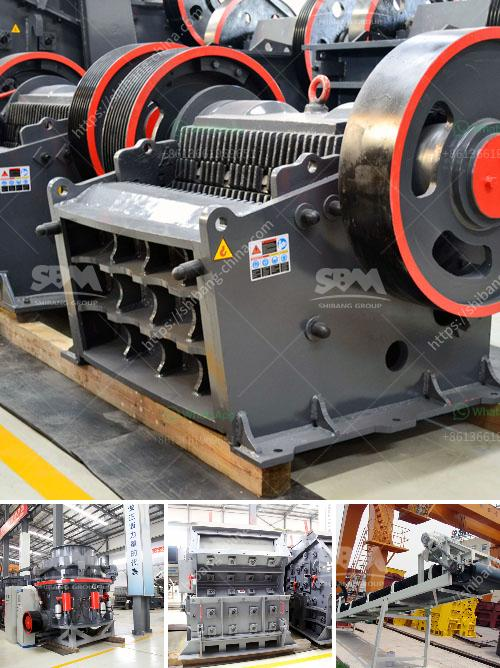

<h3>مطاحن الكرة حديد الصهر الهند</h3>
تعتبر مطاحن الكرة لحديد الصهر واحدة من أهم الآلات المستخدمة في عمليات طحن المواد في صناعة الصلب في الهند. تستخدم هذه المطاحن في طحن الخامات الحديدية إلى حجم الجزيئات المطلوب وتحويلها إلى مسحوق دقيق يستخدم في عمليات التشكيل والصب والتشكيل الحراري والصهر.

تتكون مطاحن الكرة لحديد الصهر عادةً من أسطوانة طويلة مزودة بأجنحة داخلية تساعد في حركة وتحريك الكرات المعدنية الموجودة داخل الأسطوانة. تدور الأسطوانة بفعل حركة دوران الجهاز، بينما تتحرك الكرات المعدنية داخل الأسطوانة وتطحن المادة الخام مع تأثير الصدمة والاحتكاك.

يوجد في الهند العديد من مصنعي مطاحن الكرة لحديد الصهر ذات الجودة الممتازة والتقنية المتقدمة. تتميز هذه المطاحن بأداء قوي وكفاءة عالية في طحن الخامات الحديدية وتحقيق النسبة المطلوبة من الحبيبات المطلوبة. تستند معظم تقنيات التصنيع والتصميم لهذه المطاحن على الخبرة والتحسين المستمر على مر السنين، مما يجعلها تتميز بالاقتصادية والموثوقية.

تستخدم مطاحن الكرة لحديد الصهر في العديد من مجالات صناعة الصلب في الهند. قد يتم استخدامها في تصنيع الحديد الزهر والفولاذ والسبائك المختلفة. لا تقتصر استخداماتها على طحن الخامات فقط، بل يمكن أيضًا استخدامها في طحن المواد الإضافية المستخدمة في صناعة الصلب مثل الأسمنت والكاولين والصلصال والحجر الجيري.

يعكس نجاح وتطور مطاحن الكرة لحديد الصهر في الهند تقدم صناعة الصلب في البلاد. حيث تسعى الهند لتحقيق الاكتفاء الذاتي في إنتاج الصلب وتصديره للعديد من البلدان. تلعب مطاحن الكرة دورًا حيويًا في تلبية متطلبات الإنتاج العالية وضمان جودة المنتجات.

باختصار، تعد مطاحن الكرة لحديد الصهر في الهند أداة أساسية في صناعة الصلب. تتميز بالكفاءة والجودة، وتلعب دورًا هامًا في عمليات طحن وتحويل الخامات الحديدية إلى منتجات جاهزة للتصنيع والاستخدام النهائي. إن تطور هذه المطاحن يعكس تطور وتقدم صناعة الصلب في الهند.
<h3>Contact us</h3><ul><li><strong>Whatsapp:&nbsp;<a href="https://wa.me/8613661969651">+8613661969651</a></strong></li><li><a href="https://swt.shibang-china.com/?git&amp;zhl&amp;مطاحن الكرة حديد الصهر الهند"><strong>Online Service(chat now)</strong></a></li></ul><h3>Related</h3><ul><li><a href='مصانع VSI في الإمارات.md'>مصانع VSI في الإمارات</a></li><li><a href='تصميم مصنع تكسير وتخطيطه.md'>تصميم مصنع تكسير وتخطيطه</a></li><li><a href='تعدين الجبس والكروم والحجر الجيري.md'>تعدين الجبس والكروم والحجر الجيري</a></li><li><a href='كسارة حجر محمولة من تايوان.md'>كسارة حجر محمولة من تايوان</a></li><li><a href='معدات معالجة خام الحديد.md'>معدات معالجة خام الحديد</a></li></ul>