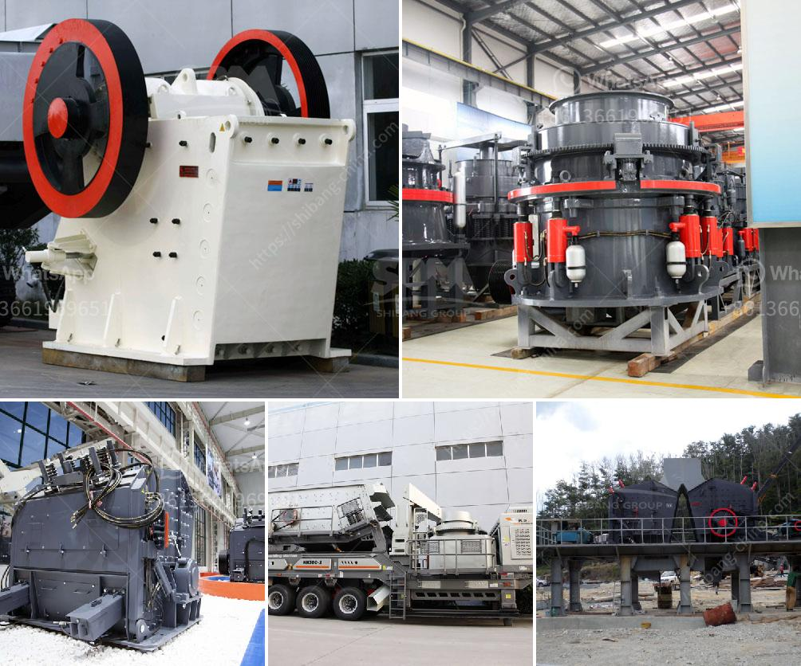

<h3>مطاحن الكرة في إندونيسيا</h3>
مطاحن الكرة في إندونيسيا: تقنية مبتكرة تساهم في تطوير صناعة التعدين

تعتبر إندونيسيا واحدة من أكبر الدول المنتجة للمعادن في العالم، حيث تمتلك احتياطيات هائلة من المعادن الثمينة مثل النحاس والذهب والفضة والرصاص والزنك. ومن أجل استخراج وتكرير هذه المعادن بكفاءة أعلى وتحقيق أقصى استفادة منها، تلعب مطاحن الكرة دورًا حيويًا في هذه العملية.

تعمل مطاحن الكرة على طحن المواد الخام المعدنية الصلبة وتحويلها إلى مسحوق ناعم، وذلك باستخدام كرات معدنية كبيرة داخل أسطوانة دوارة. يتم تشغيل المطاحن الكرة عن طريق المحرك الكهربائي، وتعتمد سرعة الدوران على نوعية المعدن المهدرج وطاقته.

تعتبر مطاحن الكرة في إندونيسيا متطورة تقنيًا، فهي مصممة للتعامل مع العديد من المعادن المختلفة وتحقيق درجات نقاوة عالية في الناتج النهائي. تستخدم هذه المطاحن أحدث التقنيات في صناعة المعادن مثل تقنية الحسابات المؤقتة ونظام الضغط العالي، مما يساهم في زيادة كفاءة الإنتاج وتقليل التلوث البيئي.

بالإضافة إلى ذلك، تعتبر مطاحن الكرة في إندونيسيا قابلة للتخصيص حسب الاحتياجات الخاصة بكل مشروع تعدين. فهي تأتي بأحجام وقدرات مختلفة لتستوعب مختلف كميات المواد الخام. كما يمكن تعديل إعدادات المطحنة بسهولة لتحقيق النتائج المطلوبة.

تساهم مطاحن الكرة في تحسين صناعة التعدين في إندونيسيا على عدة جوانب. ففي المقام الأول، تزيد من كفاءة استخراج المعادن وتعزز طاقة الإنتاج، مما يؤدي إلى زيادة الإنتاجية وتحقيق أرباح أعلى للشركات التعدينية. وبفضل تطور التقنيات المستخدمة في هذه المطاحن، يتم تقليل استهلاك الطاقة والمياه والمواد الكيميائية، وبالتالي يكون لها تأثير إيجابي على البيئة.

علاوة على ذلك، فإن مطاحن الكرة تتميز بأنها آمنة وسهلة الصيانة، مما يقلل من توقف الإنتاج ويحسن استدامة العمليات التعدينية. وبفضل توافر قطع الغيار والفنيين المهرة في المناطق المجاورة، يمكن إجراء الصيانة وإصلاح المعدات بسرعة وفعالية.

باختصار، تعتبر مطاحن الكرة في إندونيسيا جزءًا حاسمًا في عمليات التعدين وتكرير المعادن. توفر هذه التقنية المبتكرة فرصًا لزيادة الإنتاجية وتحسين الكفاءة وتقليل التأثير البيئي للصناعة التعدينية. وبفضل تطورها التقني المستمر، ستظل مطاحن الكرة في إندونيسيا جزءًا أساسيًا في تطور صناعة التعدين في البلاد.
<h3>Contact us</h3><ul><li><strong>Whatsapp:&nbsp;<a href="https://wa.me/8613661969651">+8613661969651</a></strong></li><li><a href="https://swt.shibang-china.com/?git&amp;zhl&amp;مطاحن الكرة في إندونيسيا"><strong>Online Service(chat now)</strong></a></li></ul><h3>Related</h3><ul><li><a href='كسارة فكية صغيرة في المملكة المتحدة.md'>كسارة فكية صغيرة في المملكة المتحدة</a></li><li><a href='الرمل المصنع مقابل الرمل الطبيعي.md'>الرمل المصنع مقابل الرمل الطبيعي</a></li><li><a href='معدات لتركيز خام الذهب.md'>معدات لتركيز خام الذهب</a></li><li><a href='شركات المحاجر في بوكواس وأماسامان.md'>شركات المحاجر في بوكواس وأماسامان</a></li><li><a href='سعر كسارة الهامر للطن الواحد في الساعة.md'>سعر كسارة الهامر للطن الواحد في الساعة</a></li></ul>