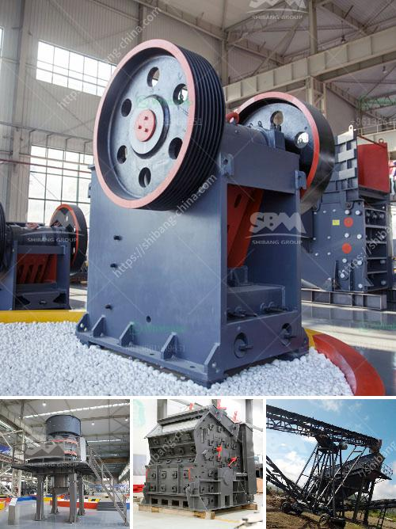

<h3>مطاحن الكرة في جنوب أفريقيا</h3>
تعتبر مطاحن الكرة في جنوب أفريقيا من أهم الصناعات التي تعزز اقتصاد البلاد وتساهم في تطويرها. تأسست أول مطاحن الكرة في جنوب أفريقيا في أواخر القرن التاسع عشر، ومنذ ذلك الحين تطورت هذه الصناعة وأصبحت من أكبر المصادر لتصنيع واستخدام الكرات المعدنية في جميع أنحاء العالم.

تعتمد مطاحن الكرة على استخدام الكرات المعدنية المصنوعة من مواد مثل الصلب أو الحديد لطحن المواد الخام. تستخدم هذه الكرات في الصناعات المختلفة مثل الأسمنت والتعدين والسيراميك والزجاج والصناعات الكيميائية الأخرى. وتعمل هذه الكرات عندما تدور في داخل مطحنة الكرة، حيث يتم سحق المواد الخام وطحنها إلى حجم صغير.

تتمتع جنوب أفريقيا بمصادر غنية من المعادن النفيسة مثل الذهب والماس والبلاتين، مما يجعلها مركزًا عالميًا في صناعة التعدين. وبالتالي، يعتبر تطوير مطاحن الكرة في جنوب أفريقيا ضرورة حتمية للاستفادة القصوى من هذه الموارد الثمينة.

تحتل مطاحن الكرة في جنوب أفريقيا مكانة بارزة في صناعة التعدين. وتتميز هذه المطاحن بتقنياتها المتطورة وجودة المواد التي تستخدم في صناعتها. وتشمل بعض التقنيات الحديثة التي يتم استخدامها في مطاحن الكرة استخدام الأنظمة الهيدروليكية والمحامل المتطورة والتحكم المؤتمت. كما يتم تصميم هذه المطاحن بطرق تسهل عملية الصيانة وتقلل من التكلفة العامة للإنتاج.

تعد مطاحن الكرة في جنوب أفريقيا مصدر رزق للعديد من العمال في البلاد، حيث يعمل العديد من الأشخاص في مصانع تصنيع هذه المطاحن والشركات المتعاقدة معها. كما تساهم هذه الصناعة أيضًا في تعزيز الاستثمارات الأجنبية المباشرة في جنوب أفريقيا، مما يعزز التنمية الاقتصادية ويخلق فرص عمل جديدة.

بالإضافة إلى ذلك، تعمل مطاحن الكرة في جنوب أفريقيا على تحسين الجودة والكفاءة في صناعات أخرى مثل صناعة الأسمنت والسيراميك. وتساعد في تطوير عمليات إنتاج هذه الصناعات وتقليل التكلفة الإجمالية للإنتاج، مما يساهم في تعزيز الصادرات وتحسين المنافسية على المستوى العالمي.

لخلاصة القول، تعتبر مطاحن الكرة في جنوب أفريقيا صناعة حيوية وحاسمة تعزز الاقتصاد المحلي وتدعم التنمية الصناعية. وبفضل التقنيات المتطورة وجودة المواد المستخدمة، تعد هذه الصناعة ذات مستقبل واعد وتحظى بالاهتمام الكبير من الشركات المصنعة والمستخدمة في العالم.
<h3>Contact us</h3><ul><li><strong>Whatsapp:&nbsp;<a href="https://wa.me/8613661969651">+8613661969651</a></strong></li><li><a href="https://swt.shibang-china.com/?git&amp;zhl&amp;مطاحن الكرة في جنوب أفريقيا"><strong>Online Service(chat now)</strong></a></li></ul><h3>Related</h3><ul><li><a href='تجار الكسارات المحمولة في جنوب أفريقيا.md'>تجار الكسارات المحمولة في جنوب أفريقيا</a></li><li><a href='طاحونة الكرة 800 طن يومياً.md'>طاحونة الكرة 800 طن يومياً</a></li><li><a href='شركة معدات البناء.md'>شركة معدات البناء</a></li><li><a href='مطحق الصخور في الفلبين.md'>مطحق الصخور في الفلبين</a></li><li><a href='كسارة حجر في المملكة المتحدة.md'>كسارة حجر في المملكة المتحدة</a></li></ul>