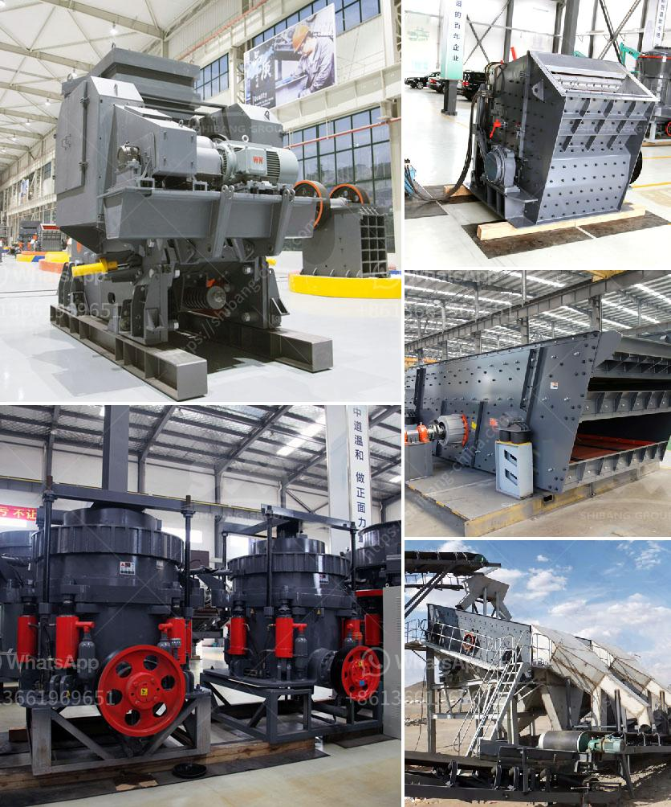

<h3>مطاحن الكرة في زابوبان</h3>
تُعتبر زامبيا واحدة من الدول الأفريقية الهامة في صناعة التعدين، حيث تمتلك العديد من الموارد الطبيعية الثمينة مثل النحاس والزنك والرصاص والألمنيوم. وتعتبر مطاحن الكرة من أدوات التكسير الهامة في عملية استخراج الخامات الصناعية المختلفة.

تعد مطاحن الكرة أجزاء أساسية في عملية تكسير المواد، حيث يتم استخدامها لسحق المواد إلى قطع أصغر في حجم محدد. وتعتبر زامبيا من أكبر المنتجين للمعادن في العالم، خاصة النحاس، حيث تستخدم مطاحن الكرة في تكسير الخام وطحنه لاستخراج المعادن المرغوبة.

تتمتع مطاحن الكرة في زامبيا بتكنولوجيا متقدمة وأداء رائع. حيث تتكون هذه المطاحن من أسطوانة تدور باستمرار، وتحتوي على كرات معدنية مصنوعة من الكروم أو الفولاذ. يتم تحميل المواد في هذه الأسطوانة مع الكرات المعدنية، وثم يتم تشغيل المطحنة لتكسير وطحن المواد المحملة داخلها.

توجد العديد من المطاحن في زامبيا، وخاصة في مناجم النحاس الكبرى مثل منجم كوبالا في مدينة ندولا. يتم استخدام هذه المطاحن لطحن الخامات في منجم كوبالا، حيث يتم استخراج النحاس والكوبالت والزنك والفضة من الخامات المكسورة. وتعد هذه المطاحن أحد العوامل الرئيسية التي تسهم في تحقيق الإنتاجية العالية للمعادن في زامبيا.

تُسهم مطاحن الكرة في زامبيا في تحقيق العديد من الفوائد الاقتصادية والاجتماعية. فعلى المستوى الاقتصادي، تعتبر صناعة التعدين واحدة من القطاعات الرئيسية في زامبيا والتي تساهم بشكل كبير في الناتج المحلي الإجمالي للبلاد. وتوفر هذه الصناعة فرص عمل للعديد من السكان المحليين وتعزز التنمية الاقتصادية للمنطقة.

من الناحية الاجتماعية، تؤدي مطاحن الكرة في زامبيا إلى توفير العديد من فرص العمل المحلية، وبالتالي تقليل مستوى البطالة والفقر في المنطقة. كما يتم استثمار أرباح صناعة التعدين وتكسير المواد في تحسين البنية التحتية للبلاد وتوفير الخدمات العامة مثل الطرق والمدارس والمستشفيات.

تعتبر مطاحن الكرة في زامبيا جزءًا أساسيًا من صناعة التعدين في البلاد ولها أثر كبير على الاقتصاد المحلي والتنمية الاجتماعية. ومع استمرار نمو قطاع التعدين في زامبيا، من المتوقع أن يزداد الاعتماد على مطاحن الكرة في عملية استخلاص المعادن وتكسير الخامات في المستقبل.
<h3>Contact us</h3><ul><li><strong>Whatsapp:&nbsp;<a href="https://wa.me/8613661969651">+8613661969651</a></strong></li><li><a href="https://swt.shibang-china.com/?git&amp;zhl&amp;مطاحن الكرة في زابوبان"><strong>Online Service(chat now)</strong></a></li></ul><h3>Related</h3><ul><li><a href='آلة كسارة الحجر.md'>آلة كسارة الحجر</a></li><li><a href='آلة تعدين الكسارة.md'>آلة تعدين الكسارة</a></li><li><a href='أسعار معدات المحجر.md'>أسعار معدات المحجر</a></li><li><a href='بائع معدات الطحن.md'>بائع معدات الطحن</a></li><li><a href='كسارة حجر البلاد في الهند.md'>كسارة حجر البلاد في الهند</a></li></ul>