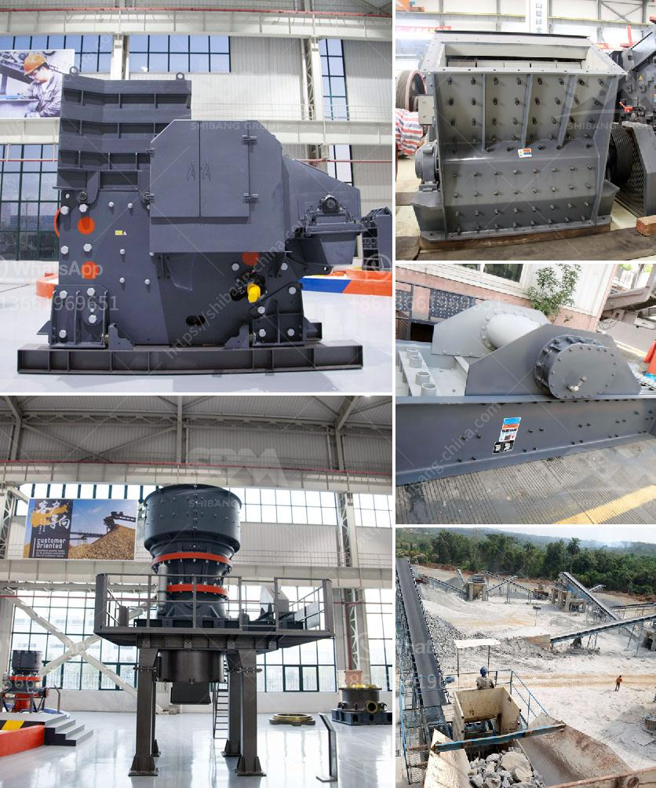

<h3>مطاحن الكرة في ماليزيا</h3>
تعد ماليزيا واحدة من أهم دول جنوب شرق آسيا التي تحقق تقدماً صناعياً رائعاً في السنوات الأخيرة. واحدة من الصناعات التي تقدم نمو مستدام في ماليزيا هي صناعة معالجة المواد الخام، و خاصة تلك التي تتطلب طحن الألغام والمواد الصلبة الأخرى.

يستخدم في ماليزيا العديد من أنواع معدات الطحن في صناعة المواد الصلبة، ومن بين تلك المعدات الحديثة، تستعمل مطاحن الكرة بشكل واسع. تعتبر مطاحن الكرة من الأجهزة الهندسية التي تعمل على طحن المواد الصلبة باستخدام كرات فولاذية خاصة.

تعمل تلك المطاحن على طريقة الاحتكاك والاستنزاف، حيث يتم وضع المادة الخام داخل الجهاز ومع الحركة الدورانية للكرات الفولاذية، تتم عملية الطحن تدريجياً حتى تصبح الجسيمات أصغر حجماً. تعتبر مطاحن الكرة فعالة وكفؤة في طحن المواد الصلبة وتحويلها إلى مسحوق، مما يتيح استخدامها في العديد من الصناعات مثل الأسمنت والكيماويات والطاقة الكهربائية والزجاج والبلاستيك والسيراميك وغيرها.

تتميز مطاحن الكرة في ماليزيا بالعديد من المميزات، مثل الأداء العالي والكفاءة الصناعية العالية، وكذلك الاستهلاك المنخفض للطاقة. بالإضافة إلى ذلك، فإن تصميم تلك المطاحن يعتمد على تقنية حديثة تضمن التحكم الدقيق في حجم الجسيمات المطحونة. تعمل مطاحن الكرة أيضًا على توفير طاقة التشغيل والتكاليف، مما يجعلها خيارًا مثاليًا لصناعات المعالجة في ماليزيا.

ومن جانب آخر، تلعب مصانع المطاحن الكبيرة في ماليزيا دورًا مهمًا في توليد فرص العمل وزيادة النمو الاقتصادي. فبفضل الطلب المرتفع على خدمات مطاحن الكرة، يتم توفير فرص عمل للعديد من العمال والفنيين، كما يشجع ذلك أيضًا على تدفق الاستثمارات في صناعة المعالجة في ماليزيا.

بالنظر إلى استدامة نمو الاقتصاد في ماليزيا وتطور صناعة المعالجة، من المرجح أن تشهد صناعة مطاحن الكرة ازدهارًا مستمرًا في المستقبل. وبفضل تقنيات الطحن الحديثة والمعدات العالية الجودة، ستستمر مطاحن الكرة في ماليزيا في تلبية الاحتياجات المتزايدة للصناعات المختلفة وتعزيز التنمية الصناعية في البلاد.

لختام المقال، يمكن القول إن مطاحن الكرة في ماليزيا تعتبر أحدث التكنولوجيا وأفضل الممارسات الصناعية لمعالجة المواد الصلبة. ومع استمرار تطور صناعة المعالجة في البلاد، من المتوقع أن تلعب مطاحن الكرة دورًا مهمًا في تعزيز التنمية الاقتصادية وتحسين جودة الحياة في ماليزيا.

- Ravichandran V, Maniam D. Fine Refining Ball Mill . Journal of Applied Sciences Research. 2011;7(1):55-59.

- Mohanta K, Mahanta K. Grinding in Ball Mills: Modeling and Process Control . Cybernetics and Information Technologies. 2012;12(2):21-31.
<h3>Contact us</h3><ul><li><strong>Whatsapp:&nbsp;<a href="https://wa.me/8613661969651">+8613661969651</a></strong></li><li><a href="https://swt.shibang-china.com/?git&amp;zhl&amp;مطاحن الكرة في ماليزيا"><strong>Online Service(chat now)</strong></a></li></ul><h3>Related</h3><ul><li><a href='كسارة حجر مستعملة في أونتاريو.md'>كسارة حجر مستعملة في أونتاريو</a></li><li><a href='مطحنة أسمنت صغيرة مستعملة في الإمارات.md'>مطحنة أسمنت صغيرة مستعملة في الإمارات</a></li><li><a href='آلة طحن الطين الصيني.md'>آلة طحن الطين الصيني</a></li><li><a href='طحن الفلدسبار بواسطة مطحنة الكرة في الفلبين.md'>طحن الفلدسبار بواسطة مطحنة الكرة في الفلبين</a></li><li><a href='سعة كسارة الحجر.md'>سعة كسارة الحجر</a></li></ul>