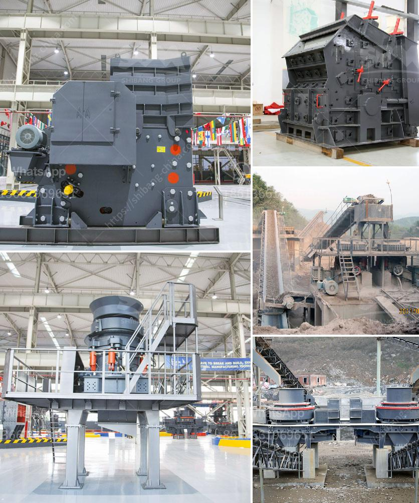

<h3>مطاحن الكرة لتعدين ٦ × ٦</h3>
تُستخدم مطاحن الكرة في صناعة التعدين لطحن المواد الخام وتكسيرها. وتعتبر مطاحن الكرة ضرورية جدًا في عمليات التعدين نظرًا للفوائد والتحسينات التي تقدمها فيما يتعلق بعملية استخلاص المعادن والتجهيز.

تتكون مطاحن الكرة لتعدين ٦ × ٦ من دوران اسطوانة كبيرة الحجم تحتوي على كرات صلبة من الفولاذ. تعمل هذه الكرات على طحن المواد الخام عن طريق الاحتكاك والتصادم مع جدران اسطوانة المطحنة وبعضها البعض. وبتحريك المطحنة، تتمكن الكرات من سحق المواد الخام وتكسيرها إلى حجم أصغر يمكنه تمريره من خلال الفتحات المصممة بداخل المطحنة.

توفر مطاحن الكرة عدة مزايا لعمليات التعدين. أحد هذه المزايا هو قدرتها على طحن المعادن بكفاءة عالية. يحدث ذلك بسبب المرونة الكبيرة لمطاحن الكرة فيما يتعلق بقدرتها على التعامل مع مجموعة متنوعة من المواد الخام، بدءًا من الصخور الصلبة إلى المعادن الناعمة. بالإضافة إلى ذلك، فإن الحجم الصغير للحبيبات التي تتمتّع بها المطاحن يمكن أن يزيد من كفاءة استخلاص المعادن وتحسينها.

علاوة على ذلك، توفر مطاحن الكرة أيضًا توزيعًا متساويًا للحبيبات المختلفة، وبالتالي تسمح بتحقيق النتائج المثلى في عملية استخلاص المعادن. الجزء الداخلي لمطحنة الكرة يحتوي على قضبان وشرائح تعمل على توزيع الشحنة بشكل متساوٍ، وبالتالي تقليل حدة التكتل وتوفير تحسين في عملية الفصل للمعادن.

يُذكر أن مطاحن الكرة لتعدين ٦ × ٦ يتم تصنيعها وتطويرها باستخدام أحدث التقنيات والمواد العالية الجودة. تتوفر هذه المطاحن بحجم مختلف مما يسمح للتعدين بتحقيق أداء مثالي وفعالية كبيرة في عمليات تكسير واستخلاص المعادن.

في النهاية، تُعد مطاحن الكرة لتعدين ٦ × ٦ أداة حيوية في صناعة التعدين. تمتاز هذه المطاحن بقدرتها على طحن المواد الخام بكفاءة عالية، وتوفير توزيع متساوي للحبيبات المختلفة، مما يحسن عمليات الاستخلاص والتجهيز للمعادن. وبفضل الابتكارات التي تحدث في تصميم وتطوير هذه المطاحن، يوجد العديد من النماذج المتاحة في السوق التي تلبي احتياجات التعدين المختلفة بفعالية وكفاءة عالية.
<h3>Contact us</h3><ul><li><strong>Whatsapp:&nbsp;<a href="https://wa.me/8613661969651">+8613661969651</a></strong></li><li><a href="https://swt.shibang-china.com/?git&amp;zhl&amp;مطاحن الكرة لتعدين ٦ × ٦"><strong>Online Service(chat now)</strong></a></li></ul><h3>Related</h3><ul><li><a href='سعر كسارة الفك المحمولة.md'>سعر كسارة الفك المحمولة</a></li><li><a href='تقرير المشروع على كسارة الخرسانة pdf.md'>تقرير المشروع على كسارة الخرسانة pdf</a></li><li><a href='طحن الكرة الصين.md'>طحن الكرة الصين</a></li><li><a href='تكلفة كسارة الأسطوانة.md'>تكلفة كسارة الأسطوانة</a></li><li><a href='محطة سحق ثابتة بسعة 200 طن في الساعة.md'>محطة سحق ثابتة بسعة 200 طن في الساعة</a></li></ul>