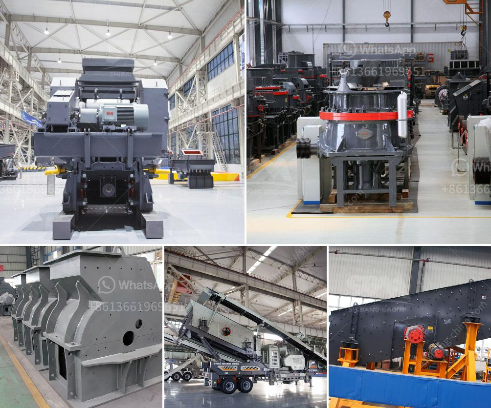

<h3>مطاحن الكرة للأسمنت</h3>
تعد مطاحن الكرة أحدث التكنولوجيا في صناعة الأسمنت. تستخدم هذه المطاحن لطحن المواد الخام وتحويلها إلى مسحوق ناعم يستخدم في صنع الأسمنت.

تتكون مطاحن الكرة من أسطوانة طويلة تحتوي على مادة الطحن مع كرات صلبة في الداخل. عندما يتم تشغيل المطحنة، تدور الأسطوانة حول محورها. تتحرك الكرات داخل المطحنة بفعل الجاذبية وقوى الاحتكاك، مما يؤدي إلى طحن المواد الخام.

تحقق مطاحن الكرة من العديد من المزايا في صناعة الأسمنت. أحد هذه الفوائد هو قدرتها على طحن مواد خام متنوعة. مع اختلاف تركيبة الخام المستخدمة في صناعة الأسمنت، يمكن لمطاحن الكرة أن تتعامل مع مجموعة متنوعة من المواد بكفاءة عالية.

بالإضافة إلى ذلك، توفر مطاحن الكرة أداءًا ممتازًا في عملية الطحن. يمكن لهذه المطاحن أن تطحن المواد الخام إلى حجم جسيمات صغيرة بسرعة عالية، مما يسهل عملية الاختلاط والتفاعل الكيميائي في صنع الأسمنت.

بالإضافة إلى ذلك، تتميز مطاحن الكرة بكفاءة استهلاك الطاقة العالية. بفضل التكنولوجيا المتقدمة المستخدمة في هذه المطاحن، يتم استخدام الطاقة بكفاءة عالية للحصول على أداء ممتاز في عملية الطحن.

ومن الجدير بالذكر أن الصيانة الدورية والتشغيل السليم لمطاحن الكرة يسهمان في ضمان استدامة أدائها. يجب على الشركات المصنعة والعاملين على هذه المطاحن مراقبة عملها وصيانتها بانتظام لضمان عملية طحن فعالة ومستدامة.

بشكل عام، تعتبر مطاحن الكرة أداة حاسمة في صناعة الأسمنت. تساهم في تحقيق عملية طحن فعالة للمواد الخام، مما يؤدي إلى إنتاج أسمنت عالي الجودة. تمتاز أيضًا بالقدرة على التعامل مع مجموعة واسعة من المواد الخام. علاوة على ذلك، فإن كفاءة استهلاك الطاقة لمطاحن الكرة تعد ميزة إضافية تساهم في تحقيق الاستدامة والكفاءة في صناعة الأسمنت.
<h3>Contact us</h3><ul><li><strong>Whatsapp:&nbsp;<a href="https://wa.me/8613661969651">+8613661969651</a></strong></li><li><a href="https://swt.shibang-china.com/?git&amp;zhl&amp;مطاحن الكرة للأسمنت"><strong>Online Service(chat now)</strong></a></li></ul><h3>Related</h3><ul><li><a href='أنظمة التحكم في كسارة الحجر المحمولة.md'>أنظمة التحكم في كسارة الحجر المحمولة</a></li><li><a href='آلات كسارة للبيع.md'>آلات كسارة للبيع</a></li><li><a href='سعر آلة طحن الحجر الرخامي والجرانيت.md'>سعر آلة طحن الحجر الرخامي والجرانيت</a></li><li><a href='قائمة أسعار مصنع التكسير.md'>قائمة أسعار مصنع التكسير</a></li><li><a href='مصنع كسارة الحصى الجرانيت.md'>مصنع كسارة الحصى الجرانيت</a></li></ul>