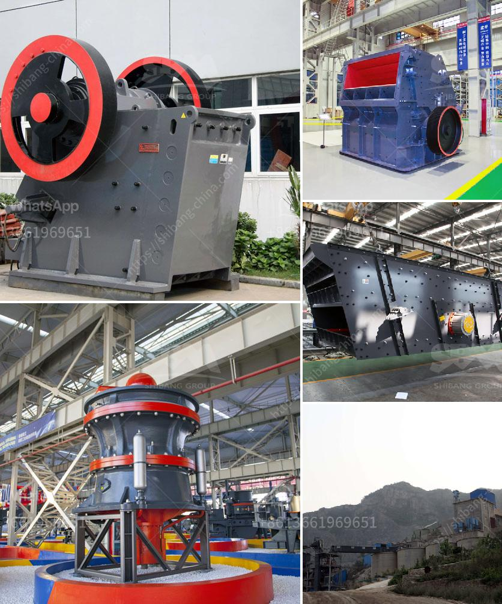

<h3>مطاحن الكرة للبيع في زيمبابوي</h3>
مطاحن الكرة هي أجهزة تستخدم في عملية طحن المواد الخام بطريقة فعالة وفعالة. تعتبر هذه المطاحن أداة أساسية في صناعات مثل التعدين والبناء والمعادن والكيماويات. في زيمبابوي، يوجد العديد من مطاحن الكرة المتاحة للبيع التي تتمتع بجودة عالية وتتوفر بأسعار تتراوح بين 200 و 400 دولار.

إحدى الشركات المعروفة في زيمبابوي لبيع المطاحن الكرة هي شركة زيمبابوي للتعدين والصناعة. تعمل هذه الشركة منذ سنوات عديدة في مجال توفير معدات التعدين والصناعة للعملاء في زيمبابوي والمناطق المحيطة. تقدم الشركة مطاحن الكرة ذات الجودة العالية التي تتميز بالمتانة والكفاءة.

تعتمد مطاحن الكرة على طريقة الطحن بالاحتكاك، حيث تقوم الكرات المعدنية بطحن المواد الخام بواسطة الاحتكاك المتكرر داخل الجهاز. وبفضل الحركة الدورانية للجهاز، يتم ضمان توزيع أفضل للمواد الخام وتحقيق أعلى كفاءة في عملية الطحن.

تتميز مطاحن الكرة التي تعرضها شركة زيمبابوي للتعدين والصناعة بالعديد من الميزات. فهي مصممة بطريقة فريدة لتتحمل الاستخدام الشاق في بيئات التعدين. تحتوي هذه المطاحن على محركات قوية تساهم في تشغيلها بكفاءة عالية. بالإضافة إلى ذلك، فإن هذه المطاحن تتميز بتصميم مضغوط يساعد على توفير مساحة في المصنع أو الموقع.

تعتبر زيمبابوي واحدة من أكبر منتجي الزراعة في القارة الأفريقية، وبالتالي فإن صناعة مطاحن الكرة لها تأثير كبير على الاقتصاد المحلي. فهي تعزز قدرة الزيمبابوي على تجهيز الحبوب وتحويلها إلى منتجات قيمة مثل الدقيق والعجينة والزيوت. بالإضافة إلى ذلك، توفر مطاحن الكرة فرص عمل للعديد من السكان المحليين، مما يساهم في تعزيز الاقتصاد وتحسين مستوى المعيشة.

باختصار، تعتبر مطاحن الكرة المتاحة للبيع في زيمبابوي أدوات أساسية للصناعات المختلفة، وهي توفر بأسعار معقولة وجودة عالية. إن توفر هذه المعدات يساهم في دعم الاقتصاد المحلي وتوفير فرص عمل، مما يعزز التنمية الاقتصادية والاجتماعية في البلاد.
<h3>Contact us</h3><ul><li><strong>Whatsapp:&nbsp;<a href="https://wa.me/8613661969651">+8613661969651</a></strong></li><li><a href="https://swt.shibang-china.com/?git&amp;zhl&amp;مطاحن الكرة للبيع في زيمبابوي"><strong>Online Service(chat now)</strong></a></li></ul><h3>Related</h3><ul><li><a href='نموذج لآلة التكسير.md'>نموذج لآلة التكسير</a></li><li><a href='معالجة الحجر الجيري في نيجيريا.md'>معالجة الحجر الجيري في نيجيريا</a></li><li><a href='تصميم وتخطيط محطة تكسير الحجارة pdf.md'>تصميم وتخطيط محطة تكسير الحجارة pdf</a></li><li><a href='مصنع تكسير الصدم.md'>مصنع تكسير الصدم</a></li><li><a href='معدات إنتاج الأسمنت في ألمانيا.md'>معدات إنتاج الأسمنت في ألمانيا</a></li></ul>