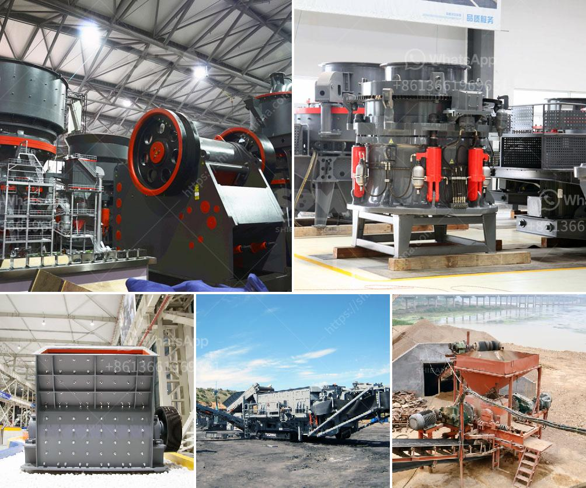

<h3>مطاحن الكرة للبيع في كندا</h3>
تعتبر مطاحن الكرة من أهم الأجهزة المستخدمة في صناعة التعدين وتكسير المواد. وتتواجد العديد من مطاحن الكرة المتاحة للبيع في كندا، حيث توجد تشكيلة واسعة ومتنوعة منها بين المطاحن المستعملة والجديدة.

مثل أي آلة أو معدة، يجب أن ننظر إلى مجموعة من العوامل عند البحث عن مطحنة الكرة المثلى للاستخدام. ومن بين هذه العوامل، يأتي الطاقة والسعة والأداء وتكلفة الصيانة وتكلفة التشغيل.

عندما نتحدث عن القدرة، فإن مطاحن الكرة المتوفرة في كندا قادرة على التعامل مع مجموعة واسعة من المواد والأحجام. ويتم قياس القدرة بوحدة تسمى "الطن في الساعة"، وتعتمد قدرة المطحنة على عوامل مثل نسبة الصلادة للمادة المطحونة ودرجة الرطوبة وحجم التغذية.

بالإضافة إلى القدرة، تعتبر جودة المطحونة وكيفية توزيع الحجم الحبيبي للمسحوق المنتج أمرًا مهمًا أيضًا. فمن المهم أن نختار مطحنة توفر جودة عالية للمسحوق المنتج، بحيث يتوافق مع متطلبات عملية التعدين أو الصناعة التي يتم استخدامها فيها.

بالإضافة إلى الأداء والجودة، تأتي تكلفة الصيانة والتشغيل كعامل حاسم في اختيار مطحنة الكرة المثلى. يجب أن تكون الآلة سهلة التشغيل والصيانة، وذات تكاليف منخفضة من حيث استهلاك الطاقة، واستبدال الأجزاء وتكاليف الصيانة العامة.

من المهم أيضًا النظر في تكلفة الشراء لمطحنة الكرة المختارة. تختلف التكاليف بشكل كبير حسب القدرة والحجم والعلامة التجارية وحالة المطحنة (جديدة أو مستعملة). ويجب أن ننظر في إمكانية تقديم ضمان على المطحنة المختارة، فضلاً عن الخدمات المساندة مثل قطع الغيار والصيانة ودعم العملاء.

باختصار، تتوفر مجموعة واسعة من مطاحن الكرة للبيع في كندا، ويجب أن نأخذ في الاعتبار عدة عوامل قبل اتخاذ القرار النهائي. يجب التأكد من القدرة المناسبة، والجودة والأداء، وتكاليف الصيانة والتشغيل، والتكلفة الإجمالية للمطحنة. كما يوصى بأن يتم الاطلاع على مراجعات المستخدمين والاستعانة بخبراء في هذا المجال للحصول على نصيحة مهنية قبل اتخاذ القرار النهائي.
<h3>Contact us</h3><ul><li><strong>Whatsapp:&nbsp;<a href="https://wa.me/8613661969651">+8613661969651</a></strong></li><li><a href="https://swt.shibang-china.com/?git&amp;zhl&amp;مطاحن الكرة للبيع في كندا"><strong>Online Service(chat now)</strong></a></li></ul><h3>Related</h3><ul><li><a href='كسارات الحجر من السويد.md'>كسارات الحجر من السويد</a></li><li><a href='آلات كسارة الحجر في ماليزيا.md'>آلات كسارة الحجر في ماليزيا</a></li><li><a href='معدات استخراج الحجر.md'>معدات استخراج الحجر</a></li><li><a href='تعدين رمال النهر والحجر في صباح.md'>تعدين رمال النهر والحجر في صباح</a></li><li><a href='مطحنة الفحم في محطة توليد الطاقة.md'>مطحنة الفحم في محطة توليد الطاقة</a></li></ul>