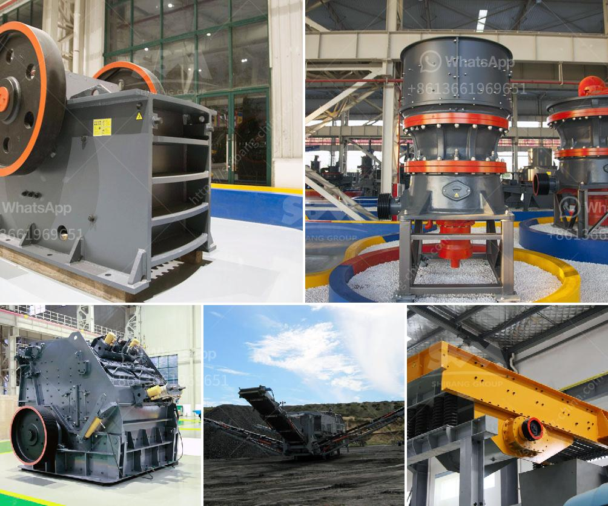

<h3>مطاحن الكرة للتعدين في الصين</h3>
تُعتبر مطاحن الكرة أداة أساسية في عمليات التعدين في الصين. فهي تستخدم لطحن وسحق المواد الخام وتحويلها إلى مسحوق ناعم يمكن استخدامه في عمليات التصنيع المختلفة. تشتهر الصين بصناعتها المتقدمة والمحترفة في مجال معدات التعدين وتعتبر واحدة من الدول الرائدة في إنتاج وتوريد مطاحن الكرة للتعدين.

تتكون مطاحن الكرة من هيكل أنبوبي يحتوي على محرك للدوران ومحبس للتحكم في تدفق المواد الخام إلى الطاحونة. تتحرك الكرات داخل المطحنة وتطحن المواد الخام بفعل الاحتكاك بين الكرات والمواد الخام. تزداد كفاءة الطحن مع زيادة سرعة الدوران وقدرة المطحنة.

تتميز مطاحن الكرة للتعدين في الصين بعدة مزايا. فهي قادرة على طحن العديد من المواد الخام بكفاءة عالية وبأحجام مختلفة. كما أنها مصممة بشكل يسمح بإعادة استخدام الطاقة الناتجة عن العملية، مما يقلل من استهلاك الطاقة ويحسن الكفاءة العملية. بالإضافة إلى ذلك، فإن مطاحن الكرة في الصين مصنوعة من مواد عالية الجودة وتتميز بالمتانة والاستدامة.

تعتبر مطاحن الكرة للتعدين في الصين جزءًا أساسيًا في سلسلة عمليات التعدين. فهي تساهم في تحويل المواد الخام إلى منتجات مفيدة وقيمة، مثل الفحم والنحاس والذهب والفضة والحديد، وتستخدم في الصناعات المختلفة مثل صناعة البناء والكيماويات وصناعة الأسمنت.

وتشهد صناعة مطاحن الكرة في الصين تطورًا مستمرًا، حيث تسعى الشركات المصنعة إلى تحسين أداء وكفاءة المطاحن من خلال تحسين التصميم واستخدام تقنيات جديدة. وتسعى الشركات أيضًا إلى توفير الحلول المخصصة وفقًا لاحتياجات العملاء، مما يعزز التعاون مع العملاء المحليين والعالميين ويعزز مكانة الصين في سوق معدات التعدين.

باختصار، تُعد مطاحن الكرة للتعدين في الصين تكنولوجيا حديثة وفعالة في تحويل المواد الخام إلى منتجات نهائية، وتشهد صناعة هذه المطاحن تطورًا سريعًا في الصين. تعزز هذه الآلات الكفاءة والإنتاجية في صناعة التعدين وتعزز تطور الصناعات المرتبطة.
<h3>Contact us</h3><ul><li><strong>Whatsapp:&nbsp;<a href="https://wa.me/8613661969651">+8613661969651</a></strong></li><li><a href="https://swt.shibang-china.com/?git&amp;zhl&amp;مطاحن الكرة للتعدين في الصين"><strong>Online Service(chat now)</strong></a></li></ul><h3>Related</h3><ul><li><a href='مصنع معالجة المنغنيز.md'>مصنع معالجة المنغنيز</a></li><li><a href='سعر آلة طاحونة الهامر.md'>سعر آلة طاحونة الهامر</a></li><li><a href='كسارة النحاس للبيع في ماليزيا.md'>كسارة النحاس للبيع في ماليزيا</a></li><li><a href='كرات كربونات الكالسيوم.md'>كرات كربونات الكالسيوم</a></li><li><a href='آلة سحق الأسفلت بسعة 15 طن في الساعة.md'>آلة سحق الأسفلت بسعة 15 طن في الساعة</a></li></ul>