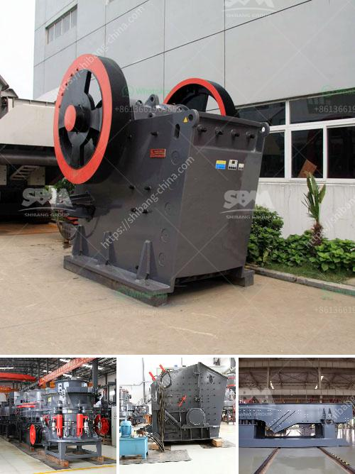

<h3>مطاحن الكرة للكالسيوم</h3>
تُعد مطاحن الكرة من أهم التقنيات المستخدمة في صناعة الكالسيوم، حيث تقوم هذه المطاحن بطحن المواد الخام لتحقيق الحصول على حجم جسيمات صغير ومنتظم. تعمل المطاحن الكروية على طحن المواد الخام عن طريق الاحتكاك والتأثير المتكرر للكرات المعدنية داخل الأسطوانة المدورة.

تتكون مطاحن الكرة من أسطوانة مدورة تحتوي على العديد من الكرات المعدنية في داخلها. عند تشغيل المطحنة، تدور الأسطوانة على محورها، مما يؤدي إلى اصطدام الكرات مع المواد الخام الموجودة داخل المطحنة. يتم طحن المواد الخام بسبب التأثير المتكرر والقطع والاحتكاك الناتج عن حركة الكرات المعدنية داخل المطحنة. بالتالي، تتم الحصول على جسيمات صغيرة ومنتظمة.

تستخدم مطاحن الكرة للكالسيوم في صناعات عديدة، وخاصة في صناعة الطلاء، والأسمدة، وصناعة البلاستيك. فبفضل قدرتها على طحن المواد الخام بفعالية وتحقيق حجم جسيمات دقيقة، يمكن تحقيق مستوى عالٍ من الجودة والدقة في صناعة هذه المنتجات.

تتميز مطاحن الكرة بتصميمها القوي ومتانتها، مما يجعلها تعمل لفترات طويلة دون تعطل. كما يمكن ضبط سرعة المطحنة للحصول على حجم جسيمات مختلف وفقًا لاحتياجات الإنتاج.

علاوة على ذلك، فإن استخدام مطاحن الكرة للكالسيوم يساهم في زيادة كفاءة الإنتاج وتقليل استهلاك الطاقة. حيث يتم طحن المواد الخام بشكل سريع وفعال، مما يتيح توفير الوقت والجهد وتحقيق توفير في تكاليف الإنتاج.

وفي الختام، تُعتبر مطاحن الكرة للكالسيوم تقنية حديثة وفعالة في صناعة الكالسيوم. فهي تساهم في تحسين جودة المنتج، وتحقيق دقة عالية في عملية الطحن، وتوفير الوقت والجهد والتكاليف. لذا، يجب أن نفكر في استخدام هذه التكنولوجيا في عمليات الإنتاج المختلفة للكالسيوم.
<h3>Contact us</h3><ul><li><strong>Whatsapp:&nbsp;<a href="https://wa.me/8613661969651">+8613661969651</a></strong></li><li><a href="https://swt.shibang-china.com/?git&amp;zhl&amp;مطاحن الكرة للكالسيوم"><strong>Online Service(chat now)</strong></a></li></ul><h3>Related</h3><ul><li><a href='آلات كسارة الحجر في ماليزيا.md'>آلات كسارة الحجر في ماليزيا</a></li><li><a href='رسم بياني لعملية غسيل الرمال.md'>رسم بياني لعملية غسيل الرمال</a></li><li><a href='ملصق السلامة لمحطة توليد الفحم.md'>ملصق السلامة لمحطة توليد الفحم</a></li><li><a href='قائمة معدات وآلات التعدين عن الذهب.md'>قائمة معدات وآلات التعدين عن الذهب</a></li><li><a href='آلة كسارة الذهب للبيع في جنوب أفريقيا.md'>آلة كسارة الذهب للبيع في جنوب أفريقيا</a></li></ul>