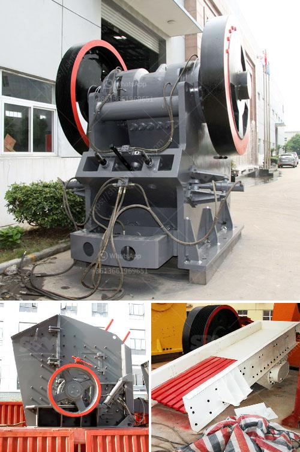

<h3>مطاحن الكرة للمواد</h3>
تُعَد مطاحن الكرة للمواد من التجهيزات الأساسية في صناعة الطحن، حيث تُستخدم في طحن المواد الخام بشكل ناعم وتحويلها إلى مسحوق. تعتبر هذه المطاحن من أكثر التجهيزات فعالية وقدرة على التحمل في عملية الطحن، مما يجعلها خيارًا شائعًا في العديد من الصناعات مثل صناعة الإسمنت والمنتجات الكيميائية وصناعة الطلاء.

تتألف مطاحن الكرة للمواد من جسم دائري يتم تحميله بالمواد الخام. عند تشغيل المطحنة، تدور الكرة الصلبة الثقيلة وتسقط على المواد الخام الموجودة في داخل المطحنة، ما يؤدي إلى طحنها بطريقة دقيقة. تؤثر قوة الجاذبية والاحتكاك التي تولدها الكرة على المواد الخام بحيث تنتج عنها قطع صغيرة تُعرف بالمسحوق.

تتميز مطاحن الكرة للمواد بعدة مزايا. فهي تتمتع بقدرة عالية على التحمل وتستطيع معالجة الكميات الكبيرة من المواد. كما يمكن ضبط سرعة الدوران وحجم الكرة في المطحنة، مما يمنح المشغل القدرة على تنظيم عملية الطحن حسب الاحتياج. بالإضافة إلى ذلك، فإن الكرة الصلبة تعمل كوسيلة طحن فعالة وتعزز عملية الطحن للمواد الخام.

لا يوجد تطبيق واحد فقط لمطاحن الكرة للمواد، حيث يمكن استخدامها في مجموعة متنوعة من الصناعات. في صناعة الإسمنت، تستخدم هذه المطاحن في طحن المواد الخام مثل الحجر الجيري والسيليكات والألومينا للحصول على مساحيق تُستخدم في إنتاج الإسمنت. أما في صناعة الطلاء، فإن مطاحن الكرة للمواد تستخدم لطحن الصبغات والمواد الكيميائية الأخرى المستخدمة في صناعة الطلاء.

في الختام، تعد مطاحن الكرة للمواد من الأدوات الضرورية في صناعة الطحن. تتميز بقدرتها على طحن المواد الخام بطريقة فعالة وناعمة، وتتيح تنظيم عملية الطحن بسهولة. إن وجودها في العديد من الصناعات يعكس أهميتها وفعاليتها في تحسين وتمييز عمليات الطحن وتحسين جودة المنتجات النهائية.
<h3>Contact us</h3><ul><li><strong>Whatsapp:&nbsp;<a href="https://wa.me/8613661969651">+8613661969651</a></strong></li><li><a href="https://swt.shibang-china.com/?git&amp;zhl&amp;مطاحن الكرة للمواد"><strong>Online Service(chat now)</strong></a></li></ul><h3>Related</h3><ul><li><a href='غرابيل للبيع في ساسكاتشوان.md'>غرابيل للبيع في ساسكاتشوان</a></li><li><a href='سعر آلة كسارة المحجر.md'>سعر آلة كسارة المحجر</a></li><li><a href='مطحنة المطرقة للبيع في دبي.md'>مطحنة المطرقة للبيع في دبي</a></li><li><a href='خط إنتاج رمل السيليكا.md'>خط إنتاج رمل السيليكا</a></li><li><a href='استيراد كسارة الفك الصين في باكستان.md'>استيراد كسارة الفك الصين في باكستان</a></li></ul>