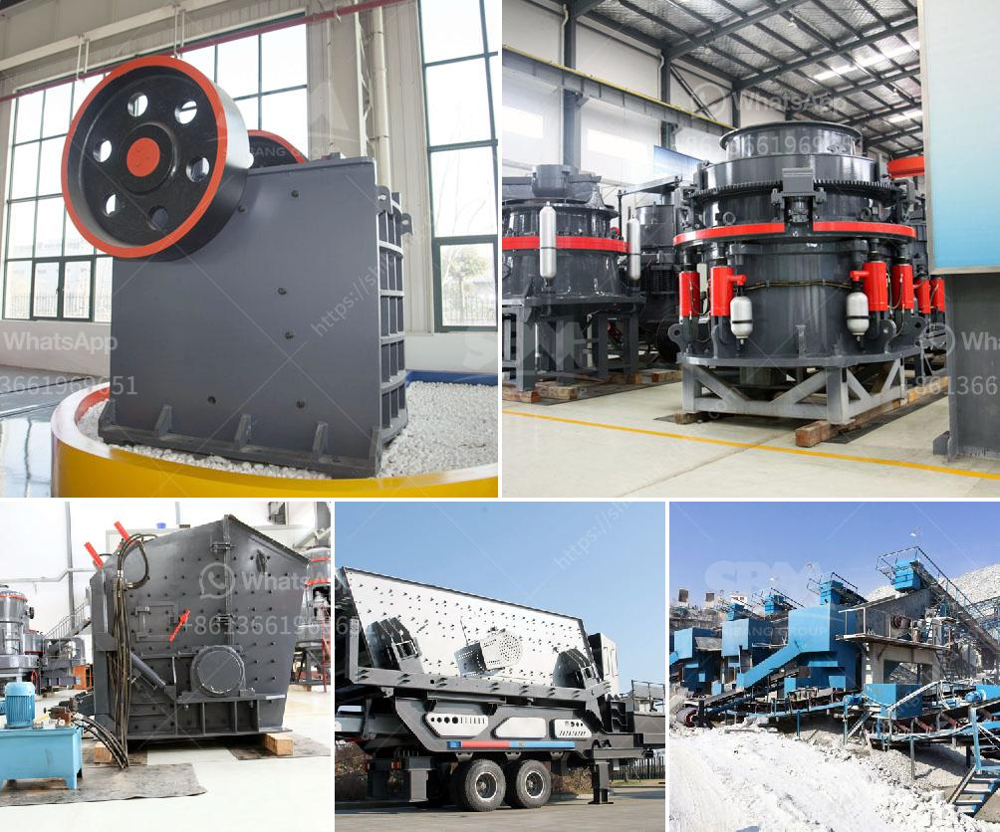

<h3>مطاحن المطرقة</h3>
تُعدّ مطاحن المطرقة من الأدوات الهامة في صناعة المعالجة الغذائية وصناعة الأعلاف. تعمل هذه المطاحن عن طريق تحويل الأطعمة إلى قواطع صغيرة بواسطة المطارق المثبتة على دوارات. تقوم الدورانات بالضرب المتكرر على المواد المراد تفتيتها، مما يؤدي إلى تحطيمها إلى قطع صغيرة. يتم استخدامها لمجموعة واسعة من المواد مثل الحبوب والأغذية الجافة والفواكه والخضروات والأعلاف.

تأتي مطاحن المطرقة عادةً في أشكال وأحجام مختلفة لتناسب احتياجات الصناعات المختلفة. فمن المهم اختيار المطحنة الصحيحة التي تناسب طبيعة المادة المطحونة واحتياجات الإنتاج. تشمل بعض الميزات التي يجب مراعاتها عند اختيار مطحنة المطرقة الطاقة الكهربائية والقدرة وسرعة المطارق ونوع الشاشة المستخدمة.

تستخدم المطاحن المطرقة في عدة صناعات مثل صناعة الأعلاف وصناعة العلف وصناعة المواد الغذائية والتحضيرات الفينولية. في صناعة الأعلاف، تساعد هذه المطاحن في تفتيت الحبوب والحصول على قواطع أصغر، مما يجعلها أكثر قابلية للهضم للحيوانات. كما أنها تساهم في زيادة كفاءة استخراج العناصر الغذائية والفيتامينات حيث يتم تحسين عملية الهضم وامتصاص المواد الغذائية.

وفي صناعة الأغذية، يمكن استخدام المطاحن المطرقة لصنع مساحيق وقواطع صغيرة من المكونات المختلفة، مثل الحبوب والتوابل والقهوة والأعشاب. يتم استخدام هذه المساحيق عادة في صناعة المنتجات الغذائية مثل الحلوى والبسكويت والحليب ومواد التغليف.

توفر مطاحن المطرقة العديد من المزايا، بما في ذلك سهولة الاستخدام والتنظيف والصيانة. كما أنها توفر أيضًا إمكانية ضبط حجم القطع المرغوب فيها من خلال تغيير نمط الشبكة المثبتة في الهوامش. وبفضل تقنيات البناء المتطورة، يمكن لهذه المطاحن توفير إنتاجية عالية وكفاءة عملية.

في الختام، تُعَدّ مطاحن المطرقة أداة حيوية في عمليات التجهيز والتحضير الغذائية وصناعة الأعلاف. تساعد في تحويل المواد إلى قواطع أصغر، مما يسهل عملية الهضم والامتصاص، وتطوير منتجات عالية الجودة. لذا، يجب على الشركات العاملة في هذه الصناعة اختيار مطحنة المطرقة المثلى لتحقيق أقصى استفادة وكفاءة.
<h3>Contact us</h3><ul><li><strong>Whatsapp:&nbsp;<a href="https://wa.me/8613661969651">+8613661969651</a></strong></li><li><a href="https://swt.shibang-china.com/?git&amp;zhl&amp;مطاحن المطرقة"><strong>Online Service(chat now)</strong></a></li></ul><h3>Related</h3><ul><li><a href='مطحنة رايموند للبيع مستعملة.md'>مطحنة رايموند للبيع مستعملة</a></li><li><a href='طاحونة مطرقية صغيرة بقطر 10 مم.md'>طاحونة مطرقية صغيرة بقطر 10 مم</a></li><li><a href='كيفية بدء منجم المحاجر.md'>كيفية بدء منجم المحاجر</a></li><li><a href='مصنع المعادن سحق خام البوكسيت.md'>مصنع المعادن سحق خام البوكسيت</a></li><li><a href='مطاحن الكرة في إندونيسيا.md'>مطاحن الكرة في إندونيسيا</a></li></ul>