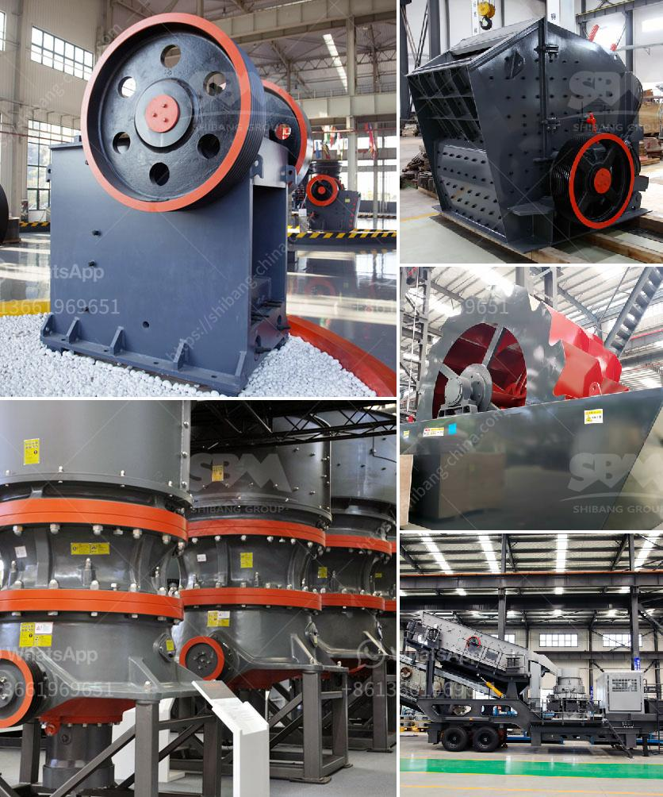

<h3>مطاحن الهامر</h3>
تعد مطاحن الهامر واحدة من الأجهزة الهامة في صناعة طحن الحبوب. إنها قطعة من المعدات المتقدمة التي تستخدم لتحويل حبوب الحب والمواد الغذائية الأخرى إلى مسحوق ناعم بفضل آلية قوية وفعالة. تستخدم هذه الطاحونة عادة في مصانع تصنيع الأعلاف والدقيق والصناعات الغذائية الأخرى.

تعمل مطاحن الهامر عن طريق وجود مطرقة مركزية تدور بسرعة عالية في غرفة الطحن. يتم تغذية الحبوب من خلال فتحة التغذية في الجزء العلوي من الطاحونة، وعندما تلامس الحبوب المطرقة فإنها تنكسر بفعل الدوران السريع للمطرقة. تسقط الحبيبات المكسورة عبر فتحات شبكة الشاشة الموجودة في الجزء السفلي من الطاحونة. يمر الدقيق الناتج من خلال الشاشة، في حين يتم إرجاع الحبوب الكبيرة إلى غرفة الطحن لمواصلة عملية الطحن.

إن استخدام مطاحن الهامر له العديد من الفوائد والمزايا. فمن المعروف أنها تعمل بكفاءة عالية وتحتاج إلى مساحة صغيرة في المصنع للتشغيل. بفضل تصميمها المبتكر، يمكن للمطاحن الهامر أن تطحن الحبوب بسرعة وبكفاءة عالية، مما يزيد من إنتاجية المصنع. كما أن تواجد الشاشات القابلة للتغيير يعني أن الطاحونة يمكنها إنتاج مجموعة متنوعة من الدرجات والأحجام من المنتجات.

علاوة على ذلك، فإن مطاحن الهامر متعددة الاستخدامات وقابلة للتكيف مع مختلف المواد الخام. إنها قادرة على طحن الحبوب والحبوب المختلفة مثل القمح والشعير والشوفان والذرة. كما يمكن استخدامها لطحن المواد الغذائية الأخرى مثل الأعشاب والتوابل وحبوب البن والأصباغ الصناعية. هذا يجعلها أداة قيمة في صناعة الأغذية والعديد من الصناعات الأخرى التي تعتمد على الطحن.

إن مطاحن الهامر هي أجهزة رئيسية في صناعة طحن الحبوب. توفر هذه الطواحين طريقة سريعة وفعالة لتحويل الحبوب إلى مسحوق. بفضل قدراتها المتعددة وكفاءتها العالية، أصبحت المطاحن الهامر أداة أساسية في العديد من المصانع والصناعات. يمكن القول بثقة إنها تلبي حاجات الشركات التي تعتمد على صناعة الأغذية وتجهيزات الأعلاف وتساهم في تحسين جودة المنتجات النهائية.
<h3>Contact us</h3><ul><li><strong>Whatsapp:&nbsp;<a href="https://wa.me/8613661969651">+8613661969651</a></strong></li><li><a href="https://swt.shibang-china.com/?git&amp;zhl&amp;مطاحن الهامر"><strong>Online Service(chat now)</strong></a></li></ul><h3>Related</h3><ul><li><a href='شراء كسارة حجرية صغيرة في الفلبين.md'>شراء كسارة حجرية صغيرة في الفلبين</a></li><li><a href='كسارة للبيع في جنوب أفريقيا.md'>كسارة للبيع في جنوب أفريقيا</a></li><li><a href='أعمال تكسير الصخور في باكستان.md'>أعمال تكسير الصخور في باكستان</a></li><li><a href='تكنولوجيا معالجة خام الباريت.md'>تكنولوجيا معالجة خام الباريت</a></li><li><a href='الطحن بالكرات في بنغالور.md'>الطحن بالكرات في بنغالور</a></li></ul>