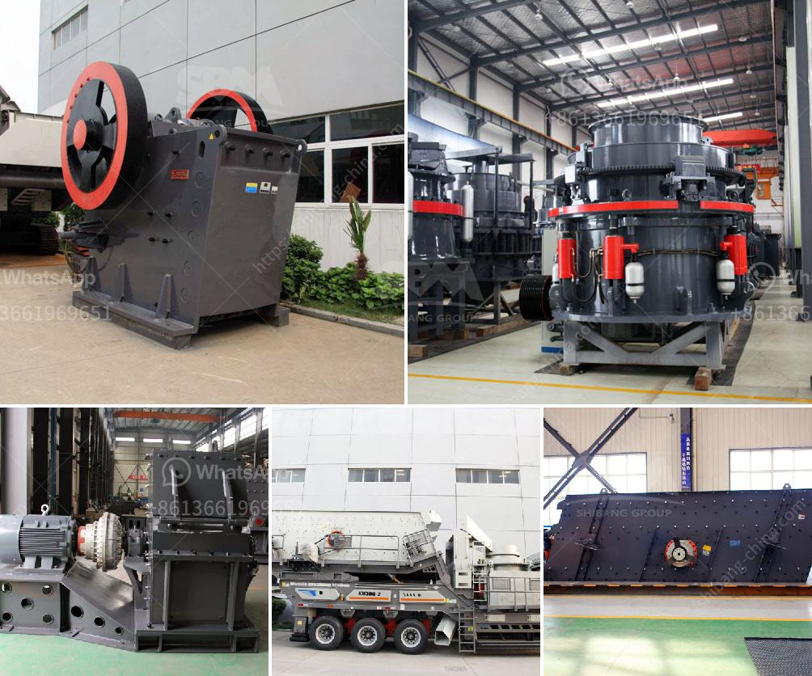

<h3>مطاحن الهامش في جنوب أفريقيا</h3>
تعد مطاحن الهامش في جنوب أفريقيا من أهم الصناعات التي تساهم في تحقيق الاكتفاء الذاتي للمحصول الزراعي وتلبية احتياجات سكان البلاد من المواد الغذائية. يعتبر الهامش واحد من أهم المحاصيل الزراعية التي تزرع في جنوب أفريقيا، حيث تشتهر المطاحن بجودتها العالية وقدرتها على إنتاج الأفران الصحية والمنتجات الغذائية الطازجة.

تتعدد مطاحن الهامش في جنوب أفريقيا وتتواجد في جميع أنحاء البلاد، وتشمل مناطق مثل ليمبوبوبو، ولاية غواتنغ، وشمال الكيب، وشمال غرب الكيب. يوفر هذا الانتشار الجغرافي عددًا كبيرًا من فرص العمل للمزارعين المحليين والعمال الزراعيين، ويشجع على الاستثمار في هذا القطاع.

تتميز مطاحن الهامش في جنوب أفريقيا بتكنولوجيا عالية وتجهيزات حديثة. يتم استخدام أحدث الأجهزة والمعدات لتنظيف وطحن الحبوب، مما يضمن الحصول على مواد غذائية ذات جودة عالية ونقية. يتميز الهامش المطحون باللون الأبيض النقي، وهو حبوب مفتتة صغيرة تستخدم في تحضير الخبز والمعجنات والحلويات.

تعمل مطاحن الهامش في جنوب أفريقيا على إنتاج العديد من المنتجات الغذائية المبتكرة والصحية، بما في ذلك الطحين الأبيض والكامل والدقيق الأبيض والفرينة والسميد والشوفان المطحون والدخن وغيرها. يعتبر الهامش غنيًا بالعناصر الغذائية الأساسية مثل الألياف والبوتاسيوم والمغنيسيوم والفيتامينات، مما يساعد على تعزيز صحة الجهاز الهضمي والقلب والجهاز العصبي.

تلعب مطاحن الهامش دورًا هامًا في تعزيز الاقتصاد المحلي وتوفير فرص العمل في المناطق الريفية. تعمل هذه المطاحن بالتعاون مع المزارعين المحليين المتفانين في زراعة وحصاد الهامش، مما يعزز التعاون بين القطاعين الزراعي والصناعي. بالإضافة إلى ذلك، تدفع مطاحن الهامش في جنوب أفريقيا المزارعين إلى الاستثمار في تحسين طرق الزراعة وتعزيز تقنيات الزراعة المستدامة.

باختصار، تعد مطاحن الهامش في جنوب أفريقيا من الصناعات الحيوية التي تلبي احتياجات السكان من الأغذية الأساسية وتعزز الاقتصاد المحلي. تستثمر في التكنولوجيا الحديثة وتوفر منتجات غذائية عالية الجودة. تعتبر مصدرًا للفرص العمل وتعزز التعاون بين القطاعين الزراعي والصناعي، مما يساهم في التنمية الاقتصادية والاجتماعية في البلاد.
<h3>Contact us</h3><ul><li><strong>Whatsapp:&nbsp;<a href="https://wa.me/8613661969651">+8613661969651</a></strong></li><li><a href="https://swt.shibang-china.com/?git&amp;zhl&amp;مطاحن الهامش في جنوب أفريقيا"><strong>Online Service(chat now)</strong></a></li></ul><h3>Related</h3><ul><li><a href='تأجير كسارة الفك في جدة.md'>تأجير كسارة الفك في جدة</a></li><li><a href='كسارات الحجر في بيلين.md'>كسارات الحجر في بيلين</a></li><li><a href='مصانع طحن الكرات.md'>مصانع طحن الكرات</a></li><li><a href='بدء عمل كسارة الجرانيت.md'>بدء عمل كسارة الجرانيت</a></li><li><a href='آلة كسارة البنتونيت.md'>آلة كسارة البنتونيت</a></li></ul>