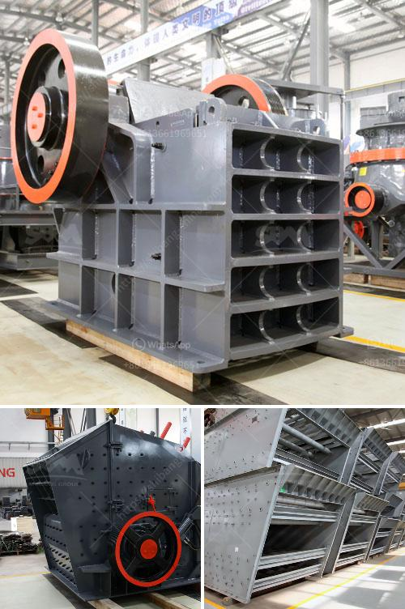

<h3>مطاحن تحضير الدولوميت</h3>
تُستخدم مطاحن تحضير الدولوميت في صناعة تحويل الدولوميت إلى مسحوق ناعم. تُعد الدولوميت معدنًا طبيعيًا يتميز بمجموعة من الخواص الفريدة، مثل صلابة عالية وكثافة ومقاومة للاهتراء ومقاومة الحرارة. يعتبر مسحوق الدولوميت ناتج عملية طحن الدولوميت الخام، ويتم استخدامه في مجموعة واسعة من التطبيقات الصناعية والتجارية.

تتألف مطاحن تحضير الدولوميت عادةً من مطحنة الكرات، وهي عبارة عن آلة تعمل على طحن الدولوميت بواسطة كرات معدنية تدور داخل الجهاز. تعمل الكرات على تقليل حجم الدولوميت وتحويله إلى مسحوق ناعم. يتم تعزيز العملية بوجود وسائط طحن مثل الكرات المعدنية، والتي تساعد على زيادة كفاءة العملية وتقليل وقت الطحن.

يتم استخدام مسحوق الدولوميت في العديد من التطبيقات، بما في ذلك صناعة الطلاءات، والتجفيف، وصناعة الورق، والمواد اللاصقة، والأسمدة، والبوليمرات، وغيرها. يتميز المسحوق بخواصه الميكانيكية الممتازة والقدرة على الانتشار، مما يجعله مادة مثالية للاستخدام في مختلف الصناعات.

بالإضافة إلى ذلك، يتم استخدام مسحوق الدولوميت في صناعة السيراميك، حيث يعزز مسحوق الدولوميت سلامة السيراميك من الكسر ويحسن قوة ومتانة المنتج النهائي. يعمل مسحوق الدولوميت أيضًا على تحسين الألوان والمظهر الجمالي للسيراميك، مما يزيد من جاذبيته وقيمته التجارية.

يساهم مطحنة تحضير الدولوميت في تسهيل وتسريع عملية تحويل الدولوميت إلى مسحوق ناعم، مما يوفر الكثير من الوقت والمجهود. كما أنه يعمل على تحسين جودة المنتج النهائي وتوحيده، مما يساعد في تحسين الأداء والكفاءة في العديد من التطبيقات الصناعية.

باختصار، تتميز مطاحن تحضير الدولوميت بقدرتها على تحويل الدولوميت الخام إلى مسحوق ناعم بجودة وكفاءة عالية. يعتبر مسحوق الدولوميت مادة قيمة في العديد من الصناعات، حيث يساهم في تحسين الأداء والمتانة والجمالية للمنتجات النهائية.
<h3>Contact us</h3><ul><li><strong>Whatsapp:&nbsp;<a href="https://wa.me/8613661969651">+8613661969651</a></strong></li><li><a href="https://swt.shibang-china.com/?git&amp;zhl&amp;مطاحن تحضير الدولوميت"><strong>Online Service(chat now)</strong></a></li></ul><h3>Related</h3><ul><li><a href='مصنع معالجة الحجر الجيري في الفلبين.md'>مصنع معالجة الحجر الجيري في الفلبين</a></li><li><a href='البحث عن معدات تجهيز الفحم الصغيرة.md'>البحث عن معدات تجهيز الفحم الصغيرة</a></li><li><a href='شراء آلة محجر من أوروبا.md'>شراء آلة محجر من أوروبا</a></li><li><a href='كم تكلفة مصنع الكرة؟.md'>كم تكلفة مصنع الكرة؟</a></li><li><a href='علامات الناقل والكسارات في إندونيسيا.md'>علامات الناقل والكسارات في إندونيسيا</a></li></ul>