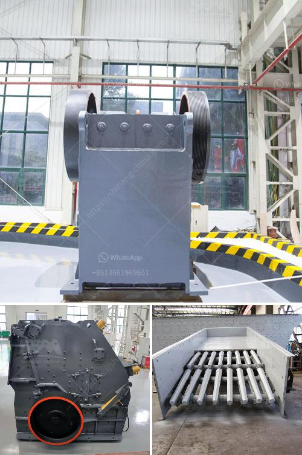

<h3>مطاحن تعدين الذهب المحمولة</h3>
تعتبر مطاحن تعدين الذهب المحمولة واحدة من أهم وحدات التعدين المستخدمة في استخراج الذهب. تعمل هذه المطاحن على سحق الخامات الصلبة الغنية بالذهب إلى جسيمات أصغر، ما يجعل عملية استخلاص الذهب أكثر فعالية وسرعة.

المطاحن المحمولة تعتبر الأكثر مرونة وسهولة في التشغيل بالمقارنة مع المطاحن التقليدية الكبيرة. يتكون هيكلها من جهاز سحق رئيسي وناقلة، وتتميز بأنها يمكن نقلها بسهولة من موقع إلى آخر. بالإضافة إلى ذلك، يتم تزويدها بمحرك يعمل بالديزل أو الكهرباء وبنظام تحكم مركزي يعمل بنظام توجيه عن بعد.

تتيح المطاحن المحمولة فرصة لاستغلال المواقع التي يكون التعدين فيها مؤقتًا. وبالتالي، فهي لا تتطلب إقامة هياكل ثابتة وتستهلك كميات أقل من الموارد. هذا يجعلها الخيار المثالي للتعامل مع الطبقات العميقة أو المواقع الجبلية النائية التي قد تكون صعبة الوصول.

وعلاوة على ذلك، فإن المطاحن المحمولة تسمح بزيادة الإنتاجية وتوفير الوقت والجهد. إذ تعمل هذه المطاحن على سحق الخامات ذات الصلابة العالية بسرعة وأداء ممتاز. كما تتميز بتكنولوجيا تصنيع مبتكرة ومتطورة تزيد من كفاءة الإنتاج وتقلل من الخسائر.

ومن الجوانب الأخرى التي تجعل المطاحن المحمولة مفيدة هي قابليتها للتخصيص وفقًا لاحتياجات المشروع. يمكن تعديلةا وتجهيزها بوحدات إضافية مثل نظام التأكسد أو نظام التنظيف لتناسب البيئة والشروط المحيطة.

بشكل عام، تعتبر المطاحن المحمولة ذات أهمية كبيرة في صناعة تعدين الذهب. فهي تسهم في تحسين فعالية وكفاءة عملية استخلاص الذهب، وتوفر الوقت والجهد للشركات التعدينية. كما تعمل على تقليل الخسائر وتوفير الموارد، وتوفر الفرصة للاستفادة من المواقع المؤقتة. وعلاوة على ذلك، فإنها تتيح مرونة في التشغيل والتكيف مع متطلبات المشروعات المختلفة.
<h3>Contact us</h3><ul><li><strong>Whatsapp:&nbsp;<a href="https://wa.me/8613661969651">+8613661969651</a></strong></li><li><a href="https://swt.shibang-china.com/?git&amp;zhl&amp;مطاحن تعدين الذهب المحمولة"><strong>Online Service(chat now)</strong></a></li></ul><h3>Related</h3><ul><li><a href='شراء آلة محجر من أوروبا.md'>شراء آلة محجر من أوروبا</a></li><li><a href='سعر النحاس.md'>سعر النحاس</a></li><li><a href='كثافة أحزمة الناقلات للتعدين.md'>كثافة أحزمة الناقلات للتعدين</a></li><li><a href='شركة تصنيع معدات كسارة الحجر في ألمانيا.md'>شركة تصنيع معدات كسارة الحجر في ألمانيا</a></li><li><a href='تكلفة سيور النقل.md'>تكلفة سيور النقل</a></li></ul>