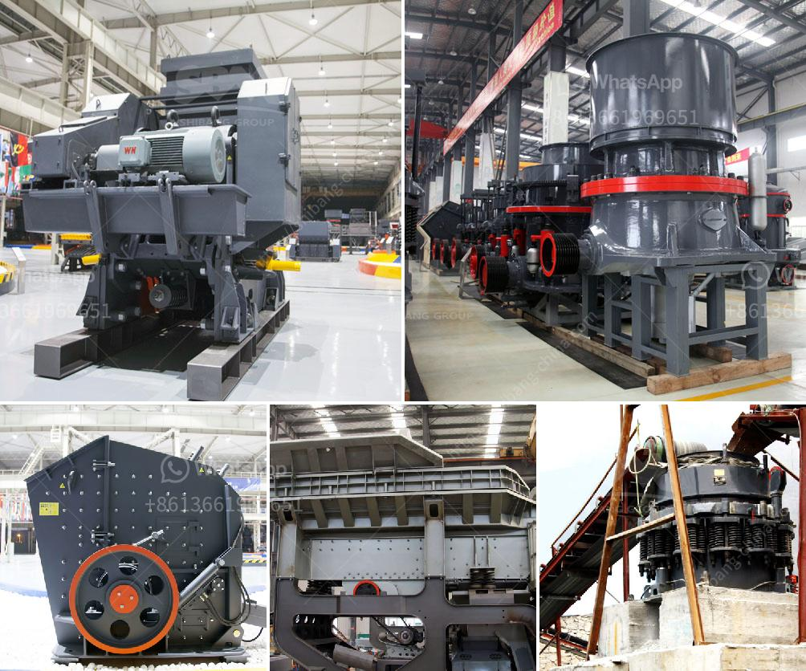

<h3>مطاحن تلك جنوب أفريقيا</h3>
تعتبر مطاحن تلك في جنوب أفريقيا من أكبر وأهم المطاحن في المنطقة، حيث تلعب دورًا حيويًا في صناعة الطحين والمنتجات الحبوب الأخرى. تأسست هذه المطاحن في عام 1860 ومنذ ذلك الحين توسعت وتطورت بهدف تلبية الاحتياجات المتزايدة للمستهلكين في البلاد.

تعتبر مطاحن تلك واحدة من أقدم شركات طحن الحبوب في جنوب أفريقيا، حيث تمتلك اليوم العديد من المصانع والمرافق الموجودة في مختلف أنحاء البلاد. تعمل هذه المطاحن بكفاءة عالية وتستخدم أحدث التقنيات والمعدات لضمان توفير منتجات عالية الجودة للعملاء.

تعتبر صناعة الطحين والمنتجات الحبوب في جنوب أفريقيا قطاعًا حيويًا ومهمًا، حيث تلبي الاحتياجات الغذائية للسكان المحليين بالإضافة إلى تصدير منتجاتها إلى الأسواق الدولية. تركز مطاحن تلك على إنتاج مجموعة متنوعة من المنتجات الحبوب، بما في ذلك الطحين الأبيض والطحين الأسمر والدقيق المستخدم في صناعة المخبوزات والعجائن.

تعمل مطاحن تلك بواسطة الة الطحن الحجرية التقليدية وتقدم منتجات طحين عالية الجودة تفي بجميع المعايير الدولية. تهدف الشركة إلى التركيز على الابتكار والتطوير المستمر في صناعة الحبوب، مع الحفاظ على المعايير البيئية والاستدامة. تعتبر مطاحن تلك ملتزمة بممارسات الإنتاج السليمة وتعمل على تقديم منتجات طحين صحية ومغذية للمستهلكين.

وبفضل توجه الشركة نحو الجودة والتميز، تحظى مطاحن تلك بشعبية كبيرة في جنوب أفريقيا وخارجها. يتم استخدام منتجاتها في وجبات الإفطار والخبز والمعجنات ومنتجات الحلويات الأخرى. توفر هذه المطاحن وظائف للعديد من العمال المحليين وتعزز التنمية الاقتصادية في المنطقة.

باختصار، تلعب مطاحن تلك دورًا حيويًا في صناعة الطحين والحبوب في جنوب أفريقيا. تعمل بكفاءة عالية وتستخدم أحدث التقنيات لإنتاج منتجات عالية الجودة. من خلال الالتزام بالجودة والابتكار، تحظى مطاحن تلك بشعبية كبيرة وتساهم في التنمية الاقتصادية في المنطقة.
<h3>Contact us</h3><ul><li><strong>Whatsapp:&nbsp;<a href="https://wa.me/8613661969651">+8613661969651</a></strong></li><li><a href="https://swt.shibang-china.com/?git&amp;zhl&amp;مطاحن تلك جنوب أفريقيا"><strong>Online Service(chat now)</strong></a></li></ul><h3>Related</h3><ul><li><a href='بائع أحزمة الناقلات في الفلبين.md'>بائع أحزمة الناقلات في الفلبين</a></li><li><a href='مصنع مكثف الزنك المحمول.md'>مصنع مكثف الزنك المحمول</a></li><li><a href='سعر stoner cusher في كينيا.md'>سعر stoner cusher في كينيا</a></li><li><a href='سعر تكسير الخرسانة في جنوب أفريقيا.md'>سعر تكسير الخرسانة في جنوب أفريقيا</a></li><li><a href='مطحنة ريموند لمعالجة البازلت الجاف.md'>مطحنة ريموند لمعالجة البازلت الجاف</a></li></ul>