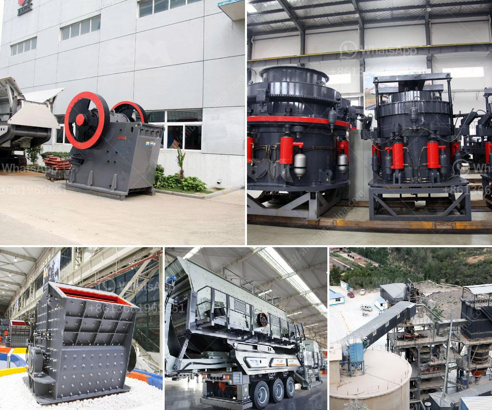

<h3>مطاحن ريموند في الصين</h3>
مطاحن ريموند هي معدات طحن تستخدم على نطاق واسع في الصناعة الصينية. تأسست شركة ريموند في عام 1927 في الولايات المتحدة الأمريكية، وانتقلت فيما بعد إلى الصين وأسست أول مصنع لها في العاصمة بكين في عام 1987. منذ ذلك الحين، أصبحت مطاحن ريموند الأكثر شهرة وانتشارًا في الصين.

تتميز مطاحن ريموند بأنها تستخدم تقنية الطحن المتقدمة وتوفر أداءًا ممتازًا في طحن المواد الخام وتصنيعها. تتكون المطاحن من مجموعة من الأسطوانات والأسطوانات الدوارة تدور بسرعة عالية. يتم تغذية المواد الخام إلى المطحنة ويتم طحنها وتفتيتها في العملية. بفضل هذه التقنية المتطورة، تمكنت شركة ريموند من تلبية احتياجات العديد من الصناعات المختلفة، مثل الصناعة الكيميائية وصناعة البناء والإلكترونيات وغيرها.

تتميز مطاحن ريموند بالكفاءة العالية والقدرة الإنتاجية الكبيرة، مما يجعلها اختيارًا مثاليًا للشركات التي تحتاج إلى طحن وتجهيز كميات كبيرة من المنتجات. كما تتميز بدقة الطحن والتحكم الدقيق في الحجم والشكل للمنتج النهائي، مما يؤدي إلى منتج نهائي عالي الجودة.

صوتت مطاحن ريموند كأفضل معدات طحن في الصين لعدة سنوات متتالية، حيث حصلت على العديد من الجوائز والتكريمات من قبل الحكومة الصينية. تتميز الشركة بخدمة العملاء الممتازة والدعم الفني الممتاز، مما يجعلها شريكًا موثوقًا للعديد من الشركات في الصين.

باختصار، تعد مطاحن ريموند من أكثر المعدات المرغوبة للطحن في الصين، حيث توفر أداءًا ممتازًا وجودة عالية، مما يجعلها اختيارًا مثاليًا للشركات التي تحتاج إلى معدات طحن فعالة ودقيقة. تستمر الشركة في الابتكار وتطوير منتجات جديدة لتلبية احتياجات الصناعات المتنوعة في الصين وخارجها.
<h3>Contact us</h3><ul><li><strong>Whatsapp:&nbsp;<a href="https://wa.me/8613661969651">+8613661969651</a></strong></li><li><a href="https://swt.shibang-china.com/?git&amp;zhl&amp;مطاحن ريموند في الصين"><strong>Online Service(chat now)</strong></a></li></ul><h3>Related</h3><ul><li><a href='كسارة الصخور كرات الحديد.md'>كسارة الصخور كرات الحديد</a></li><li><a href='سلاسل ناقلات للكسارات.md'>سلاسل ناقلات للكسارات</a></li><li><a href='مصنع تكسير متنقل في الصين.md'>مصنع تكسير متنقل في الصين</a></li><li><a href='حول مصنع سحق الصخور.md'>حول مصنع سحق الصخور</a></li><li><a href='كسارة الحجر الجيري في مصنع الأسمنت.md'>كسارة الحجر الجيري في مصنع الأسمنت</a></li></ul>