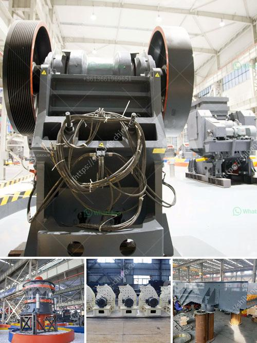

<h3>مطاحن زيمبابوي</h3>
تعد مطاحن زيمبابوي أحد أبرز رموز الصناعة في البلاد ولها دور هام في توفير موارد الغذاء والتنمية الاقتصادية. تعمل هذه المطاحن على طحن حبوب القمح والذرة والحبوب الأخرى لإنتاج مسحوق الدقيق والمنتجات ذات الصلة.

تمتلك زيمبابوي العديد من المطاحن المنتشرة في مختلف المناطق، الأمر الذي يعزز القدرة الإنتاجية ويزيد من إمكانية تلبية الطلب المحلي والدولي. تستخدم هذه المطاحن تكنولوجيا حديثة ومتطورة في عملية الطحن وتنظيف الحبوب، مما يجعل منتجاتها عالية الجودة وصحية للاستهلاك.

من أهم منتجات مطاحن زيمبابوي هو مسحوق الدقيق الأبيض النقي، والذي يتم استخدامه في إعداد الخبز والمعجنات والحلويات. كما تنتج أيضًا العديد من المنتجات الأخرى مثل السميد والدقيق البرتقالي وعجينة الكعك.

تعد مطاحن زيمبابوي جزءًا هامًا من سلسلة التوريد الغذائي في البلاد، إذ توفر فرص عمل للعديد من العاملين في هذه الصناعة. كما تساهم هذه المطاحن في تعزيز الاقتصاد المحلي من خلال توفير المنتجات المحلية بدلاً من الاعتماد على الواردات.

على الرغم من التحديات التي تواجهها صناعة المطاحن في زيمبابوي، مثل نقص الكهرباء المنتظم والتحديات في توريد الحبوب، إلا أن هناك جهود متواصلة لدعم وتطوير هذا القطاع. تعمل الحكومة على توفير البنية التحتية اللازمة وتشجيع الاستثمارات في هذه الصناعة، بالإضافة إلى تشجيع البحث والابتكار لتطوير تقنيات جديدة وتحسين إنتاجية المطاحن.

في الختام، تلعب مطاحن زيمبابوي دورًا حاسمًا في الحفاظ على استقلالية البلاد في إنتاج الدقيق وتوفير الغذاء للسكان المحليين. بفضل تكنولوجيا التصنيع المتقدمة والدعم الحكومي، تواصل هذه المطاحن تحقيق التقدم والنمو، وتعد مصدر فخر لأفراد البلاد وشركاء الأعمال على الصعيدين المحلي والعالمي.
<h3>Contact us</h3><ul><li><strong>Whatsapp:&nbsp;<a href="https://wa.me/8613661969651">+8613661969651</a></strong></li><li><a href="https://swt.shibang-china.com/?git&amp;zhl&amp;مطاحن زيمبابوي"><strong>Online Service(chat now)</strong></a></li></ul><h3>Related</h3><ul><li><a href='شركة تصنيع آلات الحجر في إيروود.md'>شركة تصنيع آلات الحجر في إيروود</a></li><li><a href='تدفق عملية مصنع البنتونايت.md'>تدفق عملية مصنع البنتونايت</a></li><li><a href='تكلفة مشروع وحدة طحن الكلنكر.md'>تكلفة مشروع وحدة طحن الكلنكر</a></li><li><a href='سعر كسارة الفك.md'>سعر كسارة الفك</a></li><li><a href='مورد آلة كسارة الفك.md'>مورد آلة كسارة الفك</a></li></ul>