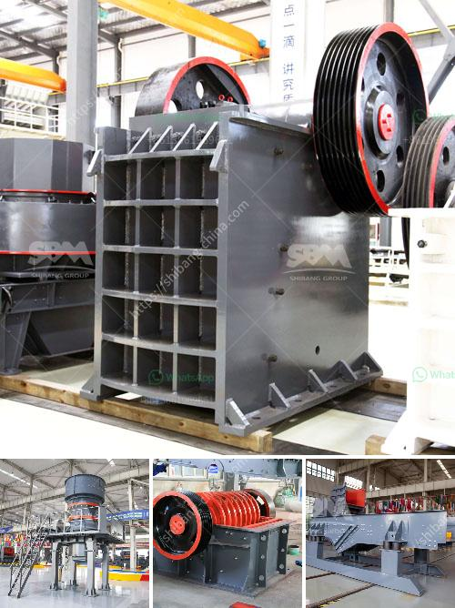

<h3>مطاحن طحن أتا</h3>
مطاحن طحن الذرة هي معدات أساسية في صناعة الأغذية، حيث تُستخدم لطحن حبوب الذرة لإنتاج الأتا الناعمة والخشنة. تعد الأتا من أهم المكونات الغذائية في عديد من الثقافات حول العالم، فهي تستخدم في تحضير العديد من الوصفات مثل الخبز والكعك والمعكرونة وغيرها.

تعمل مطاحن طحن الأتا عن طريق طحن حبوب الذرة إلى مسحوق ناعم باستخدام أسطوانات معدنية تدور بسرعة عالية. يتم تغذية الحبوب في المطحنة من خلال مدخل خاص، حيث يتم طحن الحبوب بين الأسطوانات، ويتم إخراج الأتا المطحون من الجهة الأخرى.

تختلف مطاحن طحن الأتا في سعتها، حيث يمكنها طحن كميات متنوعة من الحبوب. تتراوح سعات هذه المطاحن من 200 إلى 400 كيلوجرام في الساعة، وتتوافر بعدة أحجام وطاقات لتلبية احتياجات المستخدمين المختلفة.

تُستخدم مطاحن طحن الأتا في المزارع والمصانع الزراعية والمخابز والمطاعم وحتى في المنازل. تعتبر هذه الآلات ضرورية للحفاظ على جودة ونقاوة الأتا المطحون، مما يؤدي إلى تحسين نكهة وجودة الأطعمة التي تعتمد على استخدام الأتا كمكون أساسي في تحضيرها.

بالإضافة إلى ذلك، توفر مطاحن طحن الأتا فوائد اقتصادية وبيئية. فعند استخدام هذه المطاحن، يتم تقليل تكاليف الشراء والتوزيع للأتا المطحون، مما يساهم في تحقيق توفير ملحوظ في التكاليف. كما أن الأتا المطحون يمكن تخزينه لفترة أطول بدون أن يفقد جودته أو قيمته الغذائية.

وفي النهاية، يمكن القول إن مطاحن طحن الأتا تلعب دوراً حيوياً في صناعة الأغذية وتوفير الأتا الناعمة والخشنة للمستهلكين. إنها تساعد في توفير مكون غذائي هام ومطلوب في العديد من الوصفات الغذائية، كما تلعب دوراً في تحقيق الاقتصاد والتوفير في الشراء والتوزيع وتحسين جودة الأغذية.
<h3>Contact us</h3><ul><li><strong>Whatsapp:&nbsp;<a href="https://wa.me/8613661969651">+8613661969651</a></strong></li><li><a href="https://swt.shibang-china.com/?git&amp;zhl&amp;مطاحن طحن أتا"><strong>Online Service(chat now)</strong></a></li></ul><h3>Related</h3><ul><li><a href='أسعار كسارة الحجر في إندونيسيا.md'>أسعار كسارة الحجر في إندونيسيا</a></li><li><a href='المعدات المطلوبة لعمل محجر الجرانيت.md'>المعدات المطلوبة لعمل محجر الجرانيت</a></li><li><a href='ناقل البناء للبيع.md'>ناقل البناء للبيع</a></li><li><a href='تحسين مصنع التكسير.md'>تحسين مصنع التكسير</a></li><li><a href='كسارة مخروطية في المملكة العربية السعودية.md'>كسارة مخروطية في المملكة العربية السعودية</a></li></ul>