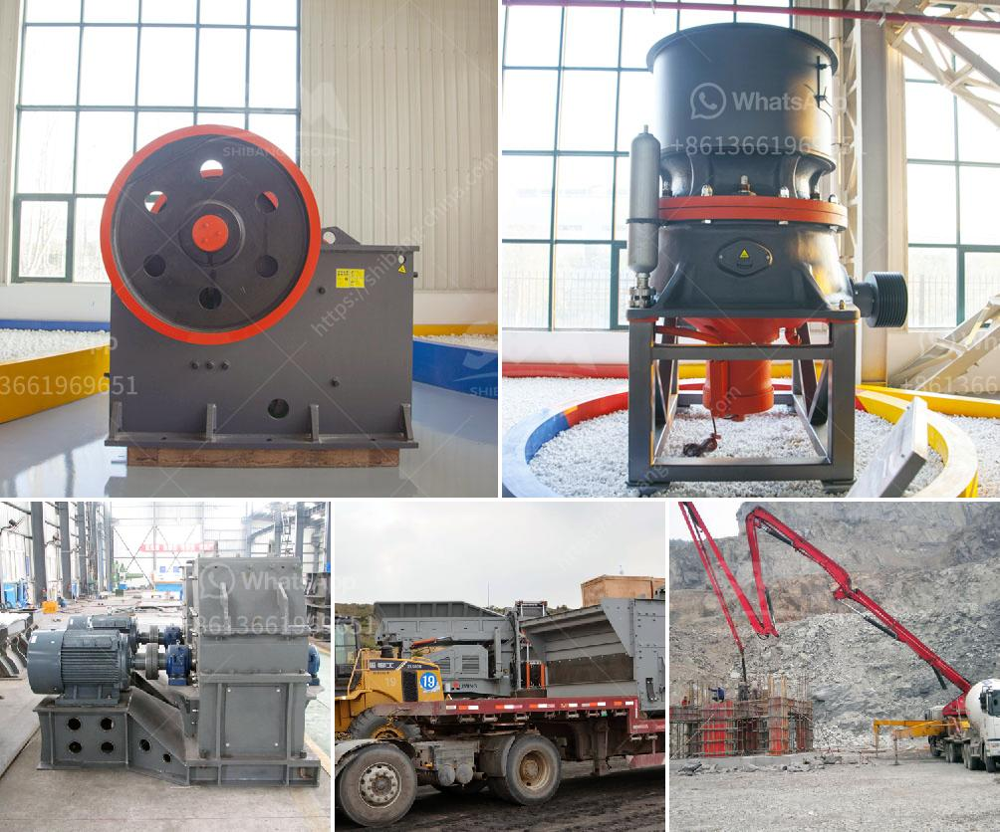

<h3>مطاحن كرات تحطيم الفحم</h3>
تُعتبر مطاحن الكرات لتحطيم الفحم إحدى الأدوات الهامة في صناعة الفحم. تقوم هذه المطاحن بتحطيم الفحم إلى قطع صغيرة تسمى كرات الفحم، وتستخدم في عمليات توليد الطاقة الحرارية وأيضًا في صناعة الصلب والاسمنت والكيماويات.

تكون مطاحن الكرات عبارة عن أسطوانة معبأة بكرات فولاذية صلبة بأحجام مختلفة. يتم تحميل الفحم داخل المطحنة من الجانب ويتم تحريكه بواسطة الكرات الفولاذية داخل الأسطوانة. تتحرك الأسطوانة بدوران مستمر لتطحن الفحم إلى أجزاء صغيرة.

من أهم المزايا التي توفرها مطاحن الكرات في تحطيم الفحم هو توفير الوقت والجهد. حيث يعمل نظام الكرات المتحركة بكفاءة عالية لتحطيم الفحم بسرعة وبدقة. كما أنها قادرة على تحطيم كميات كبيرة من الفحم في وقت قصير.

بالإضافة إلى ذلك، فإن مطاحن الكرات قادرة على التعامل مع الفحم ذي الصلابة العالية والرطوبة العالية. فغالبًا ما تحتوي العينات من الفحم على شوائب صلبة مثل الحجارة والصخور، وهذا قد يتسبب في تلف المعدات التقليدية. ولكن مطاحن الكرات تمتلك كرات قوية ومتينة تستطيع تحمل مثل هذه الشوائب وتحطيمها بسهولة.

يجب أن نذكر أيضًا أن استخدام مطاحن الكرات في تحطيم الفحم يقلل من الانبعاثات الضارة. إذ تعمل مطاحن الكرات بنظام مغلق مما يقلل من تسرب الغبار والرواسب الصلبة في الهواء. هذا يحسن جودة الهواء في المصانع ويقلل من التلوث الناجم عن صناعة الفحم.

في الختام، تعتبر مطاحن الكرات لتحطيم الفحم أداة أساسية في صناعة الفحم. فهي تساهم في توفير الوقت والجهد وتحقق نتائج دقيقة وفعالة. كما تعمل على خفض التلوث وتحسين جودة الهواء في المصانع.
<h3>Contact us</h3><ul><li><strong>Whatsapp:&nbsp;<a href="https://wa.me/8613661969651">+8613661969651</a></strong></li><li><a href="https://swt.shibang-china.com/?git&amp;zhl&amp;مطاحن كرات تحطيم الفحم"><strong>Online Service(chat now)</strong></a></li></ul><h3>Related</h3><ul><li><a href='تقرير مشروع تصنيع الطوب الرملي.md'>تقرير مشروع تصنيع الطوب الرملي</a></li><li><a href='مخطط تدفق عملية استرداد الذهب بتنسيق PDF.md'>مخطط تدفق عملية استرداد الذهب بتنسيق PDF</a></li><li><a href='آلة مطحنة الدولوميت.md'>آلة مطحنة الدولوميت</a></li><li><a href='حساب قطر كرة الطحن لمطحنة الكرة.md'>حساب قطر كرة الطحن لمطحنة الكرة</a></li><li><a href='كسارة الحجر في ماليزيا.md'>كسارة الحجر في ماليزيا</a></li></ul>