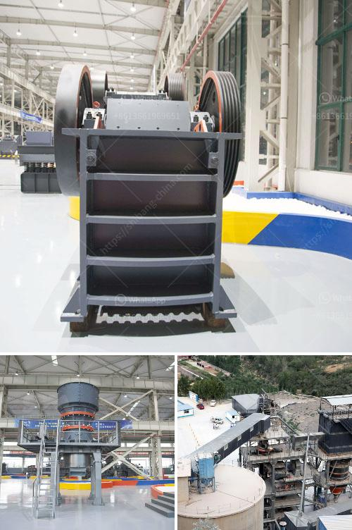

<h3>مطاحن للبيع في الفلبين</h3>
تشتهر الفلبين بصناعة الغذاء والزراعة كونها واحدة من أكبر المصدرين للأطعمة في المنطقة. ومن بين المنتجات الزراعية الهامة في الفلبين هو إنتاج الدقيق. ولتلبية احتياجات السوق المحلية والعالمية، تتوفر العديد من مطاحن الدقيق للبيع في الفلبين.

تعتبر مطاحن الدقيق من الأعمال التجارية الرائجة في الفلبين، حيث يعتمد العديد من المنتجين والمستهلكين على الدقيق المحلي لتلبية احتياجاتهم الغذائية اليومية. بصفة عامة، فإن هناك نوعان رئيسيان من المطاحن في الفلبين: المطاحن الكبيرة والمطاحن الصغيرة.

المطاحن الكبيرة هي المصانع الكبيرة التي تنتج كميات كبيرة من الدقيق يوميًا. تستخدم هذه المطاحن جهوزية عالية ومعدات حديثة لطحن القمح وإنتاج الدقيق بمختلف أنواعه، مثل الدقيق الأبيض والدقيق الكامل. وتتواجد هذه المطاحن في العديد من المناطق الزراعية في الفلبين.

بالمقابل، تشتهر الفلبين أيضًا بوجود مطاحن دقيق صغيرة تعمل بواسطة الطاقة البشرية أو الطاقة الكهربائية أو حتى الطاقة الشمسية. تعتبر هذه المطاحن الصغيرة أكثر قدرة على تلبية احتياجات السكان المحليين في المناطق الريفية والمناطق ذات الوصول المحدود إلى الكهرباء. يعتمد هؤلاء المزارعون والمنتجون على هذه المطاحن لإنتاج الدقيق الذي يساهم في تعزيز المحصول المحلي واقتصاد البلاد.

تشهد صناعة مطاحن الدقيق في الفلبين تحسنًا مستمرًا، حيث يتم تطوير التقنيات والمعدات وتحسين جودة المنتجات. يراعى أيضًا الجوانب البيئية والصحية في عملية إنتاج الدقيق، حيث تعتمد العديد من المطاحن الكبيرة والصغيرة على الطرق العضوية في زراعة المحاصيل وتجهيزها.

في الختام، تعتبر مطاحن الدقيق من الأعمال الهامة في الفلبين، حيث تلبي احتياجات السوق المحلية والعالمية من المنتجات الزراعية. تعمل هذه المطاحن على تحسين جودة الدقيق وتقديمه بأشكال وأنواع مختلفة لتلبية احتياجات المستهلكين. كما تعد هذه الصناعة مصدرًا هامًا للعمل والدخل للعديد من الفلبينيين.
<h3>Contact us</h3><ul><li><strong>Whatsapp:&nbsp;<a href="https://wa.me/8613661969651">+8613661969651</a></strong></li><li><a href="https://swt.shibang-china.com/?git&amp;zhl&amp;مطاحن للبيع في الفلبين"><strong>Online Service(chat now)</strong></a></li></ul><h3>Related</h3><ul><li><a href='آلات غسيل الفحم.md'>آلات غسيل الفحم</a></li><li><a href='مصانع معدات مصانع رمال الفراك.md'>مصانع معدات مصانع رمال الفراك</a></li><li><a href='مصنع الكرة.md'>مصنع الكرة</a></li><li><a href='كسارات محمولة مستعملة للبيع في جنوب أفريقيا.md'>كسارات محمولة مستعملة للبيع في جنوب أفريقيا</a></li><li><a href='مطحنة الأسطوانة بيرينج.md'>مطحنة الأسطوانة بيرينج</a></li></ul>