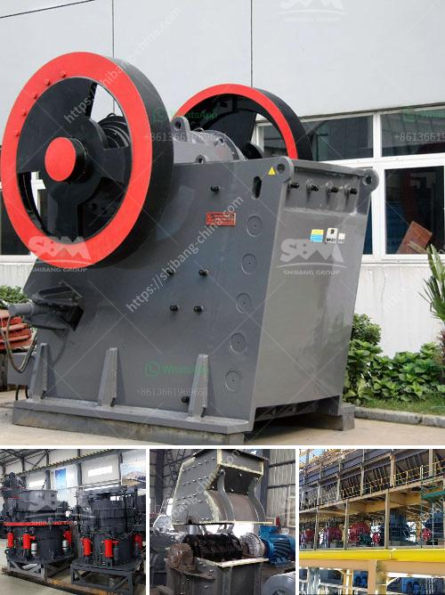

<h3>مطاحن للبيع في هراري</h3>
مع زيادة الاهتمام بالصحة والتغذية الصحية، أصبحت الخبز والمخبوزات المصنوعة من الدقيق ذات الجودة العالية أحد أهم المكونات في حياة الناس. ومع ذلك، يواجه العديد من الأشخاص صعوبة في العثور على دقيق طازج وذو جودة عالية. تلبي مطاحن هراري هذه الحاجة، حيث تقدم مجموعة واسعة من المطاحن للبيع التي تلبي احتياجات المستهلكين.

توفر مطاحن هراري مجموعة متنوعة من المطاحن الكهربائية ومطاحن اليد التي تستخدم لطحن الحبوب والبذور. تشمل هذه المطاحن الدقيقة ذات الجودة العالية ومطاحن الحبوب الكاملة التي تحتفظ بالعناصر الغذائية الحيوية للحبوب. توفر المطاحن أيضًا مطاحن البذور والتي تستخدم لطحن البذور المختلفة مثل الكتان والشيا والكمون والحبة السوداء.

بفضل تطور التكنولوجيا، أصبحت مطاحن هراري متطورة ومناسبة للاستخدام المنزلي. فهي مصممة بأحدث التقنيات لتحقيق أقصى كفاءة وجودة في عملية الطحن. تتميز هذه المطاحن بسهولة الاستخدام، حيث يمكن ضبطها بسهولة لتناسب المستخدمين المختلفين واحتياجاتهم. كما أنها سهلة التنظيف والصيانة، مما يجعلها مثالية للاستخدام اليومي.

بالإضافة إلى ذلك، تساهم مطاحن هراري في توفير المال للمستهلكين. فبدلاً من شراء الدقيق جاهزًا، يمكن للأفراد شراء الحبوب بأسعار أقل وطحنها في المنزل. هذا ليس فقط يعني توفيرًا ماليًا ولكن أيضًا يعني الحصول على دقيق طازج وجودة عالية بدون إضافة أي مواد كيميائية.

يعد شراء مطحنة في هراري استثمارًا جيدًا لمن يهتمون بالتغذية الصحية وجودة الطعام. يمكن أن تكون هذه المطاحن مثالية للأفراد الذين يعانون من الحساسية أو الحاجة إلى تناول الحبوب الكاملة. كما يمكن استخدامها في المطاعم والمخابز الصغيرة وحتى في المشاريع الزراعية.

في الختام، تعد مطاحن هراري حلاً رائعًا لمن يبحثون عن دقيق طازج وعالي الجودة. توفر المجموعة الواسعة من المطاحن المتاحة للبيع في هراري خيارات متعددة لتلبية احتياجات المستهلكين المختلفين. بالإضافة إلى ذلك، تتميز هذه المطاحن بالسهولة في الاستخدام والتنظيف وتوفير المال. لذا، إذا كنت تبحث عن طحن الحبوب الطازجة في المنزل، فإن شراء مطحنة في هراري هو الخيار المثالي لك.
<h3>Contact us</h3><ul><li><strong>Whatsapp:&nbsp;<a href="https://wa.me/8613661969651">+8613661969651</a></strong></li><li><a href="https://swt.shibang-china.com/?git&amp;zhl&amp;مطاحن للبيع في هراري"><strong>Online Service(chat now)</strong></a></li></ul><h3>Related</h3><ul><li><a href='كسارات الحجر في غانا.md'>كسارات الحجر في غانا</a></li><li><a href='آلة كسارة الرمل السيليكا المصنعة.md'>آلة كسارة الرمل السيليكا المصنعة</a></li><li><a href='شركة تصنيع آلة طحن الكرة في أوروبا.md'>شركة تصنيع آلة طحن الكرة في أوروبا</a></li><li><a href='الأحجار الكريمة الموجودة في نيجيريا.md'>الأحجار الكريمة الموجودة في نيجيريا</a></li><li><a href='أعمال التعدين والاستغلال في جنوب أفريقيا.md'>أعمال التعدين والاستغلال في جنوب أفريقيا</a></li></ul>