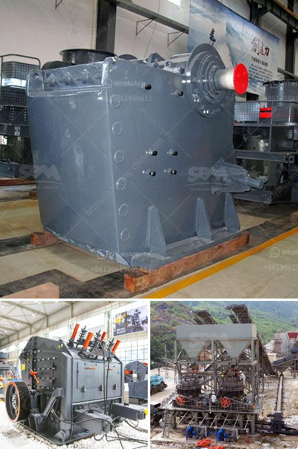

<h3>مطاحن هامر زراعية مستعملة</h3>
تعتبر مطاحن هامر الزراعية المستعملة أداة رئيسية في صناعة الزراعة وتجهيز المواد الغذائية. إنها آلات متعددة الاستخدامات تستخدم لطحن مواد مثل الحبوب والذرة والقش والتبن والأعلاف الجافة والكثير من الأشياء الأخرى. يعتمد تصميمها على آلية الهامر، حيث يتم استخدام شرائط معدنية تتحرك بسرعة عالية لسحق المواد المطحونة.

السوق المستعمل يعتبر حلا اقتصاديا مثاليًا للمزارعين والمصانع الصغيرة للحصول على معدات زراعية ذات جودة عالية بتكلفة أقل. إن شراء مطحنة هامر زراعية جديدة يكون غالبًا مكلفًا، لذا فإن الاختيار الأمثل هو البحث عن مطاحن هامر المستعملة.

تتمتع المطاحن الهامر الزراعية المستعملة بالعديد من المزايا. أحدها هو أنها مجهزة بمحركات قوية ومتينة، مما يسمح بسهولة طحن المواد الصلبة والخشنة. كما أنها تتميز بالمتانة والقدرة على التحمل، مما يجعلها قادرة على مواجهة الاستخدام القسري واستمرار العمل لعدة ساعات متواصلة.

باستخدام المطاحن الهامر الزراعية المستعملة، يمكن تحقيق نتائج طحن فعالة ودقيقة، مما يسهل معالجة الحبوب والأعلاف الجافة بشكل فعال. كما أنها توفر إمكانية التحكم في حجم ونسبة التوزيع للمواد المطحونة، مما يسمح بتلبية احتياجات مختلفة لصناعة الأعلاف والغذاء.

بالإضافة إلى ذلك، يمكن توفير العديد من الموديلات المتنوعة من المطاحن الهامر الزراعية المستعملة. هذا يعني أنه يمكن اختيار المطحنة الأكثر تناسبًا للتطبيق المحدد، سواء كانت صغيرة ومناسبة للمصانع الصغيرة أو الأعمال الزراعية الأكبر حجمًا.

وفي الختام، تشير الدراسات إلى أن استخدام المعدات الزراعية المستعملة يمكن أن يكون أكثر استدامة للبيئة، حيث يتم إعادة استخدام الموارد الموجودة وتقليل النفايات. إذا كنت تبحث عن مطحنة هامر زراعية مستعملة بتكلفة منخفضة وجودة عالية، فإن السوق المستعمل قد يكون الخيار المثالي بالنسبة لك.

باختصار، تعتبر المطاحن الهامر الزراعية المستعملة حلا اقتصاديا وفعالا للمزارعين والمصانع الصغيرة، حيث توفر الكفاءة والاقتصاد على حدٍ سواء. من خلال الاستفادة من العديد من المزايا التي توفرها هذه الآلات، يمكن تحقيق إنتاجية عالية ودقة في تجهيز المواد الزراعية والأعلاف الجافة.
<h3>Contact us</h3><ul><li><strong>Whatsapp:&nbsp;<a href="https://wa.me/8613661969651">+8613661969651</a></strong></li><li><a href="https://swt.shibang-china.com/?git&amp;zhl&amp;مطاحن هامر زراعية مستعملة"><strong>Online Service(chat now)</strong></a></li></ul><h3>Related</h3><ul><li><a href='كسارة للبيع في نيبال.md'>كسارة للبيع في نيبال</a></li><li><a href='معدات مصنع حجر الرمل.md'>معدات مصنع حجر الرمل</a></li><li><a href='سينغ كسارة الحجر ناشيك.md'>سينغ كسارة الحجر ناشيك</a></li><li><a href='ملصق السلامة لمحطة توليد الفحم.md'>ملصق السلامة لمحطة توليد الفحم</a></li><li><a href='آلة معالجة الكاولين في المصنع.md'>آلة معالجة الكاولين في المصنع</a></li></ul>