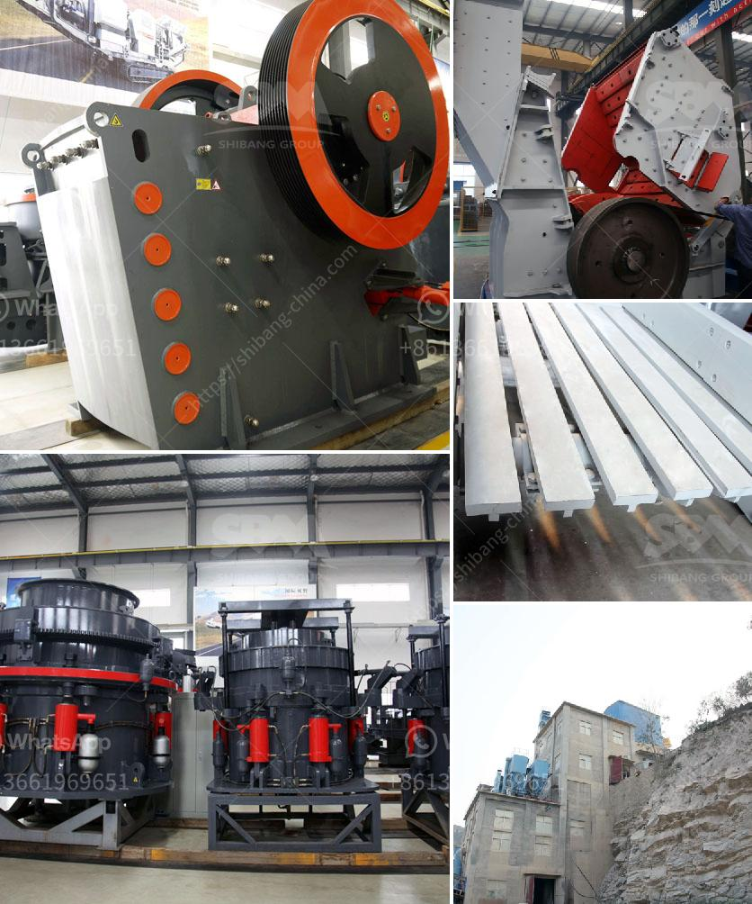

<h3>مطحق الصخور في الفلبين</h3>
يُعتبر مطارق الصخور في الفلبين من بين الظواهر الطبيعية الرائعة والمدهشة التي تعد وجهة سياحية شهيرة في البلاد. يقع هذا المشهد الطبيعي الخلاب في جزيرة بانايوان في مقاطعة إيلويلو بالفلبين. يتميز مطارق الصخور بتضاريسه الفريدة والغريبة التي تشبه مطارق ضخمة موجودة على الشاطئ. يتمتع مطارق الصخور بجاذبية واستثنائية للغاية.

ما يجعل مطارق الصخور في الفلبين مميزة هو شكلها الفريد وتشكيلها الطبيعي الذي تقدمه الطبيعة بطريقة غريبة وجذابة. تشكلت هذه المعالم الطبيعية الجميلة من الطبقات المتعاقبة من الصخور الجيرية والحجر الرملي عبر مرور الزمن وتأثيرات العوامل الجوية. ونتيجة للتآكل الطبيعي وتأثيرات الرياح والمد والجزر، تشكلت هذه الصخور ذات الشكل الغريب والأشكال المختلفة التي تشبه مطارق الضخمة.

تستقطب مطارق الصخور عددًا كبيرًا من الزوار سنويًا، حيث يأتون من مختلف أنحاء العالم للاستمتاع بجمال هذه الظاهرة الطبيعية المدهشة. يمكن للزوار المشي على الشاطئ والتجول حول هذه الصخور العملاقة والاستمتاع بالمنظر الرائع والمذهل.

إلى جانب ذلك، يوفر موقع مطارق الصخور في الفلبين فرصة رائعة لممارسة الأنشطة الهادئة مثل التزلج على الأمواج والاسترخاء على الشاطئ أو الاستمتاع بالبقاء في المنتجعات القريبة. كما يمكن للزوار زيارة المعابده القريبة والتعرف على التراث الثقافي للمنطقة.

ومن المهم أيضًا أن نشير إلى أن موقع مطارق الصخور يُعتبر محمية طبيعية، حيث تتم حمايتها والمحافظة عليها لضمان استمرارية جمالها وأهميتها البيئية. فقد تم اعتماد المنطقة كمتنزه طبيعي، وهو يثبت الحرص والاهتمام الفلبيني في الحفاظ على هذه الهدية الجميلة التي أهدها الطبيعة.

باختصار، مطارق الصخور في الفلبين هي مشهد طبيعي استثنائي يستحق الزيارة. تضيف جمالها الفريد وتشكيلها الطبيعي بحيرة جذابة لمناظر الساحل الفلبيني وتعتبر موطنًا للعديد من الأنشطة الهادئة والهامة. تعتبر هذه الواحة الطبيعية مكانًا يدهش الزوار ويوفر لهم فرصة للاسترخاء والتجديد واكتشاف جمال الطبيعة في الفلبين.
<h3>Contact us</h3><ul><li><strong>Whatsapp:&nbsp;<a href="https://wa.me/8613661969651">+8613661969651</a></strong></li><li><a href="https://swt.shibang-china.com/?git&amp;zhl&amp;مطحق الصخور في الفلبين"><strong>Online Service(chat now)</strong></a></li></ul><h3>Related</h3><ul><li><a href='خط إنتاج مطحنة عمودية LM.md'>خط إنتاج مطحنة عمودية LM</a></li><li><a href='حجر الحجر الجيري المسحوق بحجم 34 بوصة.md'>حجر الحجر الجيري المسحوق بحجم 3/4 بوصة</a></li><li><a href='أحجام كسارة الفك الحجر الجيري.md'>أحجام كسارة الفك الحجر الجيري</a></li><li><a href='هل هناك طاحونة فائقة الدقة عمودية للأسطوانة.md'>هل هناك طاحونة فائقة الدقة عمودية للأسطوانة</a></li><li><a href='كسارات محمولة جنوب أفريقيا.md'>كسارات محمولة جنوب أفريقيا</a></li></ul>