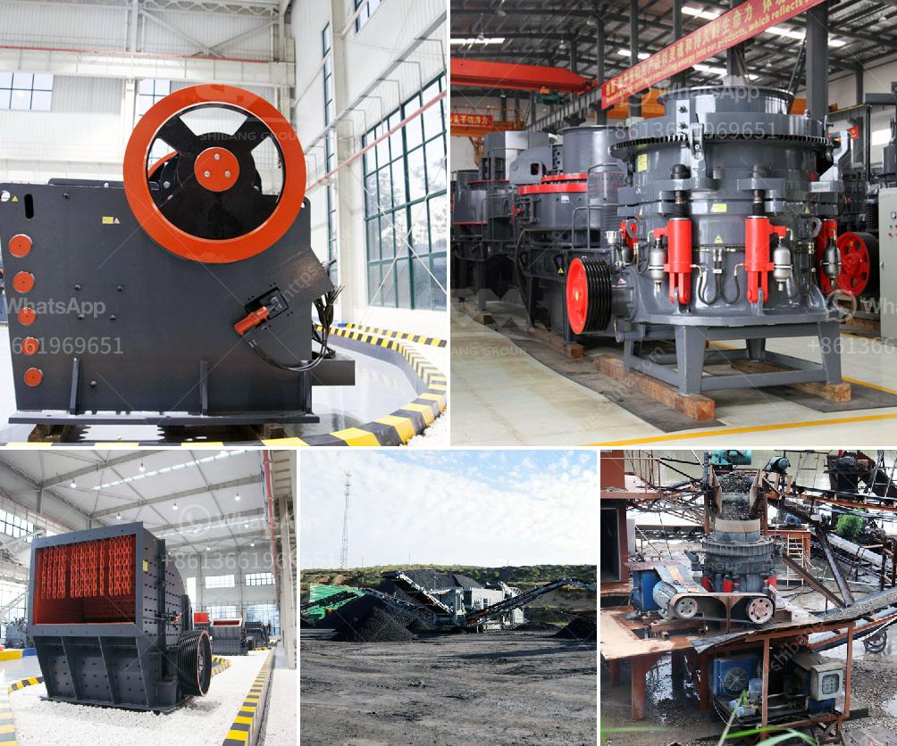

<h3>مطحنة MTM ترابيزيوم</h3>
مطحنة MTM ترابيزيوم هي واحدة من المطاحن الشائعة والمعروفة لدي عشاق صناعة البودرة. تتميز بتصميم فريد وأداء عالي الجودة يجعلها مناسبة لمجموعة متنوعة من التطبيقات الصناعية والتجارية.

تعد مطحنة MTM ترابيزيوم منتجًا من شركة الطحن المشهورة MTW. تتميز هذه المطحنة بتصميم جيد وبنية قوية توفر استقرارًا عاليًا أثناء عملية الطحن. تستخدم هذه المطحنة أساسًا لطحن المواد الخام غير المتفجرة وغير القابلة للاشتعال بنسبة رطوبة تصل إلى 6٪ وصلابة موهس تتراوح بين 9 وما فوق.

توفر مطحنة MTM ترابيزيوم طحنًا دقيقًا للمواد الخام باستخدام إطار دوار ومحورين رأسيين. يتم ضبط تدفق المواد الخام في المطحنة بواسطة نظام توجيه الهواء الذي يمزج المواد بشكل متجانس ويوجهها نحو منطقة الطحن. يتميز هذا النظام بالقدرة على تحقيق ضغط عالٍ وسرعة قوية في الهواء ، مما يساعد في تحقيق طحن دقيق ومتسق.

توفر مطحنة MTM ترابيزيوم أداءً استثنائيًا بفضل وجود نظام تحكم ذكي يساعد على تنظيم سرعة المحرك وضبط الضغط وتحسين أداء الطحن. كما تتميز بمحرك قوي يسمح بأداء عالي الكفاءة وتوفير طاقة فعالة. علاوة على ذلك ، فإن تصميم الدوار المطوي يسمح بزيادة مساحة الطحن وبالتالي زيادة كفاءة الإنتاج.

تتميز مطحنة MTM ترابيزيوم أيضًا بسهولة التشغيل والصيانة. تحتوي على نظام تحكم يمكن برمجته بسهولة وعمليات بسيطة لتبديل الأجزاء وإجراء الصيانة الروتينية. تعتبر هذه الميزات مهمة للغاية في توفير الوقت والجهد في بيئة العمل الصناعي السريع الخطى.

في النهاية ، تعتبر مطحنة MTM ترابيزيوم خيارًا مثاليًا للشركات التي تحتاج إلى طحن مواد خام ذات جودة عالية ودقة عالية. توفر هذه المطحنة أداءً ممتازًا واستقرارًا في عملية الطحن ، بالإضافة إلى سهولة التشغيل والصيانة. لذا ، فإن مطحنة MTM ترابيزيوم هي حلاً موثوقًا وفعالًا لصناعة البودرة.
<h3>Contact us</h3><ul><li><strong>Whatsapp:&nbsp;<a href="https://wa.me/8613661969651">+8613661969651</a></strong></li><li><a href="https://swt.shibang-china.com/?git&amp;zhl&amp;مطحنة MTM ترابيزيوم"><strong>Online Service(chat now)</strong></a></li></ul><h3>Related</h3><ul><li><a href='مصنع تكسير حجر الجرانيت في كينيا.md'>مصنع تكسير حجر الجرانيت في كينيا</a></li><li><a href='مزايا وعيوب مطحنة الطحن.md'>مزايا وعيوب مطحنة الطحن</a></li><li><a href='من مصنع تصنيع البوكسيت في الصين.md'>من مصنع تصنيع البوكسيت في الصين</a></li><li><a href='موزعون للأحزمة والناقلات في إندونيسيا.md'>موزعون للأحزمة والناقلات في إندونيسيا</a></li><li><a href='معالجة تكسير البازلت.md'>معالجة تكسير البازلت</a></li></ul>