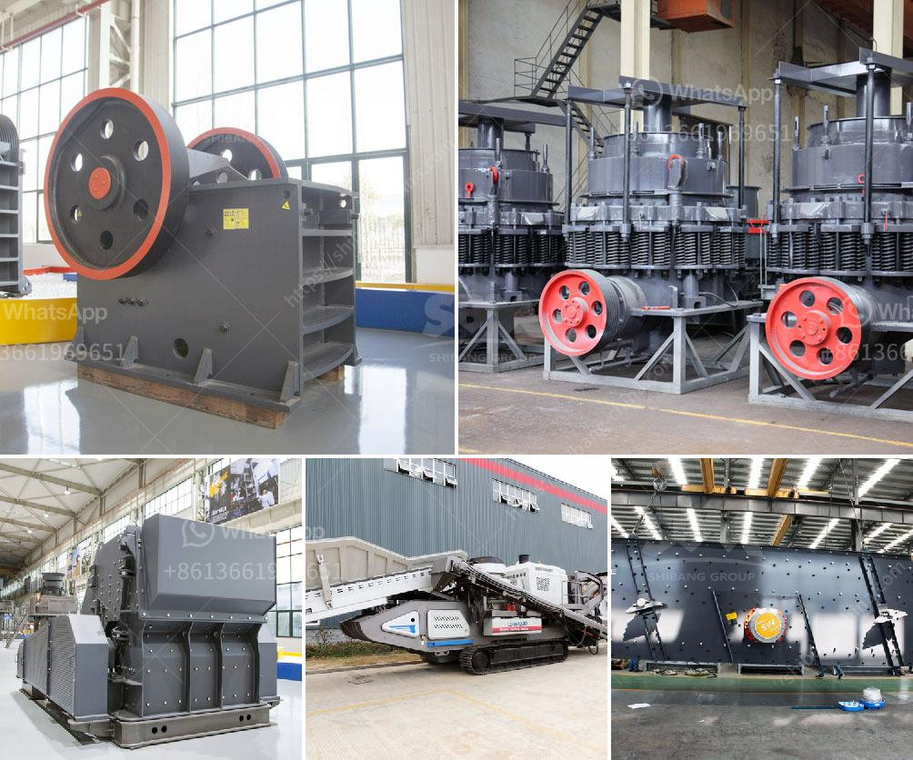

<h3>مطحنة MTW</h3>
مطحنة MTW هي واحدة من أبرز وأهم المطاحن في صناعة الطحن. تعتبر هذه المطحنة من الأجهزة المتطورة التي تتميز بالكفاءة العالية والأداء الممتاز في عملية الطحن.

تم تصميم مطحنة MTW بواسطة فريق من المهندسين المتخصصين في مجال الطحن، وتعتمد على التكنولوجيا الأكثر تطورًا لتلبية احتياجات العملاء وتحقيق أعلى معايير الجودة. تتميز هذه المطحنة بتصميمها المبتكر وهيكلها القوي، مما يجعلها قادرة على معالجة مجموعة متنوعة من المواد المختلفة بكفاءة عالية.

تعمل مطحنة MTW بنظام الطحن الدقيق الذي يعتمد على مبدأ الطحن المستمر والمتكرر. تتميز بقدرتها على طحن المواد الخام إلى مسحوق ناعم بحجم الجسيمات المطلوب. وتتميز أيضًا بمرونتها في تكييف سرعة الدوران والضغط بحسب الاحتياجات المحددة للعملاء.

تعتبر مطحنة MTW مناسبة للعديد من المواد المختلفة، مثل الحجر الجيري والبوتاس، والفحم، والكوارتز، والباريت، والفلسبار، والدولوميت، وغيرها الكثير. تعتبر حجم الجسيمات المنتجة من قبل هذه المطحنة منتظمة وموحدة، مما يسمح بإنتاج مواد طحن عالية الجودة.

ميزة أخرى مهمة لمطحنة MTW هي نظام التحكم المتقدم الذي يضمن تشغيلًا فعالًا وآمنًا. تحتوي المطحنة على نظام متقدم لجمع الغبار، مما يضمن عملية نظيفة وبيئة صحية في موقع العمل.

بشكل عام، تعتبر مطحنة MTW خيارًا مثاليًا للشركات التي تحتاج إلى إنتاج كميات كبيرة من المساحيق الدقيقة بكفاءة وجودة عالية. تلبي هذه المطحنة جميع متطلبات الطحن المتقدمة وتحمل التحديات الصعبة في مجال صناعة الطحن. بالإضافة إلى ذلك، فإنها توفر أداءًا ممتازًا وعمرًا طويلاً للمعدات وتقدم حلاً يوفر الوقت والجهد في العملية الإنتاجية.

في الختام، تعتبر مطحنة MTW اختيارًا مثاليًا للشركات التي تهتم بتحسين كفاءة العملية الإنتاجية وتحقيق أعلى جودة في منتجاتها. توفر هذه المطحنة الأداء المتميز والقدرة على معالجة مختلف المواد، مما يجعلها أداة لا غنى عنها في صناعة الطحن.
<h3>Contact us</h3><ul><li><strong>Whatsapp:&nbsp;<a href="https://wa.me/8613661969651">+8613661969651</a></strong></li><li><a href="https://swt.shibang-china.com/?git&amp;zhl&amp;مطحنة MTW"><strong>Online Service(chat now)</strong></a></li></ul><h3>Related</h3><ul><li><a href='آلة كسارة الفك في المملكة العربية السعودية.md'>آلة كسارة الفك في المملكة العربية السعودية</a></li><li><a href='مطاحن الكرة الأرجنتينية.md'>مطاحن الكرة الأرجنتينية</a></li><li><a href='كيفية اختيار كسارة مخروطية.md'>كيفية اختيار كسارة مخروطية</a></li><li><a href='معدل كسارة الحجر في نيجيريا.md'>معدل كسارة الحجر في نيجيريا</a></li><li><a href='موردين رمل السيليكا في زيمبابوي.md'>موردين رمل السيليكا في زيمبابوي</a></li></ul>