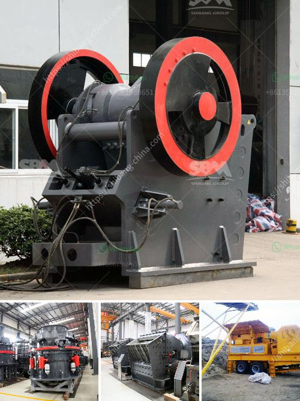

<h3>مطحنة أسطوانية الكالسيوم</h3>
تعتبر مطحنة أسطوانية الكالسيوم أحد الأدوات الهندسية الحديثة التي تستخدم في مجال معالجة المواد الخام وتحويلها إلى مساحيق دقيقة. تستخدم هذه المطاحن عادةً في صناعة الأسمدة والمواد الكيميائية وصناعة الأغذية.

تتكون مطحنة الكالسيوم الأسطوانية من جسم أسطواني مصنوع من الفولاذ الصلب المقاوم للتآكل، حيث يتم تجهيزه بأسطوانتين صغيرتين بالأسفل والأعلى للسماح بدخول المواد الخام وخروج المسحوق المطحون. كما يتم إضافة نظام تحكم دقيق لسرعة الدوران والضغط، مما يساعد على تحقيق الحجم المطلوب للمسحوق المطحون.

تعمل مطحنة أسطوانية الكالسيوم عن طريق ضغط الجسيمات الموجودة داخل الأسطوانة ضد السطح الداخلي للأسطوانة، وبذلك يتم تكسير المواد الخام وطحنها بشكل دقيق. تعتمد سرعة الدوران على نوعية المادة الخام والحجم المطلوب للمسحوق المطحون.

يمكن تطبيق مطحنة الكالسيوم الأسطوانية على مجموعة متنوعة من المواد الخام، مثل المواد الكيميائية الصناعية والمعادن والصخور. تتيح هذه الأداة تحويل المواد الخام إلى مساحيق رفيعة الحبيبات، مما يسهل تطبيقها في صناعة الأسمنت والألوان والأعلاف والأدوية والمواد الكيميائية الأخرى.

تتميز مطحنة الكالسيوم الأسطوانية بالعديد من المزايا، مثل قدرتها على تحويل المواد الخام إلى مساحيق ذات جودة عالية ومتناسقة، وبالتالي تحسين جودة المنتج النهائي. كما أنها تعمل بكفاءة عالية وتحتاج إلى قدر قليل من الطاقة، مما يوفر تكاليف التشغيل. بالإضافة إلى ذلك، فإنها تتيح تنظيم حجم الجسيمات بسهولة، مما يسهم في تلبية متطلبات الإنتاج المختلفة.

في الختام، تعد مطحنة الكالسيوم الأسطوانية أداة هندسية حديثة وفعالة لمعالجة المواد الخام وتحويلها إلى مساحيق دقيقة. يمكن استخدامها في صناعة مجموعة متنوعة من المنتجات، مما يسهم في تحسين جودة المنتج النهائي وتقليل التكاليف. يجب على الشركات العاملة في هذه الصناعات النظر في استخدام مطاحن الكالسيوم الأسطوانية كوسيلة فعالة لمعالجة المواد الخام.
<h3>Contact us</h3><ul><li><strong>Whatsapp:&nbsp;<a href="https://wa.me/8613661969651">+8613661969651</a></strong></li><li><a href="https://swt.shibang-china.com/?git&amp;zhl&amp;مطحنة أسطوانية الكالسيوم"><strong>Online Service(chat now)</strong></a></li></ul><h3>Related</h3><ul><li><a href='معدات تعدين الصغيرة مصنعين في جنوب أفريقيا.md'>معدات تعدين الصغيرة مصنعين في جنوب أفريقيا</a></li><li><a href='شركات آلات مصانع الحجر في سالم تاميل نادو.md'>شركات آلات مصانع الحجر في سالم تاميل نادو</a></li><li><a href='فاصل عالي التدرج في زينغتشو.md'>فاصل عالي التدرج في زينغتشو</a></li><li><a href='استخدام كسارة الفك المتنقلة.md'>استخدام كسارة الفك المتنقلة</a></li><li><a href='كسارة الحجر في بيرو.md'>كسارة الحجر في بيرو</a></li></ul>