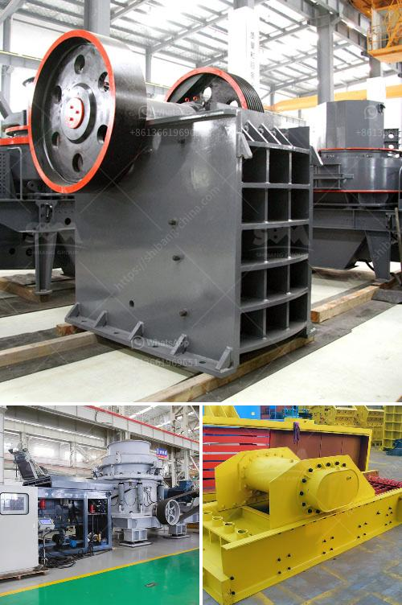

<h3>مطحنة أسطوانية بسعة 15 طن</h3>
تعتبر المطحنة الأسطوانية أحد الآلات الهامة في صناعة الحبوب والدقيق. تستخدم هذه المطاحن لطحن الحبوب الخام وتحويلها إلى دقيق عالي الجودة يمكن استخدامه في تصنيع المنتجات الغذائية المختلفة.

تتميز المطحنة الأسطوانية بأنها تحتوي على ثلاث أسطوانات متوازية تدور في اتجاه واحد وتعمل على سحق الحبوب بينها. تتكون الأسطوانات من مواد صلبة مثل الفولاذ المقاوم للصدأ وتتميز بسطح ناعم يساعد على طحن المواد بكفاءة عالية.

تختلف مطاحن الأسطوانات في سعتها، وتعتبر المطاحن بسعة 15 طن من بين أكبر المطاحن المستخدمة في الصناعة. تتيح هذه المطاحن معالجة كميات كبيرة من الحبوب في فترة زمنية قصيرة، مما يساهم في زيادة كفاءة الإنتاج وتقليل التكاليف العامة.

تعتمد سعة المطحنة الأسطوانية على عدة عوامل، مثل سرعة الأسطوانات وقوة الحصان المستخدمة لتشغيلها. يجب ضبط سرعة الأسطوانات بشكل ملائم لضمان تحقيق نتائج طحن مطلوبة دون تلف الحبوب. كما يجب أيضًا ضبط الضغط بين الأسطوانات لتحقيق توزيع متساوٍ للحبوب وتفادي التكتلات.

تعتبر مطاحن الأسطوانات ضرورية في صناعة الدقيق، حيث يتم استخدام الدقيق في إنتاج الخبز والمعجنات والمخبوزات الأخرى. يتم تصنيع الدقيق بعد عملية الطحن باستخدام المطحنة الأسطوانية، حيث يتم فصل الطحين عن القشرة والنخالة عن طريق غرابيل خاصة.

بالإضافة إلى إنتاج الدقيق، تستخدم المطاحن الأسطوانية أيضًا في صناعة العلف. يتم طحن الحبوب ومكونات العلف الأخرى بواسطة هذه المطاحن للحصول على مسحوق ناعم يمكن إضافته إلى العلف وتحسين قيمته الغذائية.

بشكل عام، تعتبر المطاحن الأسطوانية بسعة 15 طن من الآلات ذات الكفاءة العالية التي توفر إنتاجية عالية وجودة ممتازة للدقيق. تستخدم في مختلف الصناعات الغذائية، وتلبي تحديات صناعة الحبوب المتزايدة بفضل قدرتها على معالجة كميات كبيرة من الحبوب بشكل سريع وفعال.
<h3>Contact us</h3><ul><li><strong>Whatsapp:&nbsp;<a href="https://wa.me/8613661969651">+8613661969651</a></strong></li><li><a href="https://swt.shibang-china.com/?git&amp;zhl&amp;مطحنة أسطوانية بسعة 15 طن"><strong>Online Service(chat now)</strong></a></li></ul><h3>Related</h3><ul><li><a href='فاصل رمل وحجر لغسيل الشمندر.md'>فاصل رمل وحجر لغسيل الشمندر</a></li><li><a href='آلة طحن المطحنة في نيجيريا.md'>آلة طحن المطحنة في نيجيريا</a></li><li><a href='موردي آلات الأسمنت ووحدة الطحن.md'>موردي آلات الأسمنت ووحدة الطحن</a></li><li><a href='سعر كسارة المختبر المستخدمة.md'>سعر كسارة المختبر المستخدمة</a></li><li><a href='أحزمة ناقلة الشيفرون في الفلبين.md'>أحزمة ناقلة الشيفرون في الفلبين</a></li></ul>