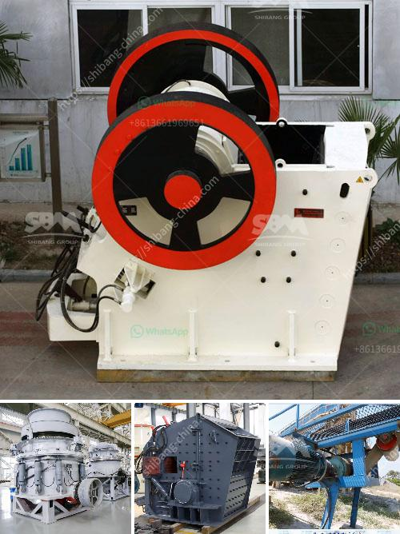

<h3>مطحنة أسطوانية ثنائية المرور</h3>
تعتبر مطحنة أسطوانية ثنائية المرور واحدة من أهم أنواع المطاحن المستخدمة في صناعة الغذاء والحبوب. يتم استخدام هذا النوع من المطاحن لطحن المواد الصلبة من خلال تمريرها بين اسطوانتين أفقيتين ملتصقتين بشكل متناغم. وتكمن أهمية هذا النوع من المطاحن في القدرة على تحقيق طحن أسرع وأكثر كفاءة للمواد.

تتكون مطاحن الأسطوانات الثنائية المرور من زوجين من الأسطوانات الملتصقة ببعضها البعض وتدور في اتجاهين متعاكسين. تعمل أسطوانتين على الطحن الاولي للمادة وفصلها وإعادة طحنها عدة مرات حتى تصل إلى الحجم المطلوب. وبفضل هذا النهج المتقدم، يمكن تحقيق طحن مواد حبيبية مختلفة بدقة أعلى وجودة أفضل.

تضيف مطاحن الأسطوانات الثنائية المرور العديد من المزايا إلى صناعة الطحن. أولاً وقبل كل شيء، تسمح هذه المطاحن بزيادة سرعة الطحن وإنتاجية العملية، مما يقلل من تكاليف الإنتاج ويوفر الوقت والجهد. كما أنها تعطي نتائج أكثر تجانسًا في القوام والجودة.

بالإضافة إلى ذلك، تتميز مطاحن الأسطوانات الثنائية المرور بمرونتها وقابلية التعديل والتكيف. يمكن تعديل فواصل الأسطوانات والسرعات والضغوط لتناسب متطلبات الإنتاج وخصائص المواد المختلفة. يمكن أن يؤدي تعديل هذه العوامل إلى تغييرات في نوعية الطحين وفتحة الطحن وحجم التوزيع، مما يسمح بتعديلات دقيقة في العملية لتلبية احتياجات العملاء.

من الجدير بالذكر أن مطاحن الأسطوانات الثنائية المرور لديها مستوى منخفض جداً من الضوضاء والاهتزاز، مما يجعلها مثالية للاستخدام في مكان العمل. أيضًا، يمكن تنظيف هذه المطاحن بسهولة وصيانتها، مما يزيد من كفاءة العملية وتوفير التكاليف.

باختصار، تعد مطاحن الأسطوانات الثنائية المرور أداة ضرورية في صناعة الغذاء والتصنيع بشكل عام. توفر سرعة وكفاءة في عملية الطحن، وتفتح الباب لتحقيق جودة عالية وتجانس في المنتجات النهائية. كما تسمح بتعديل وتكييف لتلبية متطلبات الإنتاج وتتمتع بصيانة وتنظيف سهلين.
<h3>Contact us</h3><ul><li><strong>Whatsapp:&nbsp;<a href="https://wa.me/8613661969651">+8613661969651</a></strong></li><li><a href="https://swt.shibang-china.com/?git&amp;zhl&amp;مطحنة أسطوانية ثنائية المرور"><strong>Online Service(chat now)</strong></a></li></ul><h3>Related</h3><ul><li><a href='آلة فرز للبيع في جنوب أفريقيا.md'>آلة فرز للبيع في جنوب أفريقيا</a></li><li><a href='مصنعو الكرات في بنغالور.md'>مصنعو الكرات في بنغالور</a></li><li><a href='مصانع التكسير والفحص.md'>مصانع التكسير والفحص</a></li><li><a href='شركة تصنيع آلة طحن لمسحوق ٣٠٠ شبكة.md'>شركة تصنيع آلة طحن لمسحوق ٣٠٠ شبكة</a></li><li><a href='سعر مطحنة الكرة ريموند الفائقة الدقة.md'>سعر مطحنة الكرة ريموند الفائقة الدقة</a></li></ul>