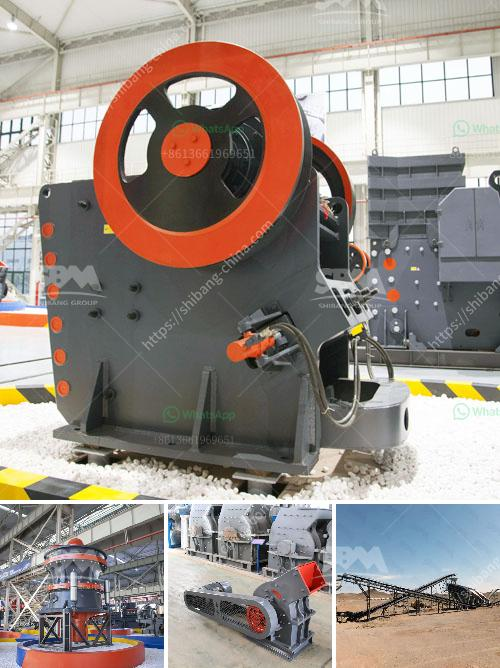

<h3>مطحنة أسطوانية صينية</h3>
تعتبر المطاحن الأسطوانية صينية من الأدوات الهامة في صناعة الطحن، حيث تستخدم لطحن الحبوب والبذور والتوابل والأعشاب وغيرها من المواد الغذائية والعطرية. تصمم هذه المطاحن بشكل أسطواني، حيث يتم وضع المادة التي ترغب في طحنها داخل الأسطوانة، وتدار الأسطوانة بواسطة محرك يعمل على دفع الأسطوانة حول محورها.

تتميز المطاحن الأسطوانية الصينية بعدة مزايا، فهي تعتبر أداة مرنة وفعالة في طحن المواد الغذائية المختلفة. يمكن ضبط درجة الطحن وفقًا للحاجة والمادة المراد طحنها، حيث تتيح للمستخدمين تحديد الحجم النهائي للمنتج المطحون. بالإضافة إلى ذلك، فإن هذه المطاحن قادرة على طحن الكميات الكبيرة من المواد في وقت قصير، مما يسهل ويسرع عملية الإنتاج.

تتوفر المطاحن الأسطوانية الصينية بعدة أحجام مختلفة، بدءًا من الأحجام الصغيرة المناسبة للاستخدام المنزلي وصولاً إلى الأحجام الكبيرة المناسبة للاستخدام التجاري. كما أنها تتوفر بمختلف القدرات، حيث يمكن أن تتراوح قدرة هذه المطاحن من 200 إلى 400 كيلوغرام في الساعة، مما يتيح المزيد من المرونة للمستخدمين لتلبية احتياجاتهم الفردية.

تعتبر المطاحن الأسطوانية الصينية متينة وقوية، حيث تصنع من مواد عالية الجودة مثل الفولاذ المقاوم للصدأ. كما أنها مصممة لتتحمل الاستخدام المكثف والمستمر دون تلف. وبفضل تصميمها المدمج، يمكن تخزينها بسهولة بعد الاستخدام وتنظيفها بسرعة وبساطة.

بالاختصار، تعد المطاحن الأسطوانية الصينية أداة مهمة في عملية الطحن، وتتميز بالمرونة والكفاءة والجودة. باستخدام هذه المطاحن، يمكن تحقيق نتائج ممتازة في عملية الطحن وتحقيق المذاق الفريد والنكهة الغنية للمنتجات المطحونة المختلفة. سواء كنت تستخدمها في المنزل أو في الصناعة، فإن المطاحن الأسطوانية الصينية ستكون اختيارًا مثاليًا لتلبية احتياجاتك وتحقيق تجربة طحن ممتعة وناجحة.
<h3>Contact us</h3><ul><li><strong>Whatsapp:&nbsp;<a href="https://wa.me/8613661969651">+8613661969651</a></strong></li><li><a href="https://swt.shibang-china.com/?git&amp;zhl&amp;مطحنة أسطوانية صينية"><strong>Online Service(chat now)</strong></a></li></ul><h3>Related</h3><ul><li><a href='صيانة مطحنة الأسطوانة العمودية  تنزيل PDF.md'>صيانة مطحنة الأسطوانة العمودية - تنزيل PDF</a></li><li><a href='مصانع تكسير الحجر في الهند.md'>مصانع تكسير الحجر في الهند</a></li><li><a href='عملية تصنيع حجر الكوارتز.md'>عملية تصنيع حجر الكوارتز</a></li><li><a href='كسارة VSI لسحق الرمل.md'>كسارة VSI لسحق الرمل</a></li><li><a href='كسارة الحجر المصنوعة في إيطاليا.md'>كسارة الحجر المصنوعة في إيطاليا</a></li></ul>