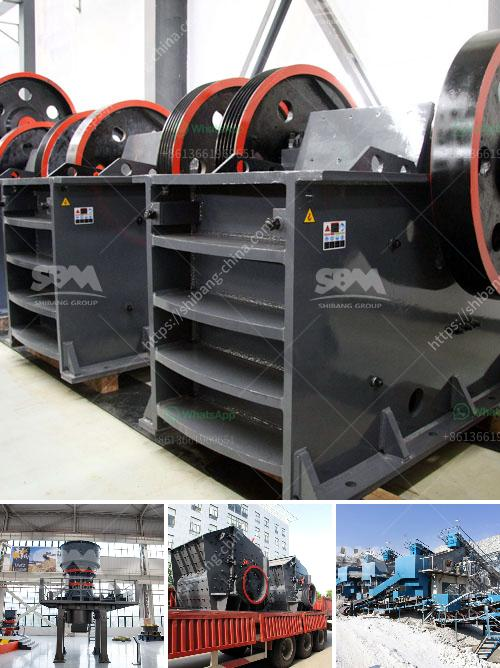

<h3>مطحنة أسطوانية عمودية للفحم</h3>
تعد مطحنة أسطوانية عمودية للفحم واحدة من التجهيزات الهامة في صناعة الطاقة الحرارية والتي تستخدم لطحن وطحن الفحم الخام إلى مسحوق ناعم يستخدم في عمليات إنتاج الكهرباء.

تتكون مطحنة الفحم الأسطوانية العمودية من جسم رئيسي يحتوي على محور عمودي وعدد من الأسطوانات المدمجة يتم تثبيتها على طول المحور. يتم تغذية الفحم الخام إلى المطحنة من خلال فتحة التغذية في الجزء العلوي من المطحنة. يتم توجيه الفحم الخام إلى الأسطوانات المدمجة حيث يتم سحقها وطحنها بواسطة الأجزاء الدوارة والثابتة في المطحنة.

تعمل الأسطوانات المدمجة بواسطة محرك كهربائي يعمل على تدوير الأسطوانات على حسب السرعة المطلوبة. بفضل حركة دوران الأسطوانات، يتم تحطيم الفحم الخام بفعل القوة العالية التي تطبق على الأسطوانات. فمع كل لفة يتلامس فيها الفحم مع الأسطوانات، يتم ضغطه وتدميره إلى جزيئات صغيرة. وبشكل متزايد، يتم طحن الفحم إلى مسحوق ناعم وجاهز للاستخدام في إنتاج الكهرباء.

تتمتع مطاحن الفحم الأسطوانية العمودية بالعديد من المزايا. أولاً وقبل كل شيء، فإن هذا النوع من المطاحن يتميز بكفاءة عالية في طحن الفحم وتحويله إلى مسحوق ناعم في وقت قصير. يعمل التصميم الدقيق للأسطوانات على توفير سطح طحن كبير يؤدي إلى زيادة كفاءة الطحن. كما تتميز هذه المطاحن بحجمها الصغير وأقل استهلاك للطاقة مقارنة بالأنواع الأخرى من المطاحن.

بالإضافة إلى ذلك، تحتوي المطاحن الأسطوانية العمودية على نظام تصنيف دقيق يحدد حجم الجسيمات المطحونة التي تمر بفوهات التصنيف. هذا يضمن جودة الطحن ويحسن الكفاءة العامة للعملية. كما أن العملية تحدث بدون إنبعاثات ضارة للهواء أو الغبار، مما يقلل من التلوث البيئي.

في الختام، فإن مطاحن الفحم الأسطوانية العمودية تلعب دورًا حيويًا في صناعة الطاقة الحرارية. تسهم في تحويل الفحم الخام إلى مسحوق ناعم يتم استخدامه في استخراج الكهرباء، مع توفير كفاءة عالية واستهلاك منخفض للطاقة. كما أنها تتمتع بأداء دقيق وموثوق به، مما يجعلها اختيارًا شائعًا للشركات والمصانع في هذه الصناعة.
<h3>Contact us</h3><ul><li><strong>Whatsapp:&nbsp;<a href="https://wa.me/8613661969651">+8613661969651</a></strong></li><li><a href="https://swt.shibang-china.com/?git&amp;zhl&amp;مطحنة أسطوانية عمودية للفحم"><strong>Online Service(chat now)</strong></a></li></ul><h3>Related</h3><ul><li><a href='كسارات الحجر الجيري المستخدمة للبيع في تكساس.md'>كسارات الحجر الجيري المستخدمة للبيع في تكساس</a></li><li><a href='مصنع كسارة الحصى بالقرب من مانيلا.md'>مصنع كسارة الحصى بالقرب من مانيلا</a></li><li><a href='كسارة للبيع في جنوب أفريقيا.md'>كسارة للبيع في جنوب أفريقيا</a></li><li><a href='تخطيط منشأة تعدين الماس.md'>تخطيط منشأة تعدين الماس</a></li><li><a href='آلات كسارة الصخور.md'>آلات كسارة الصخور</a></li></ul>