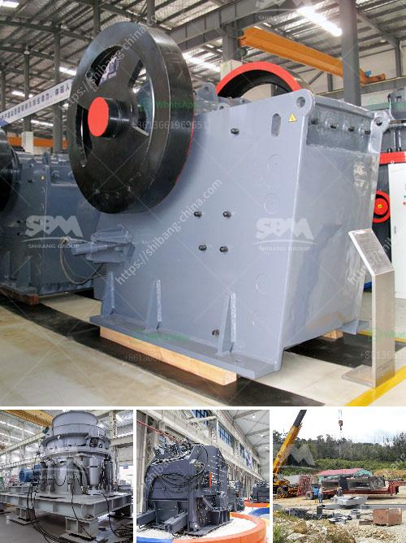

<h3>مطحنة أسطوانية عمودية</h3>
تعد المطحنة الأسطوانية العمودية واحدة من الأدوات الهامة في صناعة الطحن. وتستخدم المطاحن الأسطوانية العمودية في عملية سحق الحبوب والمواد الصلبة الأخرى للحصول على مسحوق ناعم يمكن استخدامه في الصناعات المختلفة مثل الأسمنت، والكيميائيات، وصناعة الورق، وصناعة الطعام.

تتكون المطاحن الأسطوانية العمودية من عدد من الأسطوانات الموجودة عمودياً والتي تدور بسرعة معينة. تتميز هذه المطاحن بنظام طحن فعال يجمع بين عملية الضغط والاحتكاك لتحقيق أداء ممتاز في الطحن.

تزود المطاحن الأسطوانية العمودية بنظام تغذية الحبوب والمواد الصلبة الأخرى، وتضغط هذه المواد بين الأسطوانات الدوارة. يتم ضغط المواد بقوة بحيث يتم طحنها وتمريرها في التجويف بين الأسطوانات. تعمل القوة العالية والتحريك المستمر للفراغ بين الاسطوانات على طحن وسحق المواد الصلبة بشكل مستمر، حتى تصبح بمقدار الحجم المطلوب.

تتميز المطاحن الأسطوانية العمودية بالعديد من الميزات. فهي تعتبر مصممة بشكل خاص لأداء عمليات الطحن بكفاءة عالية وتقديم نوعية مسحوق ممتازة. بفضل تكنولوجيا العمل الدقيقة والسرعة القابلة للتعديل، يمكن ضبط المطحنة لتلبية المتطلبات المحددة لعملية الطحن. وتتوفر أيضاً أنظمة تبريد عالية الجودة للمطاحن الأسطوانية العمودية للتحكم في درجة الحرارة الناتجة عن عملية الطحن.

بالإضافة إلى ذلك، تعتبر المطاحن الأسطوانية العمودية مثالية للمهام الثقيلة والاستخدام المستمر. فهي قوية وتتحمل الضغط العالي ومناسبة للعديد من الصناعات المختلفة التي تكافح معالجة المواد الصلبة.

في الختام، تعد المطاحن الأسطوانية العمودية أداة أساسية في صناعة الطحن. تقدم تقنية متقدمة لطحن المواد الصلبة وتحقق مستوى عالي من الكفاءة في العملية. ومع تصميمها القوي ودقتها، فإن المطاحن الأسطوانية العمودية توفر العديد من الفوائد للصناعات المختلفة وتلبي احتياجاتها المتنوعة.
<h3>Contact us</h3><ul><li><strong>Whatsapp:&nbsp;<a href="https://wa.me/8613661969651">+8613661969651</a></strong></li><li><a href="https://swt.shibang-china.com/?git&amp;zhl&amp;مطحنة أسطوانية عمودية"><strong>Online Service(chat now)</strong></a></li></ul><h3>Related</h3><ul><li><a href='معدات الطحن.md'>معدات الطحن</a></li><li><a href='شاشة اهتزاز للشبكة 14 شاشة اهتزاز.md'>شاشة اهتزاز للشبكة 14 شاشة اهتزاز</a></li><li><a href='مصنعون لمصانع التكسير المتنقلة.md'>مصنعون لمصانع التكسير المتنقلة</a></li><li><a href='موزع كسارة مخروط في إندونيسيا.md'>موزع كسارة مخروط في إندونيسيا</a></li><li><a href='كسارة صخور الحجر الجيري.md'>كسارة صخور الحجر الجيري</a></li></ul>