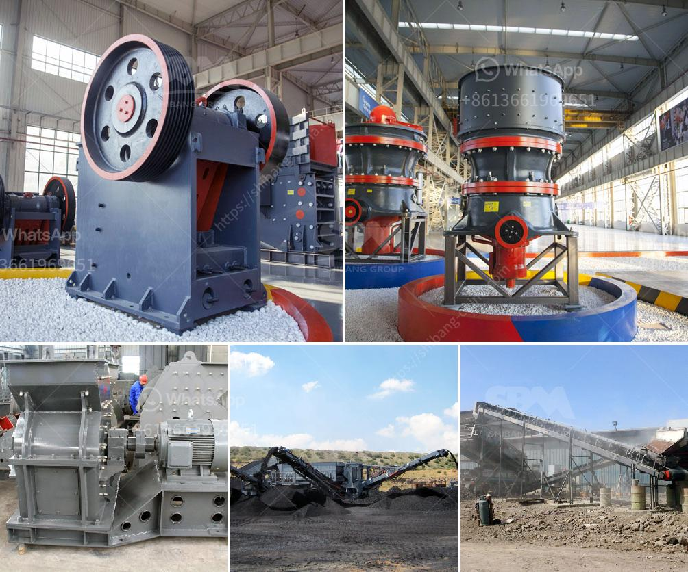

<h3>مطحنة أسطوانية لطحن المعادن في سالم</h3>
تُعدّ مطحنة أسطوانية لطحن المعادن في سالم أحدث تطور في صناعة التعدين. تتميز هذه المطاحن بالقدرة على طحن المعادن بكفاءة عالية وسرعة كبيرة. تعتبر هذه التقنية مبتكرة ومثالية لصناعة التعدين التي تتطلب طحن المعادن إلى حجم أكثر دقة وأصغر قبل أن يتم غربلتها لاستخدامها.

تعتمد مطحنة أسطوانية لطحن المعادن في سالم على عمليات الطحن الميكانيكية لكسر الصخور الكبيرة وطحنها إلى حجم مناسب. يتم تحقيق ذلك من خلال تدوير الأسطوانة الأفقية التي تحتوي على مراوح داخلية. هذه المراوح تقوم بسحق المواد وتحويلها إلى حجم أصغر حيث يتم تفريغها في الأسطوانة الأسفل. تقوم المطاحن الأسطوانية الحديثة بتحديد حجم التفاعل ونسبة الطحن المطلوبة بدقة كبيرة مما يجعلها أداة قوية لصناعة التعدين.

تتميز مطاحن الأسطوانات المستخدمة في سالم بقدرتها على طحن مختلف أنواع المعادن، بما في ذلك النحاس والذهب والفضة والحديد والرصاص والزنك والكروم وغيرها. بفضل تكنولوجيا التحكم الآلي والحاسوب المتقدمة، تتمتع هذه المطاحن بالقدرة على التعامل مع مختلف أحجام المواد والظروف المختلفة. هذا يعني أن صناعة التعدين لن تتأثر بانقطاع أو تذبذب عملية إنتاج المعادن المطاحن الأسطوانية توجد في سالم.

مع تطور المطاحن الأسطوانية لطحن المعادن في سالم، يتم تحسين كفاءة صناعة التعدين بشكل كبير. تمتلك هذه التقنية القدرة على توفير الوقت وتقليل التكاليف التشغيلية. كما أنها تساهم في زيادة إنتاجية المصنع وتحسين جودة المنتج النهائي. علاوة على ذلك، تعمل المطاحن الأسطوانية على تقليل الانبعاثات الضارة وحماية البيئة.

يمكن القول إن مطحنة أسطوانية لطحن المعادن في سالم تشكل ثورة في صناعة التعدين. تعزز قدرة المنشآت التعدينية على إنتاج كميات كبيرة من المعادن بكفاءة عالية وتساعد في تحسين العمليات وضمان الجودة. بفضل استخدام التكنولوجيا المتقدمة في هذه المطاحن، تعتبر سالم وجهة مثالية لصناعة التعدين وتوفير احتياجات المعادن العالمية.
<h3>Contact us</h3><ul><li><strong>Whatsapp:&nbsp;<a href="https://wa.me/8613661969651">+8613661969651</a></strong></li><li><a href="https://swt.shibang-china.com/?git&amp;zhl&amp;مطحنة أسطوانية لطحن المعادن في سالم"><strong>Online Service(chat now)</strong></a></li></ul><h3>Related</h3><ul><li><a href='مصنع كسارة الحجر 100 tph.md'>مصنع كسارة الحجر 100 tph</a></li><li><a href='سعر مطحنة المطرقة للطين.md'>سعر مطحنة المطرقة للطين</a></li><li><a href='كسارات حجر محمولة أوغندا للبيع.md'>كسارات حجر محمولة أوغندا للبيع</a></li><li><a href='مختلف طرق سحق وطحن السيراميك.md'>مختلف طرق سحق وطحن السيراميك</a></li><li><a href='مطاحن تحضير الدولوميت.md'>مطاحن تحضير الدولوميت</a></li></ul>