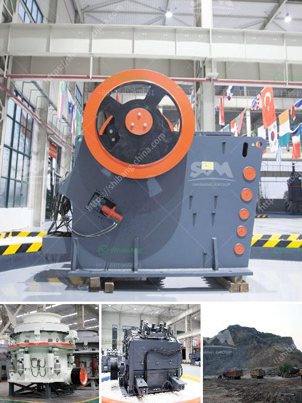

<h3>مطحنة أسطوانية للبيع في نيوزيلندا</h3>
تُعد مطحنة الأسطوانة من الأدوات الأساسية في صناعة الغذاء والزراعة، وهي استثمار رائع لمربي المواشي والمزارعين الذين يرغبون في طحن الحبوب والبذور في منازلهم بطريقة فعالة. إذا كنت تعيش في نيوزيلندا وتبحث عن مطحنة أسطوانية للبيع، اقرأ المزيد لمعرفة المزيد عن هذه الأداة الرائعة والتي يمكن أن تصبح جزءًا مهمًا من عملك الزراعي.

تتميز مطاحن الأسطوانة بأنها قادرة على طحن المواد الغذائية بشكل متساوٍ وفعال. فهي تعمل عن طريق ضغط الحبوب بين اسطوانتين من الفولاذ المقاوم للصدأ، مما يؤدي إلى تفتيتها إلى جزيئات صغيرة قابلة للاستخدام في عمليات الطهي والتجهيز الغذائي. تتميز هذه المطاحن أيضًا بأنها تعتبر أكثر كفاءة في طحن الحبوب مقارنةً بالمطاحن التقليدية الأخرى، فهي تسمح بطحن كميات أكبر في وقت أقل.

عند البحث عن مطحنة أسطوانية للبيع في نيوزيلندا، يمكن أن تتأثر أسعارها بعوامل عديدة. قد تجد مطحنة بسعر 200 دولار أمريكي، وهي مطحنة صغيرة الحجم وتلائم الاحتياجات الشخصية. وإذا كنت تبحث عن مطاحن ذات أحجام أكبر ومزودة بميزات إضافية، فقد يزيد سعرها إلى 400 دولار أمريكي أو أكثر. استمر في البحث وقارن بين العديد من العروض والميزات لتجد المطحنة التي تناسب احتياجاتك.

عند شراء مطحنة أسطوانية، يجب أن تأخذ بعين الاعتبار العديد من العوامل الأساسية. أهمها الأداء والموثوقية وسهولة الاستخدام. قد ترغب في الاستعلام عن القوة المحركة وسرعة الطحن، فضلاً عن نظام التحكم في الحبوب. كما يجب أن تتأكد من جودة المكونات المستخدمة في تصنيع المطحنة، فمن المهم أن تكون بنية الأسطوانات قوية ودائمة لتتحمل الاستخدام اليومي.

قبل الشراء، يُنصح بالبحث وقراءة تقييمات المستخدمين السابقين للمطاحن المختلفة والبحث عن الماركات المعروفة والموثوقة. يمكنك أيضًا استشارة خبير في صناعة الزراعة أو الغذاء للحصول على نصيحة قبل اتخاذ قرار الشراء.

في النهاية، شراء مطحنة أسطوانية للبيع في نيوزيلندا يمكن أن يكون استثمارًا رائعًا لأي شخص يعمل في صناعة المواد الغذائية والزراعة. توفر هذه الأداة الفرصة لطحن الحبوب والبذور بكفاءة وسرعة، مما يتيح لك إضافة قيمة لمشروعك وتوفير الوقت والجهد في عملية التحضير الغذائي. قم بإجراء البحث اللازم واختر المطحنة التي تناسب احتياجاتك، واستفد من فوائد هذه الأداة المثيرة للاهتمام.
<h3>Contact us</h3><ul><li><strong>Whatsapp:&nbsp;<a href="https://wa.me/8613661969651">+8613661969651</a></strong></li><li><a href="https://swt.shibang-china.com/?git&amp;zhl&amp;مطحنة أسطوانية للبيع في نيوزيلندا"><strong>Online Service(chat now)</strong></a></li></ul><h3>Related</h3><ul><li><a href='محجر مستعمل بشكل معقول في نيجيريا.md'>محجر مستعمل بشكل معقول في نيجيريا</a></li><li><a href='آلات مصنع الحصى الكوارتز.md'>آلات مصنع الحصى الكوارتز</a></li><li><a href='كسارة أولية للبيع.md'>كسارة أولية للبيع</a></li><li><a href='كسارات متنقلة وشاشات مستعملة في جنوب أفريقيا.md'>كسارات متنقلة وشاشات مستعملة في جنوب أفريقيا</a></li><li><a href='تكلفة إنشاء مصنع للأسمنت.md'>تكلفة إنشاء مصنع للأسمنت</a></li></ul>