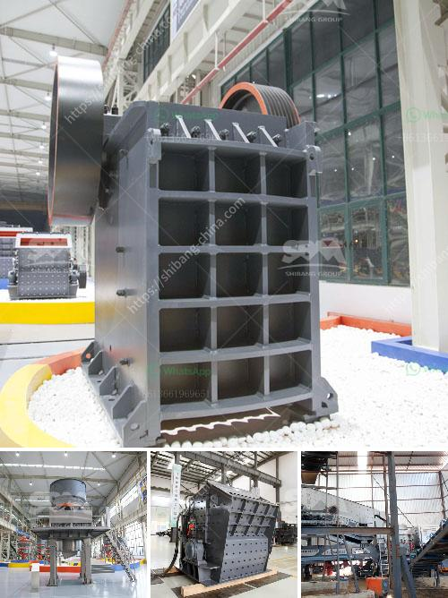

<h3>مطحنة أسطوانية للمعادن</h3>
تعد المطاحن الأسطوانية للمعادن من أهم الأدوات المستخدمة في صناعة التعدين ومعالجة المعادن. إنها آلات تستخدم لسحق وطحن الخامات المعدنية إلى حجم أصغر، مما يسهل عملية استخلاص العناصر القيمة منها. سنتحدث في هذه المقالة عن تصميم ووظيفة المطاحن الأسطوانية للمعادن وأهميتها في صناعة التعدين.

تتألف المطاحن الأسطوانية للمعادن من أسطوانة دوارة تتحرك بسرعة محددة، وأسطوانة ثابتة تتم تثبيتها في المطحنة. الهدف الأساسي من استخدام المطاحن الأسطوانية هو سحق وطحن الخامات المعدنية بحيث يتم تفتيتها إلى حجم أصغر. تتضمن هذه الخامات المعدنية العديد من الأمثلة مثل الذهب، الفضة، الحديد، النحاس، والرصاص.

تعمل المطاحن الأسطوانية بواسطة وضع الخامة المعدنية داخل المطحنة الدوارة ثم تدحرج على المطحنة الثابتة، حيث يتم طحن الخامة بين الأسطوانات. يتم تحديد سرعة دوران المطحنة الدوارة بناءً على صلابة الخامة المطحونة والمتطلبات النهائية. كلما زادت سرعة الدوران، زادت قوة الصدمة وسرعة الطحن.

واحدة من أهم المزايا التي توفرها المطاحن الأسطوانية هي قدرتها على تحقيق توزيع جيد لحجم الجسيمات في المنتج النهائي. وهذا يسهل عمليات الفصل والاستخلاص للعناصر القيمة من الخامة المطحونة، مما يزيد من كفاءة العملية ويقلل من تكاليف الإنتاج. بالإضافة إلى ذلك، تقلل المطاحن الأسطوانية من تكوين غبار الخامات المعدنية، مما يحسن بيئة العمل ويحمي صحة العاملين.

قد يكون هناك العديد من التطبيقات المختلفة للمطاحن الأسطوانية في صناعة التعدين ومعالجة المعادن. فعلى سبيل المثال، قد يتم استخدام المطاحن الأسطوانية في تجهيز الخامات قبل إرسالها إلى المعالجة اللاحقة مثل الفصل الجاذبية أو التعويم. كما يمكن استخدامها في تحضير العينات المعدنية للتحليل المختبري.

باختصار، المطاحن الأسطوانية للمعادن تعد أداة أساسية في صناعة التعدين ومعالجة المعادن. تساهم في تحطيم الخامات المعدنية إلى حجم أصغر وتحسن التوزيع الجسيمات في المنتج النهائي. توفر هذه المطاحن كفاءة أعلى في استخلاص العناصر القيمة وتقليل تكاليف الإنتاج. إن المطاحن الأسطوانية تلعب دورًا مهمًا في تعزيز إنتاجية واستدامة صناعة التعدين.
<h3>Contact us</h3><ul><li><strong>Whatsapp:&nbsp;<a href="https://wa.me/8613661969651">+8613661969651</a></strong></li><li><a href="https://swt.shibang-china.com/?git&amp;zhl&amp;مطحنة أسطوانية للمعادن"><strong>Online Service(chat now)</strong></a></li></ul><h3>Related</h3><ul><li><a href='بيانات مصنع تحضير خام الكروم.md'>بيانات مصنع تحضير خام الكروم</a></li><li><a href='تكلفة كسارة المعدات في ماليزيا.md'>تكلفة كسارة المعدات في ماليزيا</a></li><li><a href='مصنع كسارة الحجر بسعة 100 طن.md'>مصنع كسارة الحجر بسعة 100 طن</a></li><li><a href='كسارة الحجر بوزولانا للبيع.md'>كسارة الحجر بوزولانا للبيع</a></li><li><a href='معدات تكسير الحجر زينيث.md'>معدات تكسير الحجر زينيث</a></li></ul>