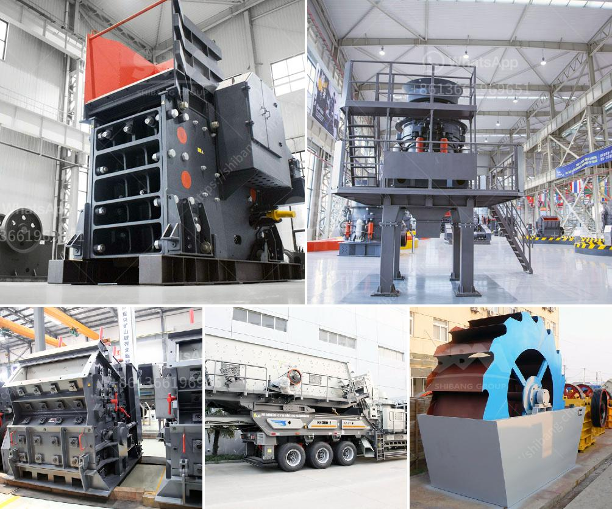

<h3>مطحنة أسطوانية لمرادآباد</h3>
تعتبر مطحنة أسطوانية لمرادآباد واحدة من أبرز المعالم الثقافية والتاريخية في العاصمة الإيرانية طهران. تأسست هذه المطحنة في القرن الثامن عشر ، وهي تعد من أقدم المطاحن في المنطقة. تم تصميم المطحنة الأسطوانية على الطراز التقليدي الإيراني، وتتميز ببنيتها الجميلة وتفاصيلها الدقيقة.

يتكون بنيان المطحنة الأسطوانية من ثلاثة طوابق، حيث يوجد الجزء السفلي من المطحنة الذي يحتوي على المعدات والآلات اللازمة لطحن الغلال. يتم استخدام آلات حديثة وأدوات طحن متقدمة لضمان الحصول على أعلى جودة للمنتج النهائي. يحافظ العاملون على المطحنة على اتباع أعلى معايير النظافة والجودة لضمان نتائج ممتازة.

تتميز مطحنة أسطوانية لمرادآباد بقدرتها على طحن مجموعة متنوعة من المواد الغذائية، بما في ذلك الحبوب والأعلاف والبقوليات. وتعتبر من أهم المطاحن في المنطقة بفضل جودة المنتج النهائي الذي تقدمه. وقد اشتهرت المطحنة على مستوى البلاد والمنطقة بإنتاج الدقيق عالي الجودة والمنتجات الأخرى المطحونة بالطرق التقليدية.

تحظى مطحنة أسطوانية لمرادآباد بشعبية كبيرة لدى المستهلكين نظراً لجودة منتجاتها وثقافتها التقليدية. تتميز المطحنة بأنها تقطع المسافة بين المنتج والمستهلك، حيث يتم طحن البنود المحلية وتعبئتها في الموقع بمجرد الطلب. توفر المطحنة بذلك منتجات ذات جودة عالية وطازجة لعملائها.

تعتبر مطحنة أسطوانية لمرادآباد مصدراً هاماً لدخل المدينة، حيث توفر فرص عمل للسكان المحليين وتعزز الاقتصاد العام للمنطقة. كما أنها تعتبر وجهة سياحية شهيرة للزوار الراغبين في استكشاف التاريخ والثقافة المحلية.

باختصار ، يعتبر وجود مطحنة أسطوانية لمرادآباد في طهران إضافة ثقافية وتاريخية هامة. تلعب المطحنة دورًا أساسيًا في تلبية احتياجات السكان المحليين وزوار المدينة من خلال توفير منتجات ذات جودة عالية وموثوقية. يُعتبر وجود المطحنة فخرًا للمجتمع المحلي ومصدرًا للعمل والازدهار الاقتصادي.
<h3>Contact us</h3><ul><li><strong>Whatsapp:&nbsp;<a href="https://wa.me/8613661969651">+8613661969651</a></strong></li><li><a href="https://swt.shibang-china.com/?git&amp;zhl&amp;مطحنة أسطوانية لمرادآباد"><strong>Online Service(chat now)</strong></a></li></ul><h3>Related</h3><ul><li><a href='آلات تعدين الذهب مستعملة.md'>آلات تعدين الذهب مستعملة</a></li><li><a href='آلة كسارة الحجر 250 400.md'>آلة كسارة الحجر 250 400</a></li><li><a href='سعر مصنع تعدين الذهب في الصين.md'>سعر مصنع تعدين الذهب في الصين</a></li><li><a href='كسارات الحجر المحمولة في جنوب أفريقيا.md'>كسارات الحجر المحمولة في جنوب أفريقيا</a></li><li><a href='مشروع كلنكر الإسمنت في الهند.md'>مشروع كلنكر الإسمنت في الهند</a></li></ul>