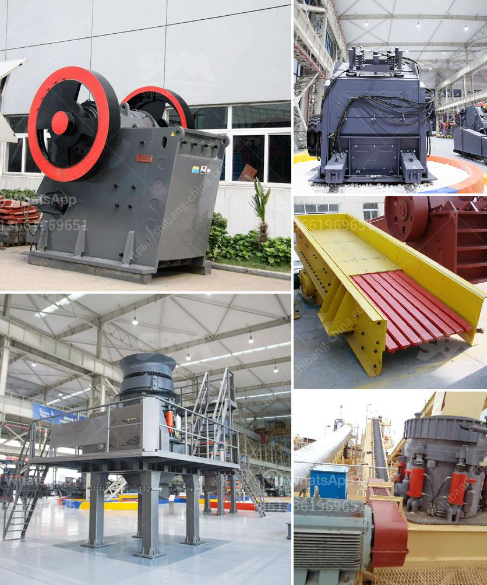

<h3>مطحنة أسمنت صغيرة مستعملة في الإمارات</h3>
تعد صناعة الأسمنت من الصناعات الأساسية في الإمارات العربية المتحدة، حيث تلعب دورًا هامًا في تطوير البنية التحتية والاقتصاد الوطني. تأتي مع ذلك الحاجة لمطاحن أسمنت صغيرة وفعالة من حيث التكلفة لتلبية الطلب المتزايد على الأسمنت.

تعد المطاحن الصغيرة المستعملة من الخيارات المثالية للشركات الصغيرة والمتوسطة الحجم، حيث يمكنها إنتاج كميات مناسبة من الأسمنت بتكلفة معقولة.تعد تلك المطاحن متوفرة بأحجام مختلفة، وعادة ما تتراوح من 200-400 طن يوميًا، وذلك يعتمد على الاحتياجات الخاصة للشركة.

يتم تصنيع المطاحن الصغيرة هندسيًا لتحقيق أعلى كفاءة ممكنة وضمان الأداء المستدام. تتكون المطاحن من مرحلتين رئيسيتين: مرحلة الطحن الخشن ومرحلة الطحن الدقيق. يتم في المقام الأول سحق الكلنكر - وهو المكون الرئيسي للأسمنت - بمطرقة كبيرة إلى قطع صغيرة. ثم يتم طحن هذه القطع في مرحلة الطحن الدقيق لتحقيق ملمس أكثر نعومة وأداء أفضل.

ميزة المطاحن الصغيرة هي أنها مدمجة الحجم، ولا تحتاج إلى مساحة كبيرة للتشغيل. كما أنها تعمل بكفاءة عالية وتستهلك كمية قليلة من الطاقة والماء، مما يقلل من التكاليف ويحافظ على البيئة. بالإضافة إلى ذلك، يمكن تشغيل تلك المطاحن بسهولة ويسر، وبالتالي فهي مناسبة للشركات التي تبحث عن تحسين إنتاجية أسمنتها بتكلفة منخفضة.

يتم استخدام المطاحن الصغيرة في الإمارات لإنتاج الأسمنت العادي والأسمنت المعزز بالإضافات والألوان والرمل الملون. وبفضل تقنيات التحكم المتطورة، يمكن تغيير خصائص الأسمنت حسب الاحتياجات الخاصة للعملاء، مما يزيد من مرونة الإنتاج ويوفر طيفًا أوسع من المنتجات.

في الختام، تعتبر المطاحن الأسمنتية الصغيرة المستعملة في الإمارات خيارًا مثاليًا للشركات الصغيرة والمتوسطة الحجم التي تسعى لزيادة إنتاجية أسمنتها بتكلفة منخفضة. فهي تجمع بين الكفاءة والجودة والاستدامة، مما يدعم تطور الصناعة الإماراتية والاقتصاد الوطني بشكل عام.
<h3>Contact us</h3><ul><li><strong>Whatsapp:&nbsp;<a href="https://wa.me/8613661969651">+8613661969651</a></strong></li><li><a href="https://swt.shibang-china.com/?git&amp;zhl&amp;مطحنة أسمنت صغيرة مستعملة في الإمارات"><strong>Online Service(chat now)</strong></a></li></ul><h3>Related</h3><ul><li><a href='سعر كسارة الحجر في جنوب أفريقيا.md'>سعر كسارة الحجر في جنوب أفريقيا</a></li><li><a href='عمل كسارة الفك.md'>عمل كسارة الفك</a></li><li><a href='منجم فحم للبيع في ميدلبرغ.md'>منجم فحم للبيع في ميدلبرغ</a></li><li><a href='سعر كسارة حجر البازلت.md'>سعر كسارة حجر البازلت</a></li><li><a href='أسعار مصنع معالجة الكولتان.md'>أسعار مصنع معالجة الكولتان</a></li></ul>