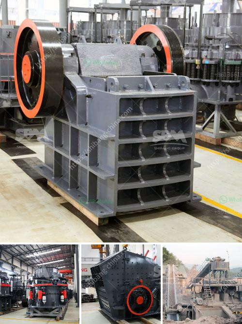

<h3>مطحنة الأسطوانة الجبس</h3>
تعتبر مطحنة الأسطوانة الجبس أحد الأدوات المهمة في صناعة الأسمنت والجبس. تستخدم هذه المطاحن لطحن الجبس الخام إلى مسحوق ناعم يستخدم في عملية التشكيل والقولبة والتطبيقات الأخرى.

تعتبر مطحنة الأسطوانة الجبس من الأنواع المتقدمة من مطاحن الأسطوانات. تتكون المطحنة من طاحونتين متواجدتين أفقيًا، حيث يوجد مساحة قابلة للطحن بين الأسطوانتين. يتم تغذية الجبس الخام إلى المطحنة من الجزء العلوي، وتدور الأسطوانتان بسرعات مختلفة في اتجاهين متعاكسين، مما يؤدي إلى سحق وطحن الجبس بين الأسطوانتين.

تتميز مطاحن الأسطوانة الجبس بعدة مزايا. فبفضل سرعة الدوران المرتفعة وقوة الاحتكاك بين الأسطوانتين، يتم طحن الجبس بكفاءة وسرعة عالية، مما يضمن الحصول على مسحوق ناعم ومتجانس. تستخدم هذه المطاحن أيضاً في عمليات الجفاف والتبريد للجبس، حيث يتم تحويله من حالة مبللة إلى مسحوق جاف مستقر.

تعتبر مطاحن الأسطوانة الجبس مثالية للعمل في صناعة الأسمنت. فإلى جانب طحن الجبس، يمكن استخدامها أيضاً في طحن المواد الأخرى مثل الفحم المطحون والكلنكر والرماد المتطاير. بفضل تصميمها الفريد، توفر هذه المطاحن تكلفة منخفضة من حيث استهلاك الطاقة والصيانة، مما يعزز كفاءة الإنتاج ويقلل الخسائر.

لتلبية متطلبات التشغيل المختلفة، تأتي مطاحن الأسطوانة الجبس بمختلف القدرات والموديلات، حيث تتراوح قدرتها من 200 إلى 400 طن في الساعة. التحكم الآلي المتقدم ونظام التشحيم الذاتي يعززان الأداء والموثوقية للمطاحن، مما يجعلها من الخيارات المثالية للشركات المصنعة والمقاولين.

باختصار، تعد مطاحن الأسطوانة الجبس أدوات حاسمة في صناعة الأسمنت والجبس. تجمع بين المرونة والفعالية في التشغيل، وتساهم في جودة المنتج النهائي وتحقيق الكفاءة العالية في الإنتاج.
<h3>Contact us</h3><ul><li><strong>Whatsapp:&nbsp;<a href="https://wa.me/8613661969651">+8613661969651</a></strong></li><li><a href="https://swt.shibang-china.com/?git&amp;zhl&amp;مطحنة الأسطوانة الجبس"><strong>Online Service(chat now)</strong></a></li></ul><h3>Related</h3><ul><li><a href='مطحنة الكرة مطرقة مطحنة مطحنة أسطوانية آلة.md'>مطحنة الكرة مطرقة مطحنة مطحنة أسطوانية آلة</a></li><li><a href='آلة كسارة في الفلبين.md'>آلة كسارة في الفلبين</a></li><li><a href='مصنع معالجة التنغستن في الهند.md'>مصنع معالجة التنغستن في الهند</a></li><li><a href='كسارة الفك من الصين.md'>كسارة الفك من الصين</a></li><li><a href='مصنعي معدات تعدين الذهب في الدنمارك.md'>مصنعي معدات تعدين الذهب في الدنمارك</a></li></ul>